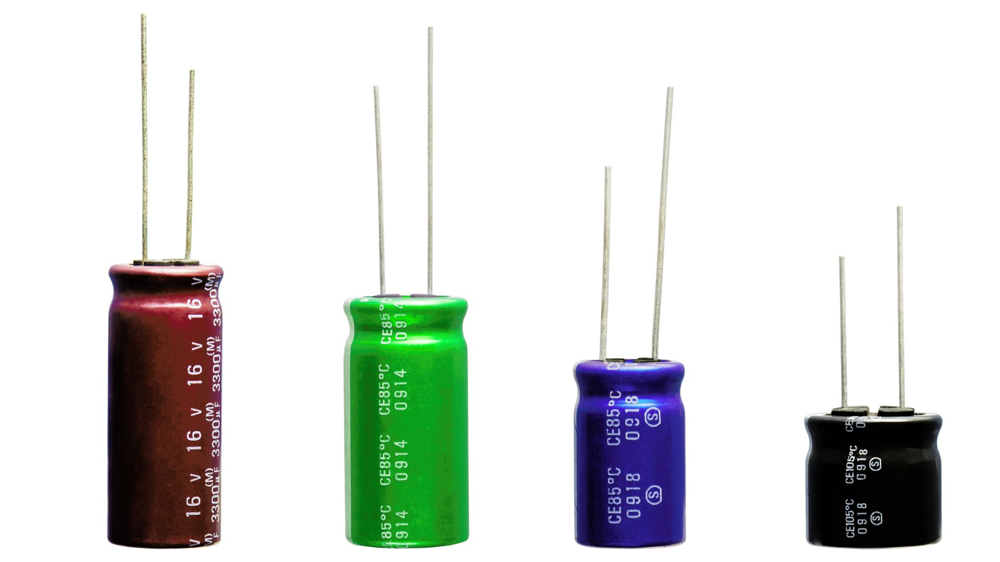
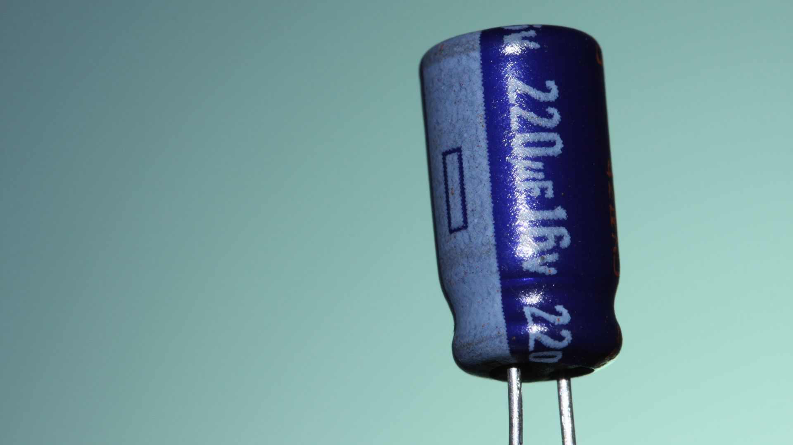
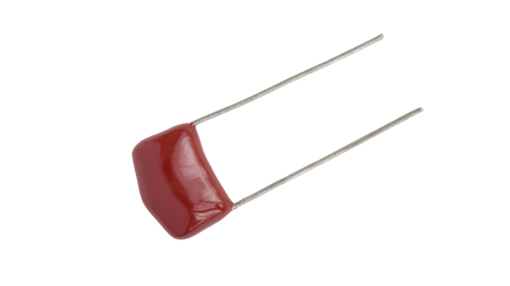
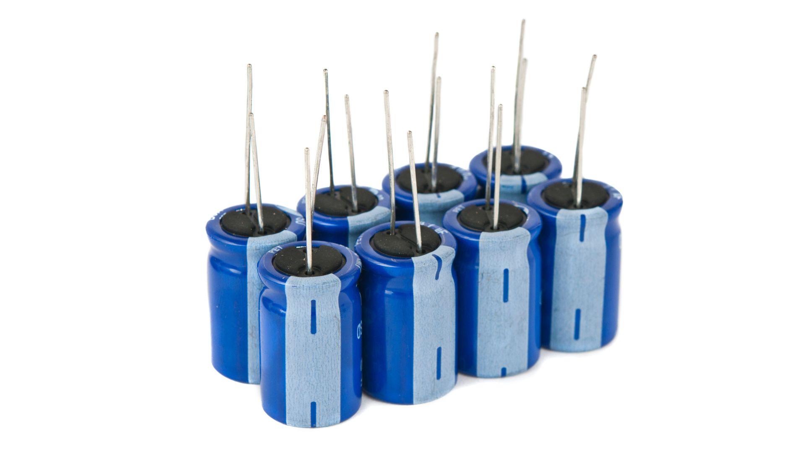

{:class=""cover}

If you recall from our earlier lessons, we likened a capacitor to a reservoir in our river of electricity. Just as a reservoir stores water, a capacitor stores electric charge. Today, we'll further explore capacitors: what they are, how they work, their various types, and their uses in electronic circuits.

{:class="img-fluid w-50"}

---

## What are Capacitors?

Capacitors are two-terminal electronic components that store electrical energy in an electric field. Think of them as batteries; however, unlike batteries that store energy in a chemical form and release it slowly, capacitors store energy directly in an electric field and can release it rapidly.

{:class="img-fluid w-50"}

---

## Function of Capacitors

Capacitors play several roles in electronic circuits:

- **Energy Storage**: Capacitors store electrical energy, which can be released when required. This is similar to how a water tank stores water for later use.

- **Filtering**: In power supplies, capacitors smooth out fluctuations in the output voltage. This is like a buffer or shock absorber in a car, absorbing the roughness of the road to give a smooth ride.

- **Coupling and Decoupling**: Capacitors can connect two circuits so that AC signals can pass while blocking DC signals. This is like a door that only allows certain people to pass.

## Different Types of Capacitors

Just as resistors come in various types, so do capacitors. Some of the common types include:

- **Ceramic Capacitors**: These are general-purpose capacitors, often used in radio frequency applications.

- **Electrolytic Capacitors**: These capacitors have a larger capacitance per unit volume and are commonly used in power supply filters.

- **Tantalum Capacitors**: These are stable and reliable but more expensive, often used in sensitive circuits where stability is essential.

{:class="img-fluid w-50"}

---

## Using Capacitors in Electronic Circuits

{:class="img-fluid w-50"}

Capacitors can be used in a variety of ways in electronic circuits, such as:

- **Power Supply Filters**: Capacitors smooth out the ripples in the output of power supplies, providing a steady DC voltage.

- **Signal Filtering**: In radio and audio circuits, capacitors are used to block certain frequencies and pass others.

- **Timing Circuits**: In combination with resistors, capacitors can be used to create circuits that perform actions after a certain time period.

Capacitors are fundamental building blocks in electronic circuits. Understanding their functionality and applications will equip you with a crucial tool in designing and creating electronic circuits.

---
