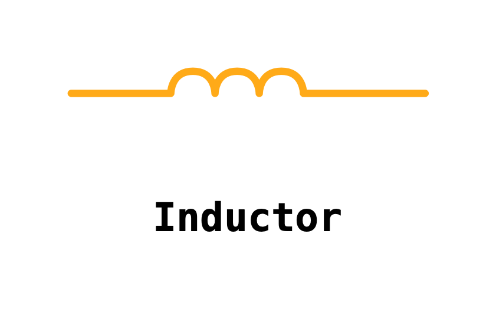

{:class="cover"}

In our previous lessons, we've likened an inductor to a water turbine in a river that stores energy in its spinning motion. In this lesson, we'll learn more about inductors: what they are, how they work, their various types, and their uses in electronic circuits.

---

## What are Inductors?

Inductors are passive electronic components that store energy in a magnetic field when electric current flows through them. If you've ever seen a metal coil in an electronic device, that's likely an inductor. Think of them as a type of energy reservoir, similar to a flywheel in mechanical systems.

---

## Schematic Symbol

{:class="img-fluid w-50"}

Inductors are depicted using schematic symbols in circuit diagrams.  The electrical symbol for an inductor, often used in circuit diagrams, typically consists of several curved lines or a series of loops or coils, which represent the coiled wire used in the construction of the inductor.

---

## Function of Inductors

Inductors serve several purposes in electronic circuits:

- **Energy Storage**: Inductors store electrical energy in a magnetic field, just like a flywheel stores mechanical energy.

- **Filtering**: Inductors can filter out high-frequency signals in electronic circuits, much like a net that allows small fish to pass through but stops the larger ones.

- **Timing**: In combination with capacitors, inductors can create timing circuits.

---

## Different Types of Inductors

Like resistors and capacitors, inductors come in various types, including:

- **Air-core Inductors**: These are simple inductors made by coiling a wire. They're often used in high-frequency applications.

- **Iron-core Inductors**: These inductors use an iron core to increase the inductance. They're often used in power applications.

- **Ferrite-core Inductors**: These inductors use a ferrite core for even higher inductance and are used in a wide variety of applications.

---

## Using Inductors in Electronic Circuits

Inductors can be used in many ways in electronic circuits, including:

- **Filters**: Inductors are used in electronic filters to remove high-frequency noise from signals.

- **Power Supplies**: In combination with capacitors, inductors are used in power supplies to smooth out voltage and provide a constant output.

- **Transformers**: When two inductors are placed near each other, they can form a transformer, which is used to increase or decrease voltage levels in a circuit.

Inductors are fundamental components in electronic circuits, especially in power supplies and radio frequency applications. Understanding them is a crucial step in learning electronics.

---
