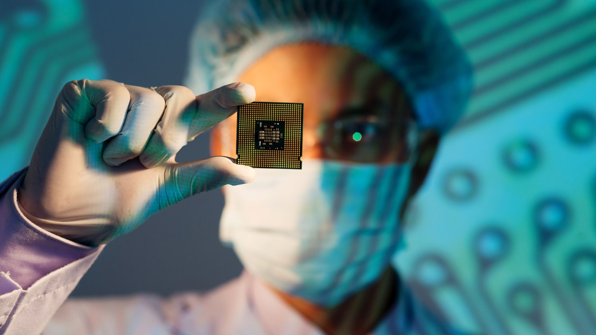

{:class="cover"}

---

## What are Semiconductors?

Semiconductors are materials that sit on the boundary between conductors and insulators in terms of resistivity. Their magic lies in their ability to control the flow of electricity, making them crucial for tasks like amplification and switching in electronic circuits.

{:class="img-fluid w-50"}

---

## Function of Semiconductors

Semiconductors act as the foundation for a myriad of components in electronic circuits:

- **Diodes**: Functioning like one-way streets, diodes permit current flow in one direction while obstructing it in the opposite direction. This property finds uses in applications such as power supply rectification and signal demodulation.
- **Transistors**: Capable of amplifying a minor input signal into a significantly larger output signal, transistors form the cornerstone of modern digital circuits.
- **Integrated Circuits (ICs)**: An IC represents a set of electronic circuits integrated on a small semiconductor material chip. This facilitates the construction of complex electronic functions in a compact, reliable, and cost-effective package.

{:class="img-fluid w-50"}

---

## The Magic Ingredient: Doping

Semiconductors' unique behavior arises from a process called "doping", wherein impurities are added to the semiconductor material. Doping can create an excess of free charge carriers (n-type) or a deficiency (p-type), thereby influencing the conductivity of the material. This ability to control and manipulate the charge flow is at the heart of semiconductor devices.

---

## Types of Semiconductors

Semiconductor devices, tailored for specific applications, come in an assortment of types:

- **Silicon Semiconductors**: Owing to its abundant availability and excellent semiconductor properties, silicon is the most widely used material in semiconductors.
- **Germanium Semiconductors**: While less common today, germanium found use in the early semiconductor industry and continues to be used in some high-frequency applications.
- **Compound Semiconductors**: Composed of two or more elements, examples include gallium arsenide (GaAs) for high-frequency and high-power applications, and gallium nitride (GaN) for LED technology.

{:class="img-fluid w-50"}

---

## Semiconductors at Work

Semiconductors serve a multitude of roles in electronic circuits:

- **Amplification**: Semiconductors serve in amplifiers to escalate the amplitude of a signal.
- **Switching**: In digital circuits, semiconductors function as ultra-fast switches.
- **Signal Processing**: Semiconductor devices like diodes and transistors can modify signals in various ways, altering aspects like amplitude, frequency, or waveform.

{:class="img-fluid w-50"}

Semiconductors truly epitomize the wizardry of electronics. By understanding their workings, you unlock the potential to construct intricate electronic devices from elementary building blocks. Keep experimenting and stay curious as we continue to navigate through the fascinating world of electronics!

---
