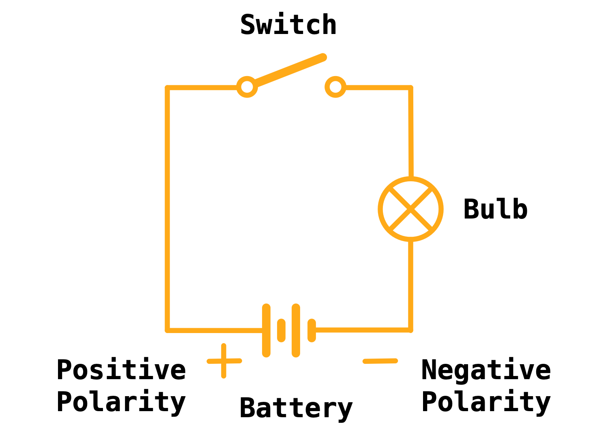
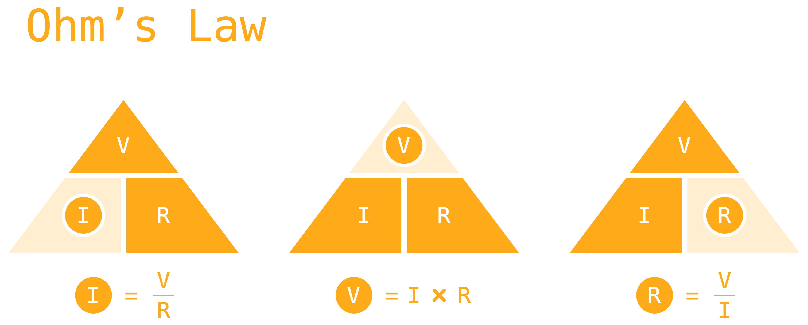

Just as we've been familiarizing ourselves with the individual components of electronics – akin to studying individual players in a sports team – it's time to understand how these players synergize, culminating in an electronic circuit. In this lesson, we delve into fundamental principles such as series and parallel circuits, electric potential, Ohm's Law, and Kirchhoff's Laws.

---

## Electric Potential: The Driving Force

Before we explore the dynamics of electronic circuits, it's vital to understand electric potential or voltage. It's the force that propels the electric charge around the circuit, similar to the way gravity pulls a ball down a slope. The higher the voltage, the stronger the push, driving more current through a circuit for a given resistance.

{:class="img-fluid w-50"}

---

## Series and Parallel Circuits: The Game Formations

In the realm of electronics, components can align in series or parallel formations, akin to players positioning in a sports game:

- **Series Circuit**: In a series circuit, components join end-to-end, creating a singular path for the electric current to traverse. A failing component disrupts the entire circuit – much like a player fumbling the ball in a series pass halts the play.
- **Parallel Circuit**: In contrast, a parallel circuit allows components to connect across each other, carving multiple routes for the current. A malfunctioning component doesn't halt the entire circuit as current finds alternate paths – similar to how the game continues even if one player misses a pass in a parallel arrangement.

---

## Ohm's Law: The Game Rules

Ohm's Law lays the fundamental framework in electronics, outlining the interplay between voltage (V), current (I), and resistance (R) in a circuit. Comparable to the rules directing the players' behavior in sports, Ohm's Law states that the current coursing through a circuit is directly proportional to the voltage and inversely proportional to the resistance – captured in the equation V = IR.

{:class="img-fluid w-75"}

---

## Kirchhoff's Laws: The Playbook

Kirchhoff's Laws constitute two governing principles dealing with charge and energy conservation in electrical circuits:

- **Kirchhoff's Current Law (KCL)**: KCL asserts that the total current infiltrating a junction or node in a circuit equates to the total current exiting the same junction. Consider a busy intersection: the sum of vehicles entering must equal those leaving, accounting for parked vehicles.
- **Kirchhoff's Voltage Law (KVL)**: According to KVL, the sum of voltages around any closed loop in a circuit must zero out. Think of it as a scenic trail: if you start and finish at the same spot, your net elevation change is zero, even if you've traversed hills and valleys on your journey.

By grasping these fundamental principles, you equip yourself to analyze, comprehend, and design electronic circuits. Much like mastering the rules, tactics, and strategies of a sport, you're gearing up to become a proficient electronic circuit designer.

---
