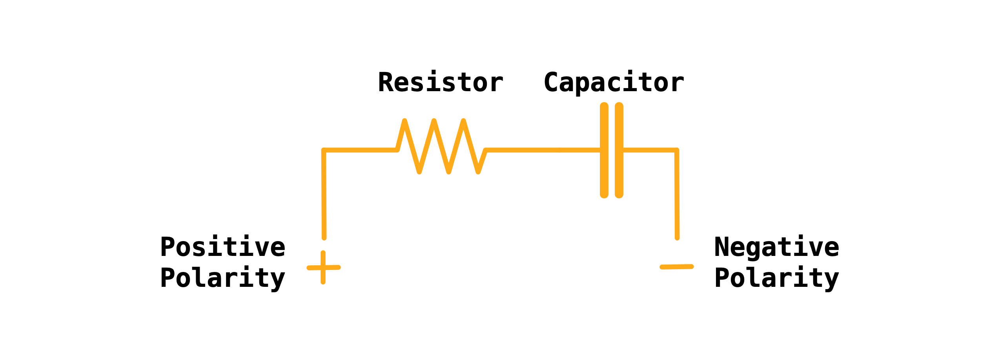

Having acquainted ourselves with the fundamentals of electronic circuits, we are prepared to explore specific circuit types. Our focus in this lesson lies with RC circuits, a combination of resistors and capacitors, which behave akin to a timing mechanism, delaying signal transmission.

## What are RC Circuits?

An `RC` circuit, shorthand for `Resistor-Capacitor` circuit, is a simple electrical circuit comprising a resistor (R) and a capacitor (C). The resistor regulates the rate of charge flow, or current, in the circuit, while the capacitor stores this charge, similar to a faucet (resistor) controlling the water flow rate into a bucket (capacitor).

{:class="img-fluid w-75"}

## Characteristics of RC Circuits

RC circuits demonstrate distinctive properties:

- **Charging and Discharging**: When a voltage is applied to an RC circuit, the capacitor charges up progressively through the resistor, mimicking the slow filling of a bucket with water. Upon voltage removal, the capacitor discharges, equivalent to emptying the bucket.

- **Time Constant**: The RC circuit's time constant, the product of the resistance and capacitance (T=RC), dictates the pace of the capacitor's charging or discharging. A larger time constant results in a slower process, akin to a larger bucket requiring more time to fill or empty.

## Practical Applications of RC Circuits

RC circuits find ubiquitous application in a multitude of areas:

- **Signal Filtering**: RC circuits can filter out high-frequency signals in electronic systems, permitting only the slower, lower-frequency signals to pass through, much like a coffee filter allowing the liquid to pass but blocking the grounds.

- **Timing and Control**: RC circuits can create time delays in electronic circuits, operating similar to a stopwatch or timer.

- **Coupling and Decoupling**: In amplifier stages, RC circuits can provide coupling, facilitating the passage of AC signals while obstructing DC, like a doorman allowing only certain guests to enter.

Gaining an understanding of RC circuits equips us with the ability to design circuits with specific timing and filtering properties. This capacity grants us control over signal processing in our electronic devices, thereby expanding our electronics toolset.

---
