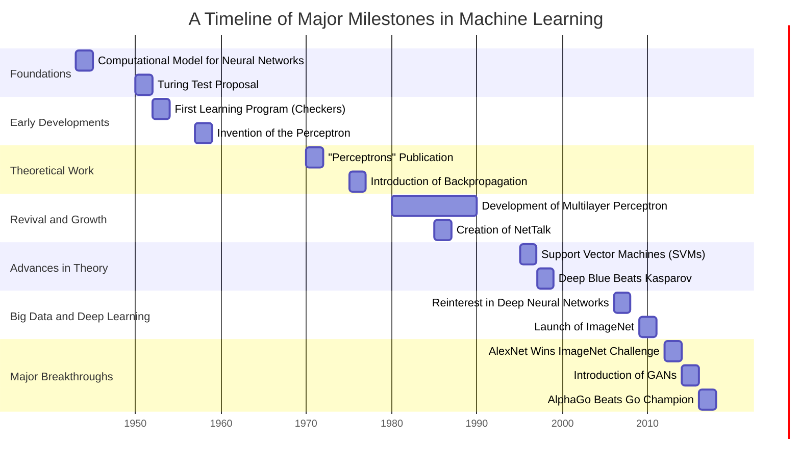

```mermaid
gantt
    title A Timeline of Major Milestones in Machine Learning
    dateFormat YYYY-MM-DD
    axisFormat %Y

    section Foundations
    Computational Model for Neural Networks :1943-01-01, 1944-12-31
    Turing Test Proposal :1950-01-01, 1951-12-31

    section Early Developments
    First Learning Program (Checkers) :1952-01-01, 1953-12-31
    Invention of the Perceptron :1957-01-01, 1958-12-31

    section Theoretical Work
    "Perceptrons" Publication :1970-01-01, 1971-12-31
    Introduction of Backpropagation :1975-01-01, 1976-12-31

    section Revival and Growth
    Development of Multilayer Perceptron :1980-01-01, 1989-12-31
    Creation of NetTalk :1985-01-01, 1986-12-31

    section Advances in Theory
    Support Vector Machines (SVMs) :1995-01-01, 1996-12-31
    Deep Blue Beats Kasparov :1997-01-01, 1998-12-31

    section Big Data and Deep Learning
    Reinterest in Deep Neural Networks :2006-01-01, 2007-12-31
    Launch of ImageNet :2009-01-01, 2010-12-31

    section Major Breakthroughs
    AlexNet Wins ImageNet Challenge :2012-01-01, 2013-12-31
    Introduction of GANs :2014-01-01, 2015-12-31
    AlphaGo Beats Go Champion :2016-01-01, 2017-12-31
```