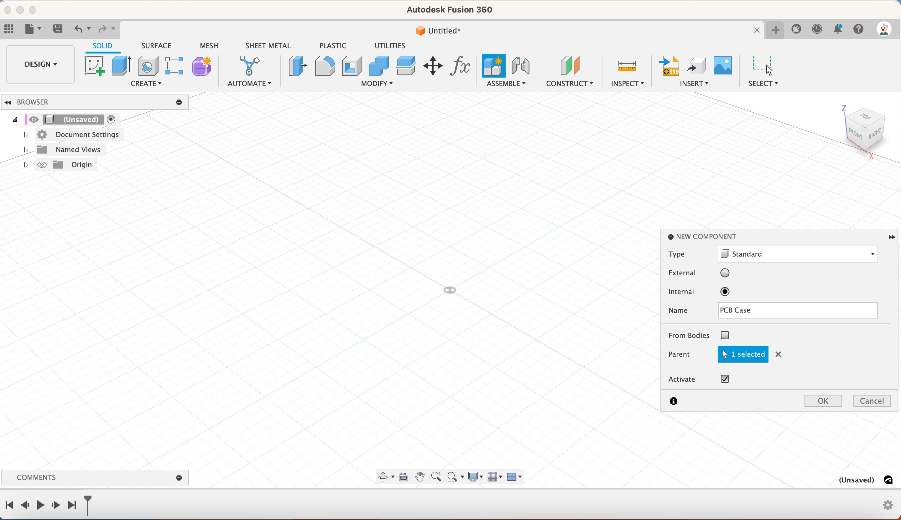
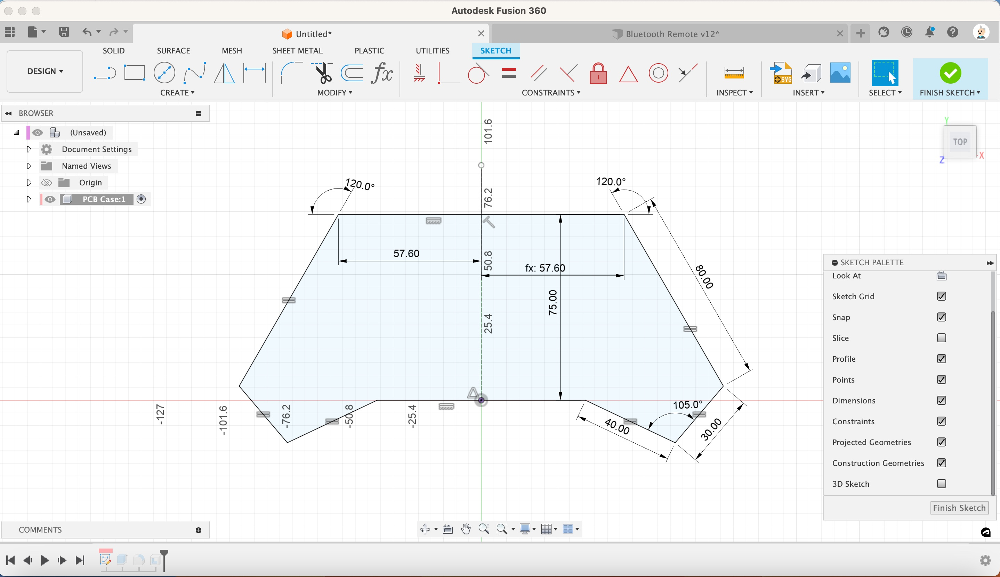

1. Circuit Sketch

    [{:class="img-fluid w-05 shadow-lg rounded-3"}](assets/pcb02.jpg)

1. Create the controller outline

    [{:class="img-fluid w-05 shadow-lg rounded-3"}](assets/pcb03.jpg)

---
