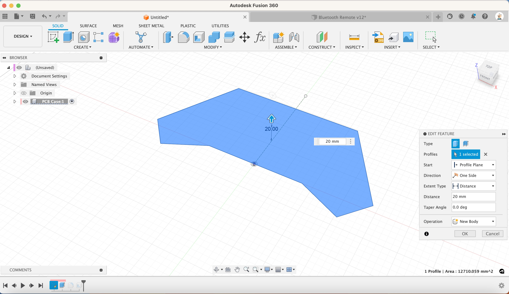
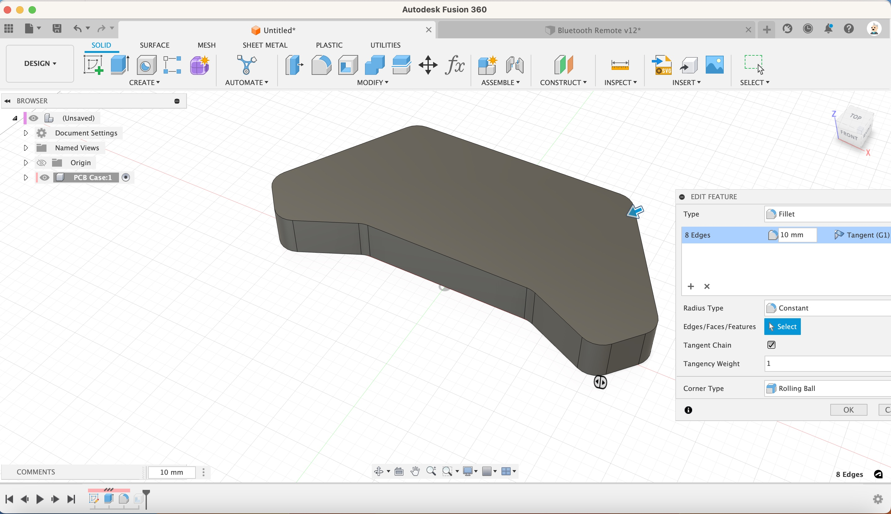
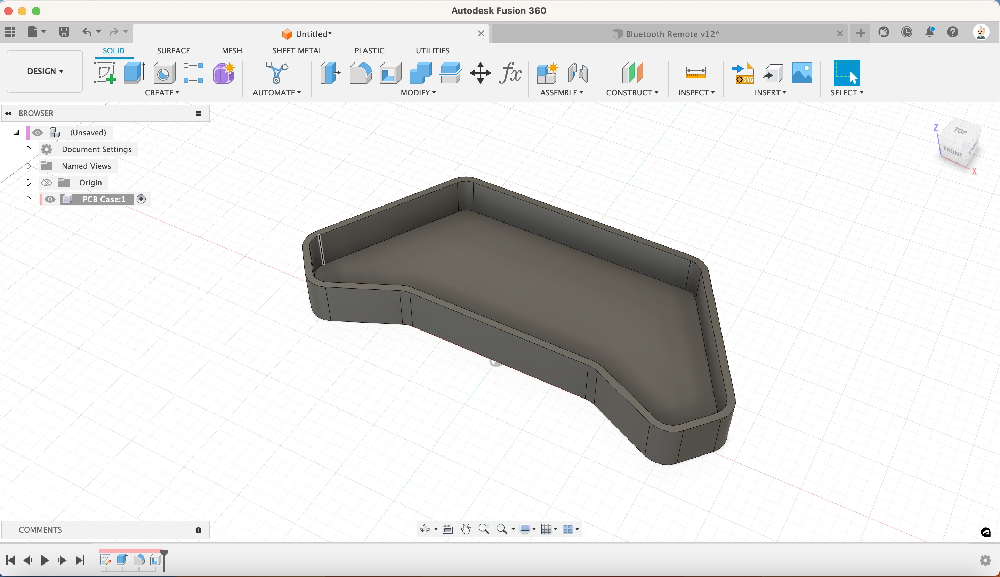

1. Extrude 20mm

[{:class="img-fluid w-05 shadow-lg rounded-3"}](assets/pcb04.jpg)

1. Add a 10mm fillet to each edge

[{:class="img-fluid w-05 shadow-lg rounded-3"}](assets/pcb05.jpg)

1. Create a Shell 3mm from the top face

[{:class="img-fluid w-05 shadow-lg rounded-3"}](assets/pcb06.jpg)

---
