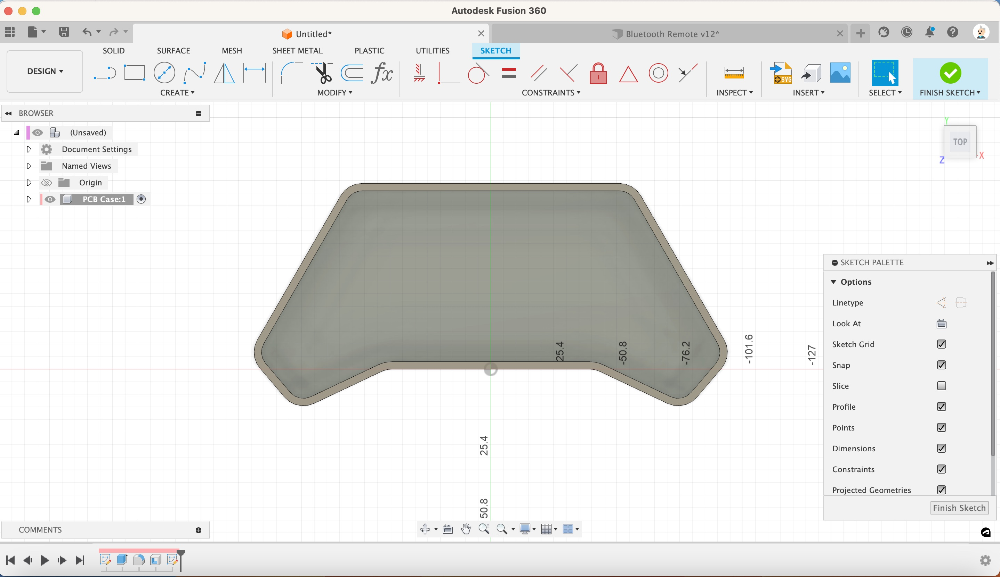
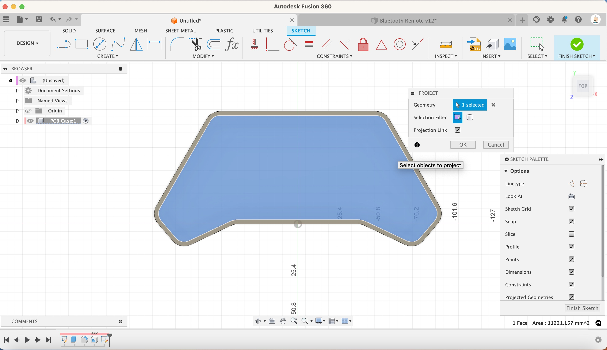
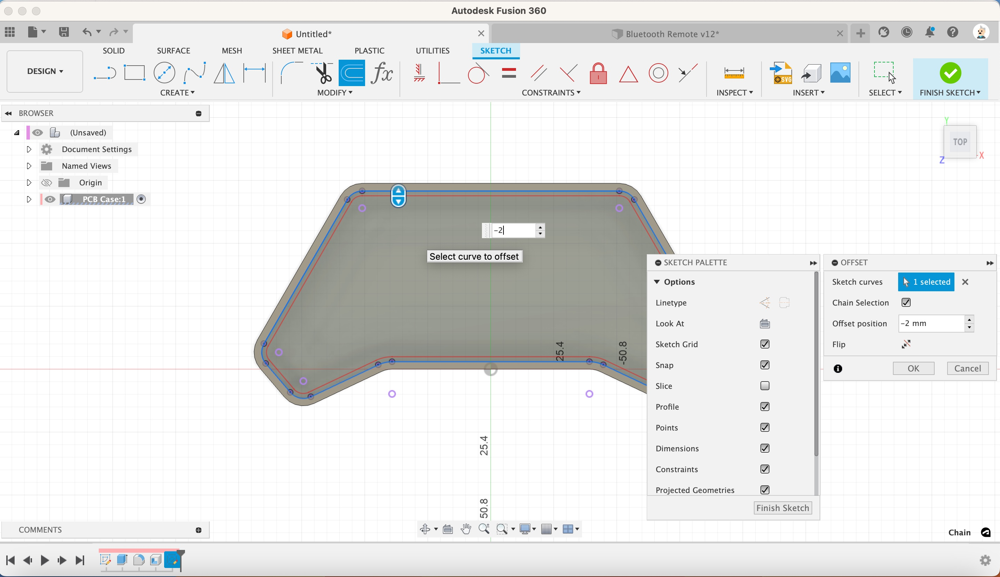

1. Select the inner face and create a new sketch

[{:class="img-fluid w-05 shadow-lg rounded-3"}](assets/pcb07.jpg)

1. Project geometry (press P) and select the inner outline of the case

[{:class="img-fluid w-05 shadow-lg rounded-3"}](assets/pcb08.jpg)

1. Create an Offset by selecting the projected geometry and give it a -2mm offset.

[{:class="img-fluid w-05 shadow-lg rounded-3"}](assets/pcb09.jpg)

1. Click Finish the Sketch

---
