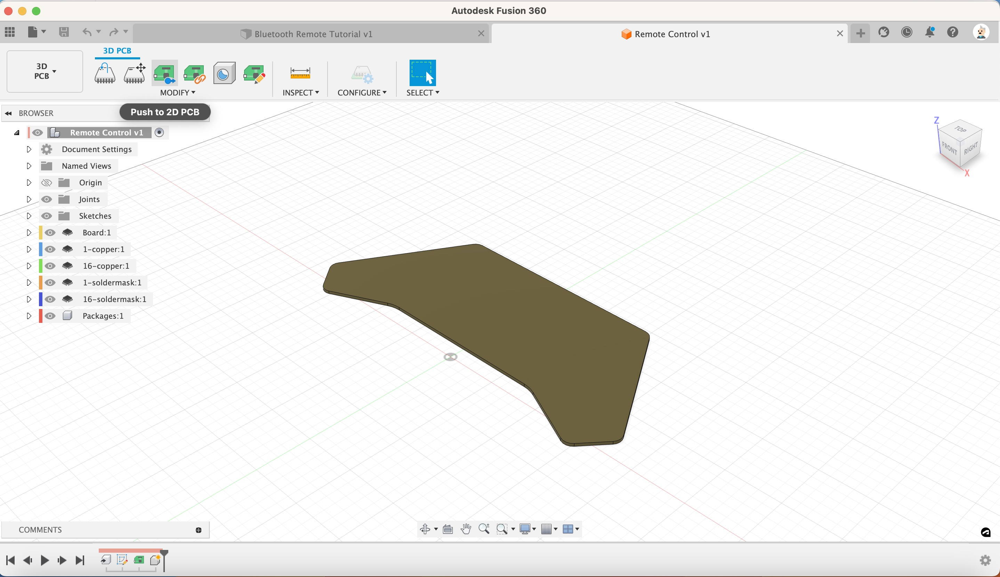
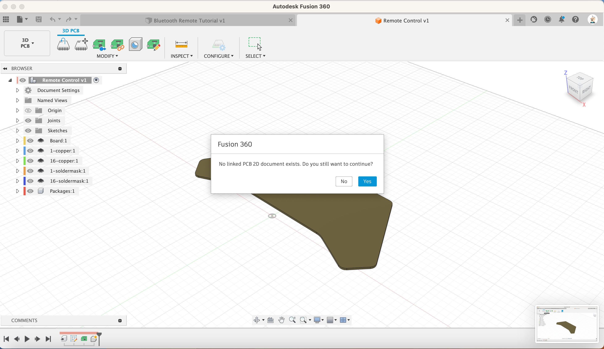

1. Click Push to 2D PCB & Click yes when asked to create a new PCB

   [{:class="img-fluid w-05 shadow-lg rounded-3"}](assets/pcb13.jpg)

   [{:class="img-fluid w-05 shadow-lg rounded-3"}](assets/pcb14.jpg)

1. We now need to create a new blank Electronic Design and link it to this 2D PCB Board file

---
