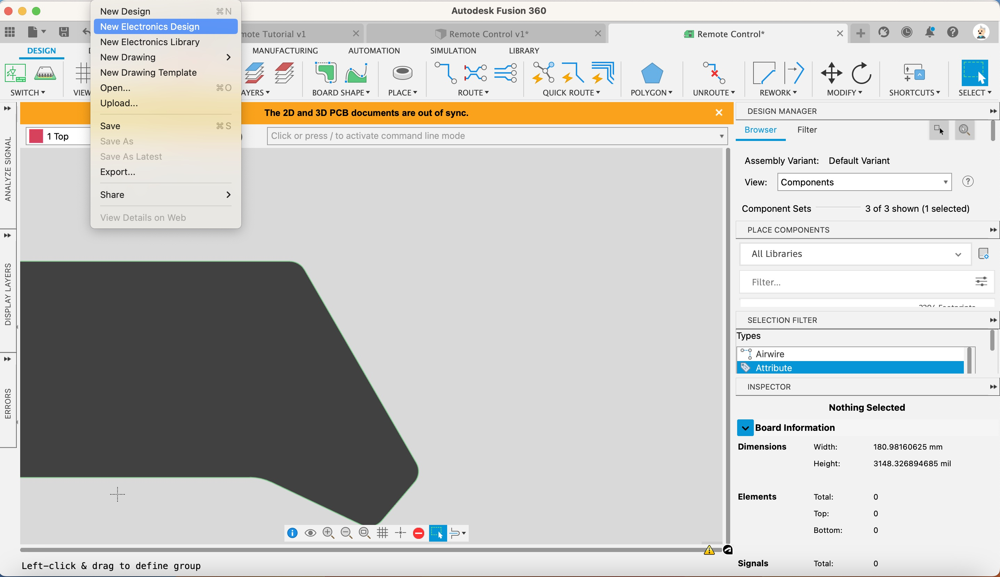
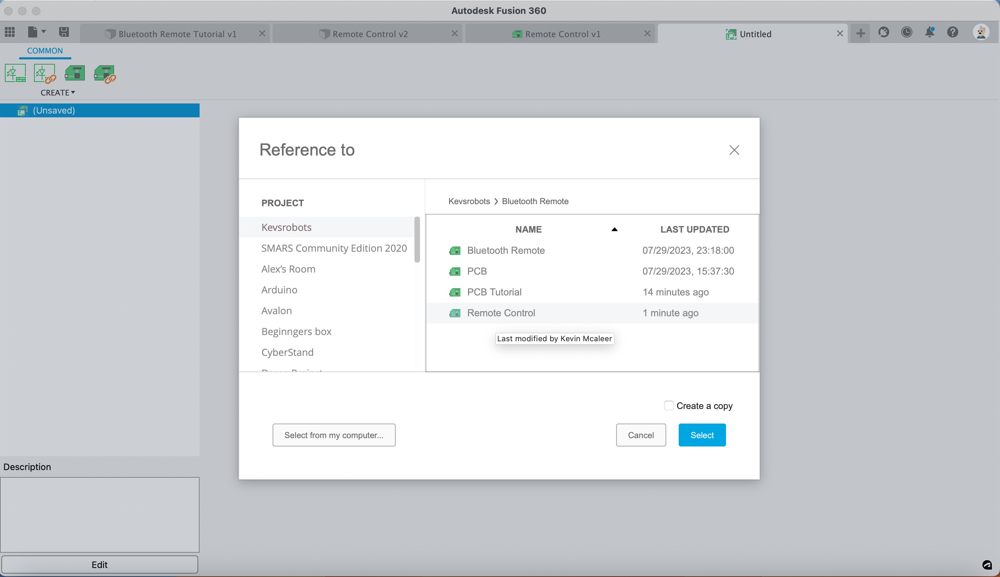
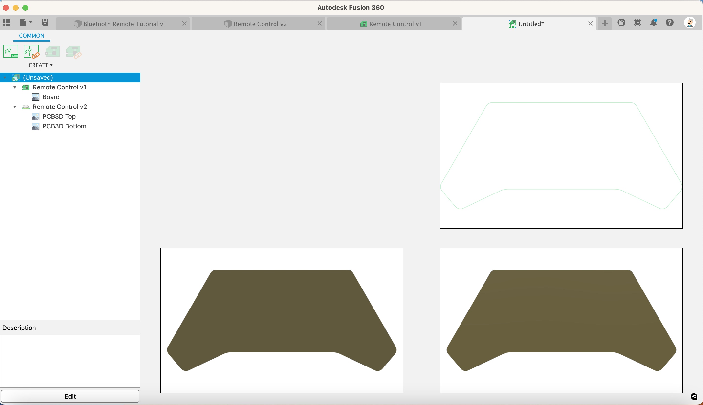
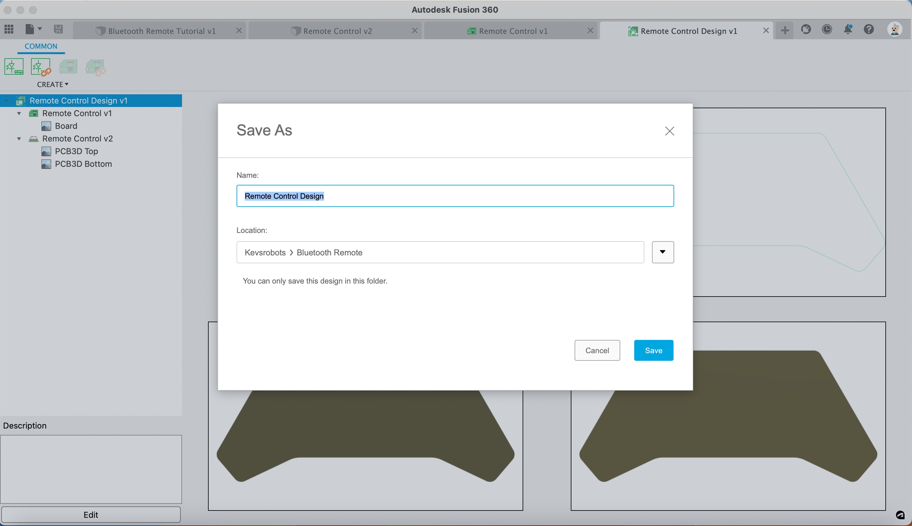

1. Click Save and call it Remote Control

1. Click File-> New Electronics Design

    [{:class="img-fluid w-05 shadow-lg rounded-3"}](assets/pcb15.jpg)

1. Click Reference PCB Design

1. Click the `Remote Control` design from the Reference to window, then click Select

    [{:class="img-fluid w-05 shadow-lg rounded-3"}](assets/pcb16.jpg)

1. Click back on the Untitled Tab and Save it as Remote Control Design

    [{:class="img-fluid w-05 shadow-lg rounded-3"}](assets/pcb17.jpg)

    [{:class="img-fluid w-05 shadow-lg rounded-3"}](assets/pcb18.jpg)

---
