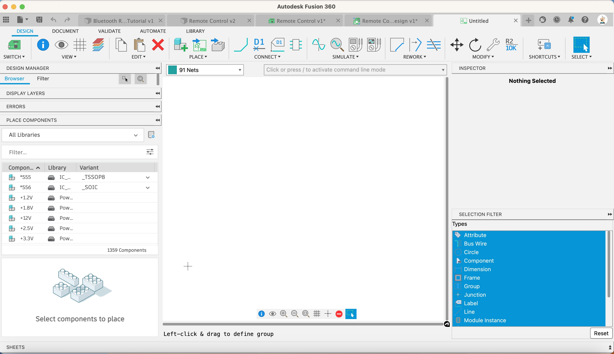

1. Click on New Schematic

    [{:class="img-fluid w-05 shadow-lg rounded-3"}](assets/pcb19.jpg)

---

This interface looks a bit overwhelming at first, buts it’s not too bad once we start to use it.

Next we are going to place the components we need onto the schematic.

Fusion is really clever in that each component has a schematic symbol, 2d pcb model and 3d model associated with it. Updating one of the three models will update the rest, intelligently.

---
