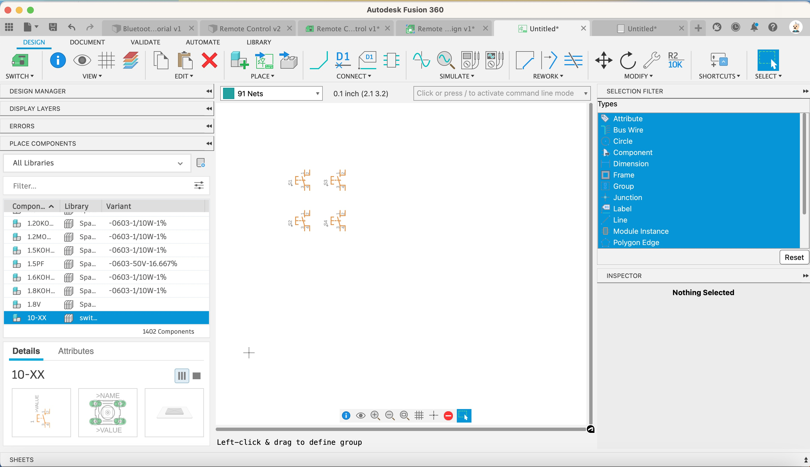
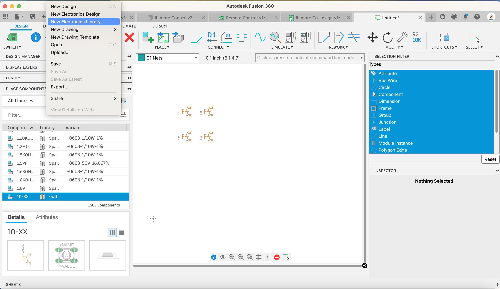

We want to place a Raspberry Pi Pico W, however there isn’t a component for that, yet.

Lets create it:

1. Click on File, New Electronics Library

    [{:class="img-fluid w-05 shadow-lg rounded-3"}](assets/pcb22.jpg)

    [{:class="img-fluid w-05 shadow-lg rounded-3"}](assets/pcb23.jpg)

---
