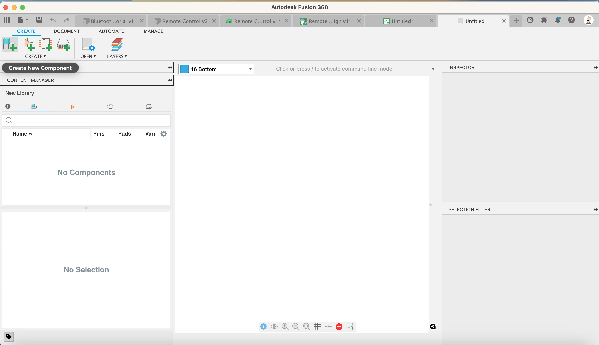
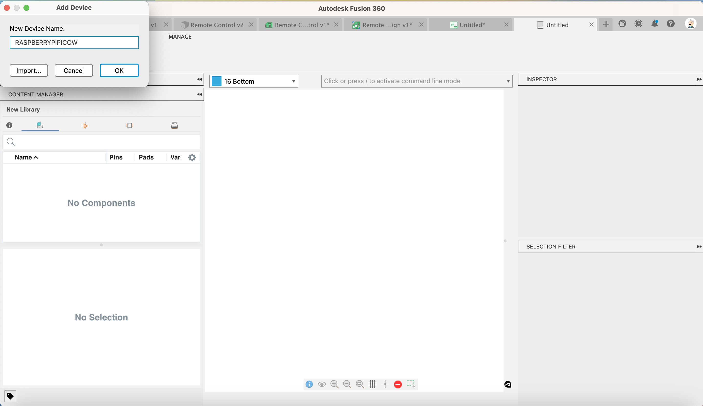
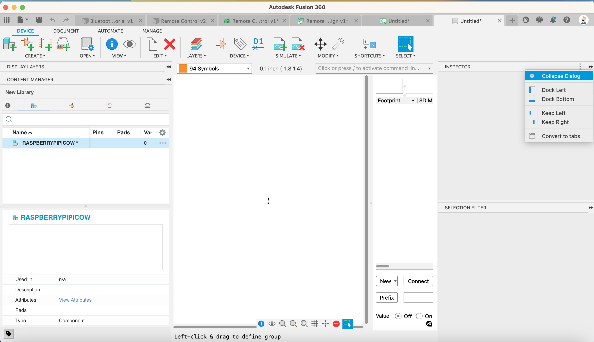

To build a component we need to create a number of steps:

1. Create the Component
1. Create the symbol
1. Create the footprint
1. Create the 3d model (or link it to an exiting one)

---

Lets start by creating a new Component

1. Click Create new component

    [{:class="img-fluid w-05 shadow-lg rounded-3"}](assets/pcb24.jpg)

1. Name it Raspberry Pi Pico W

    [{:class="img-fluid w-05 shadow-lg rounded-3"}](assets/pcb25.jpg)

   Next lets collapse any open inspectors for more room

1. Click Collapse Dialog

    [{:class="img-fluid w-05 shadow-lg rounded-3"}](assets/pcb26.jpg)

---
