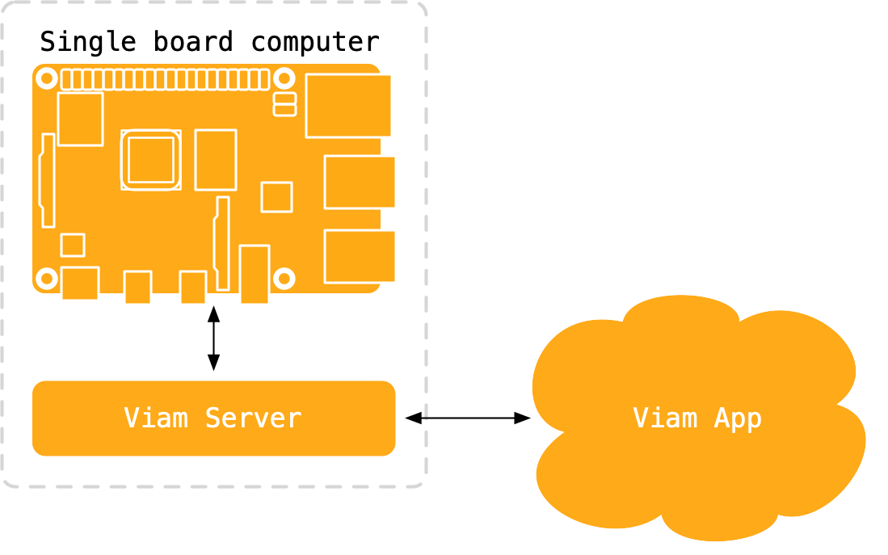
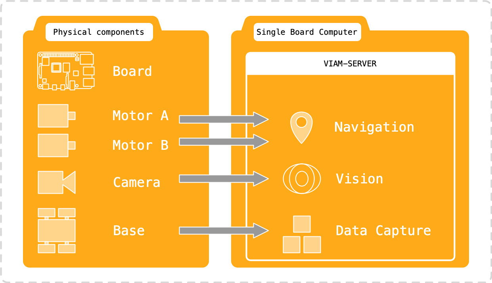

{:class="cover"}

## What does Viam do?

Viam helps you build robots by taking care of the basics such as controlling motor movement, connecting sensors, and cameras. It can also help you do more advanced robotics such as machine learning, computer vision including object detection and classification, and complex navigation.

It has a number of software components that work together to enable you to build robots quickly and without programming.

- `viam-server`: A local server component
- `viam-app`: A Cloud-based interface

{:class="img-fluid w-50"}

Viam also represents phyiscal components in software, to enable you to quickly build and configure your robot.

{:class="img-fluid w-50"}

The easiest way to familiarise yourself with Viam is to give it a [Try](https://docs.viam.com/try-viam/).

---
