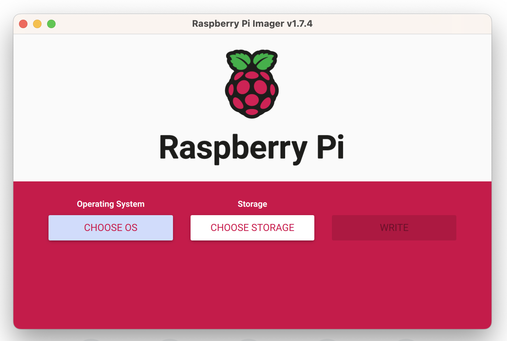
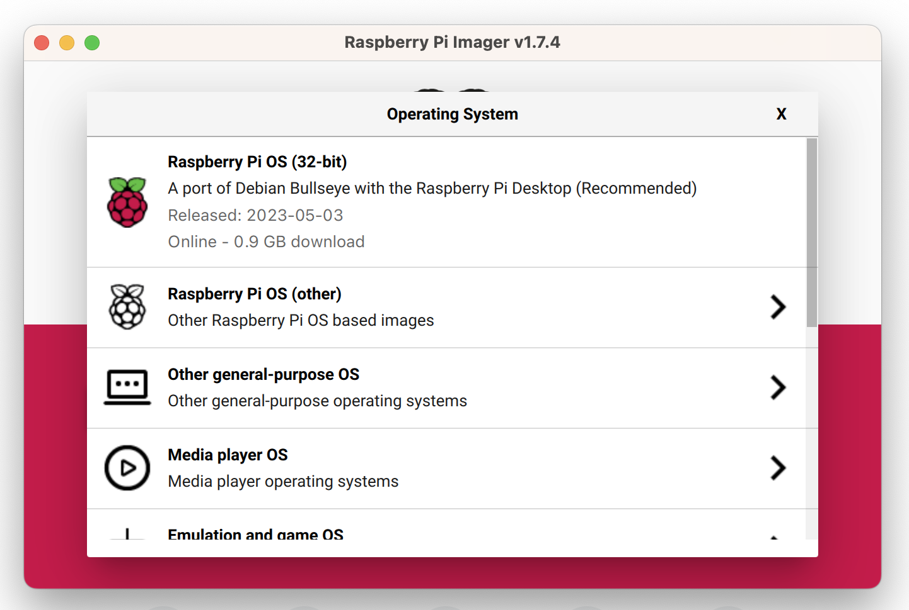
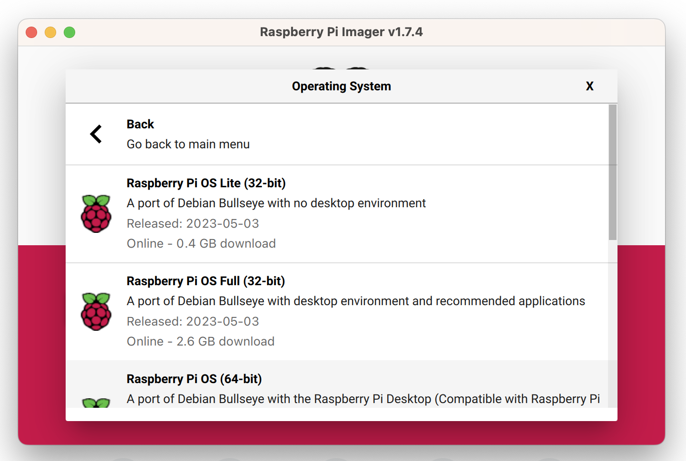
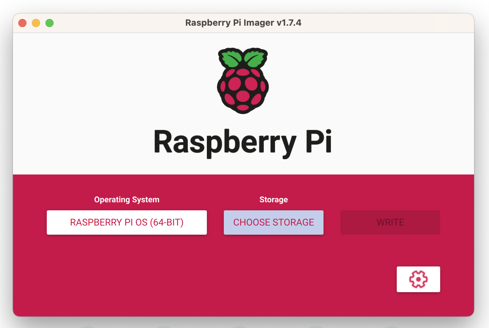
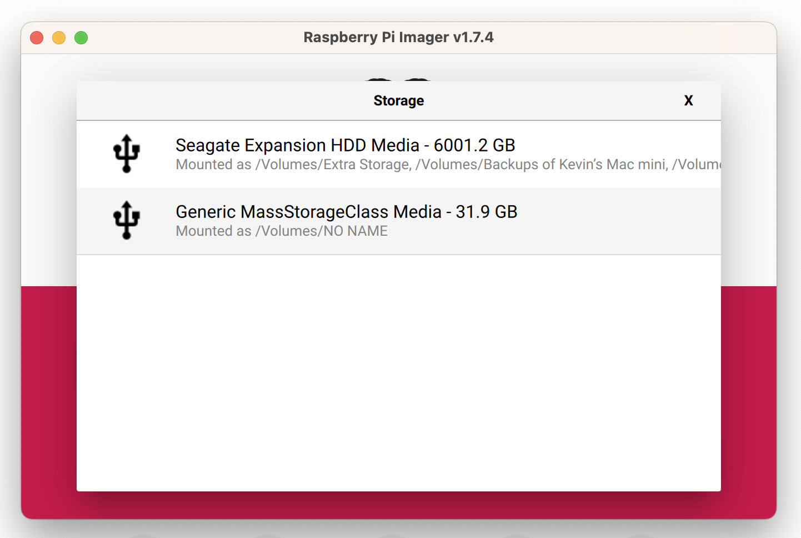
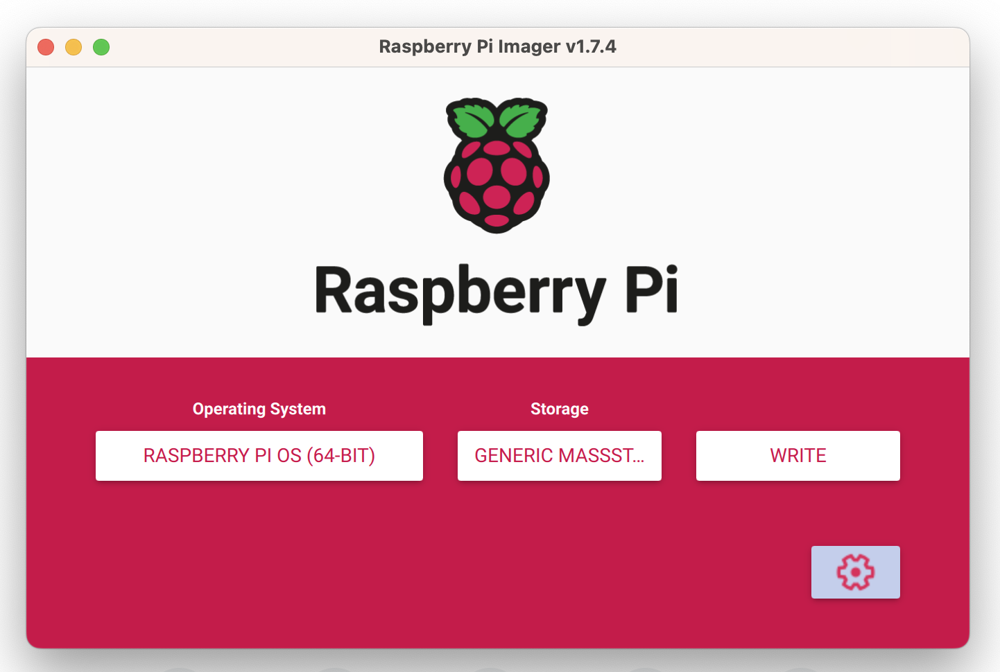

## Create an Account and Add your first robot 

1. Go to [app.viam.com](https://app.viam.com)
1. Create an account and log in
1. From the `Fleet` menu, Type the name of your robot in the `new robot` textbox and click `Add robot`
1. From the `Setup` tab, make sure the `Mode:` is set to `Linux`, and the Architecture is set to `Aarch64`

---

## Setup your Raspberry Pi

Viam works best on the Raspberry Pi 4, though the Raspberry Pi 3+ is also supported. You will need to install the 64bit version of the Raspberry Pi OS.

1. Download the Raspberry Pi Imager from <https://www.raspberrypi.com/software/>, and launch it
1. Click the `Choose OS` button

    {:class="img-fluid w-50"}

1. Click the `Raspberry Pi OS (other)` option

    {:class="img-fluid w-50"}

1. Click the `Raspberry Pi OS (64-Bit)` option

    {:class="img-fluid w-50"}

1. Click the `Choose Storage` button

    {:class="img-fluid w-50"}

1. Insert your Raspberry Pi SD-card into the reader, then select the option for the SD-card from the list; it usually has the name `generic MassStorageClass Media` with the size in GB of the SD-card you have inserted

    {:class="img-fluid w-50"}
1. Click the little cog icon to set the username, password and wifi details to automatically connect the Raspberry Pi to your network without needed a keyboard, monitor and mouse

    {:class="img-fluid w-50"}

---
