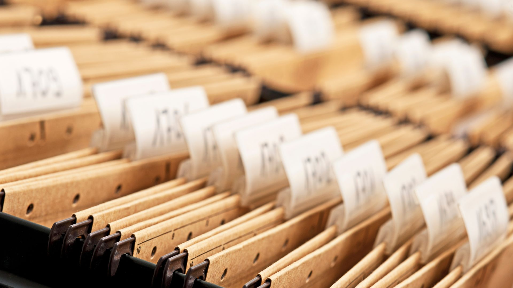

{:class="cover"}

## Overview

Welcome to `Working with Data`. This course is aimed at people new to MicroPython and programming in general, want to use sensors to read in data and then work with that data. It will take you through each concept step by step, provide examples of ***real code*** and explain ***how*** and ***why*** it works.

## Course Content

In this course you will learn:

* What is the diference between data, information, knowledge and wisdom
* Pins & reading values
* How to Read and write files
* Work with lists
* Work with dictionaries
* Work with strings
* Casting and formatting data

---

## Key Results

After you have completed this course you will know how to read and write data to and from files. You will know how to use the Pins on your MicroPython board to reading values. You will use lists and dictionaries to store data, and learn how to manipulate, sort and search for data. You will learn how to use strings of text and maniupulate them in useful ways. Finally you'll learn how to change one format of data into another

---
## What you'll need

To take this course you will need:

* a computer, tablet or phone to read the course material from
* a computer that is capable of connecting to a MicroPython board such as the [Raspberry Pi Pico](https://www.raspberrypi.com)
* a MicroPython board
* a USB cable to connect the computer to the MicroPython board

---

## How the course works

New Keywords are introduced and explained, and are highlighted to help emphasise them. 

For example keywords are highlighed inline with the course text like `this`.

Longer examples of code are hightlighted like this:

```python
print('this is an example')
```

Important notes will be highlighted in sections like the two below:

> ## This is a note
>
> Important notes are hightlighted like this

---

> ## Another aside
>
> Asides are also highlighed in sections, but in an alternative colour
{:.bg-blue}

---
