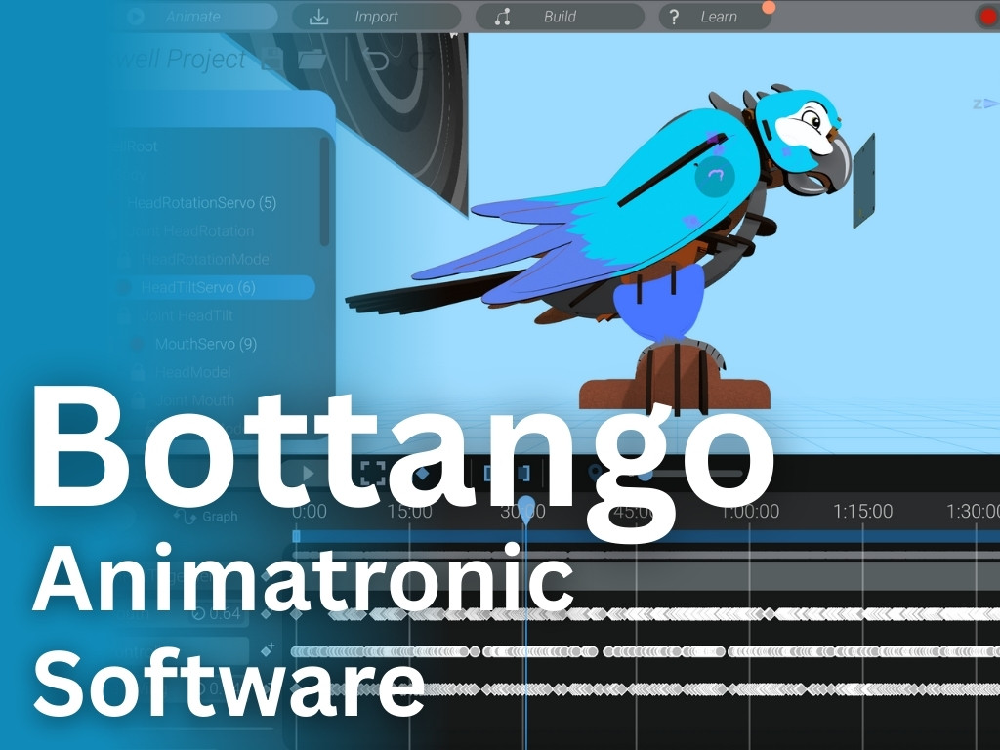

{:class="cover"}

---

## Overview

`Bottango` is a powerful and intuitive motion engine designed to let you **animate servos and other actuators** without writing any code. Whether you're creating a robotic puppet, an animatronic character, or simply want to add motion to your DIY project, Bottango makes it easy to bring your ideas to life.

Bottango (<https://bottango.com>) is a free application for Windows and Mac that connects to microcontroller boards like **Arduino Uno** or **ESP32**. It gives you a timeline-style editor, similar to animation software, where you can create precise servo movements, add events, and even sync animations to music.

Unlike traditional servo control that requires coding, Bottango provides a **drag-and-drop interface** and real-time playback, making it ideal for beginners and advanced makers alike.

---

## Course Content

In this course, you'll explore:

- Installing and configuring Bottango on your computer
- Connecting and setting up microcontroller boards (Arduino, ESP32)
- Wiring servos and understanding power requirements
- Creating smooth motion sequences with the timeline editor
- Using triggers and events for interactive animations
- Syncing servo movements to music and audio
- Controlling animations with gamepads and external inputs
- Building complete animatronic projects from start to finish

---

## Key Results

After completing this course, you'll be able to:

- Set up Bottango with your Arduino or ESP32 board
- Wire and configure servos for precise control
- Create fluid, lifelike animations without writing code
- Build interactive robotic projects with gamepad control
- Sync servo movements to music for performances
- Design and deploy complete animatronic characters

---

## What you'll need

Here's a list of recommended components to follow along with the course:

- A Windows or Mac computer
- A microcontroller (Arduino Uno, Nano, or ESP32)
- 1–3 SG90 or MG90S servos
- USB cable to connect your board
- External power supply (for more than 1 servo)
- Jumper wires and a breadboard (optional)

You'll also need to download Bottango from the official site:

🔗 [Download Bottango](https://bottango.com)

---

## How the course works

Throughout this course, you'll find:

- **Step-by-step instructions** with screenshots and diagrams
- **Real-world examples** showing practical applications
- **Troubleshooting tips** for common issues
- **Hands-on exercises** to practice what you've learned
- **Interactive challenges** to test your skills

Each lesson builds on the previous one, starting with installation and progressing to advanced animation techniques. By the end, you'll have the skills to create your own animatronic projects.

> **Note:** Code blocks and configuration examples will be shown in `monospace font` for easy identification.

---

## Prerequisites

This course assumes basic knowledge of:

- Working with microcontrollers (helpful but not required)
- Basic electronics concepts (servos, power supplies)

No coding experience is required! That's the beauty of Bottango.

---

## What's Next

After completing this course, you might enjoy:

- Building animatronic characters and puppets
- Creating interactive robot projects
- Exploring advanced servo control with MicroPython
- Designing your own custom motion control systems

---

Let's dive in and get your board talking to Bottango!

Next up: [Installing Bottango](01_install.md)

---
