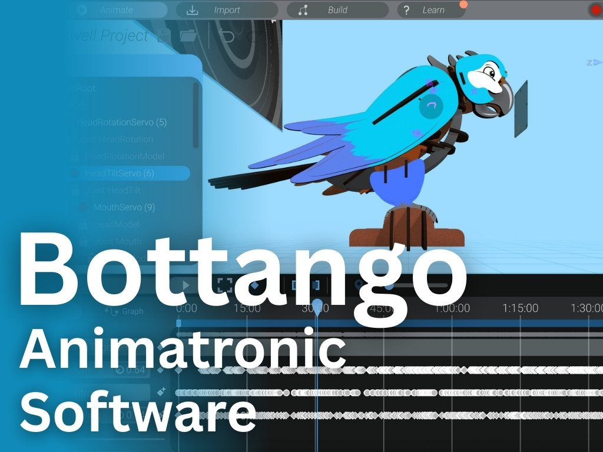

{:class="cover"}

---

`Bottango` is a powerful and intuitive motion engine designed to let you **animate servos and other actuators** without writing any code. Whether you're creating a robotic puppet, an animatronic character, or simply want to add motion to your DIY project, Bottango makes it easy to bring your ideas to life.

---

## 🛠️ What is Bottango?

Bottango (<https://bottango.com>) is a free application for Windows and Mac that connects to microcontroller boards like **Arduino Uno** or **ESP32**. It gives you a timeline-style editor, similar to animation software, where you can create precise servo movements, add events, and even sync animations to music.

Unlike traditional servo control that requires coding, Bottango provides a **drag-and-drop interface** and real-time playback, making it ideal for beginners and advanced makers alike.

---

## ✨ What You’ll Learn

In this course, you’ll learn how to:

- Install and set up Bottango on your computer
- Connect and configure supported microcontroller boards
- Wire up servos to create motion
- Design motion sequences using Bottango’s timeline editor
- Use triggers and external controls like gamepads
- Build interactive or synchronized performances

---

## 🔧 What You’ll Need

Here’s a list of recommended components to follow along with the course:

- A Windows or Mac computer
- A microcontroller (Arduino Uno, Nano, or ESP32)
- 1–3 SG90 or MG90S servos
- USB cable to connect your board
- External power supply (for more than 1 servo)
- Jumper wires and a breadboard (optional)

You’ll also need to download Bottango from the official site:

🔗 [Download Bottango](https://bottango.com)

---

## 🤖 Why Use Bottango?

Traditional servo control often requires you to:

- Write code
- Upload it to the board
- Recompile for every small change

With Bottango, you:

- Design and test motion in real-time
- Create fluid, lifelike movements
- Add interactivity without a single line of code

---

Let's dive in and get your board talking to Bottango!

Next up: [Installing Bottango](02_install.md)

---
