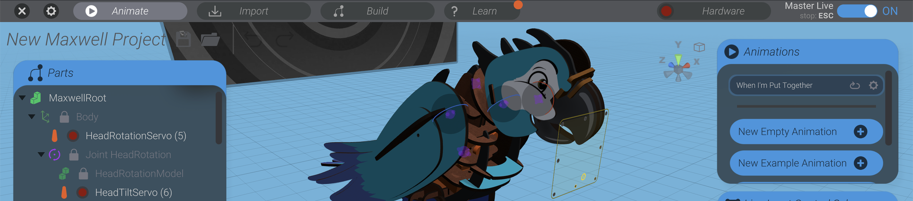

{:class="cover"}

---

Servos are the muscles of your project – they move parts back and forth in response to the motion sequences you create in Bottango. In this lesson, we’ll wire up the servos so they can be controlled by your board.

---

## 🧩 What You'll Need

- 1–3 servo motors (SG90 or MG90S are great)
- Jumper wires (female-to-male or male-to-male depending on your board)
- Optional: Breadboard
- **External power supply** (for more than 1 servo, recommended)

---

## 🔌 Servo Pinout

Most servo motors have **3 wires**:

- **Brown or Black** = GND (Ground)
- **Red** = VCC (Power, usually 5V)
- **Orange or Yellow** = Signal (PWM)

Make sure to check your specific servo's color code.

---

## ⚙️ Connect to Arduino Uno/Nano

| Servo Wire | Arduino Pin |
|------------|-------------|
| GND        | GND         |
| VCC        | 5V          |
| Signal     | D3, D5, D6  |

Use one digital pin per servo for signal. For example:

- Servo 1 → D3  
- Servo 2 → D5  
- Servo 3 → D6

You can connect VCC and GND for all servos to the same 5V and GND pins — but **be careful** not to overload your board.

---

## ⚡ Powering More Than One Servo

The Arduino’s onboard 5V regulator **can only power 1 small servo reliably**.

If you're using multiple servos:

1. Use an external 5V power supply (like a USB power bank or battery pack).
2. Connect servo VCC to the external power **+5V**.
3. Connect **all grounds together** — including the Arduino GND and the external power GND.

> 🛑 **Never power high-current servos directly from the Arduino!**

---

## 🔧 ESP32 Wiring

Most ESP32 dev boards support 3.3V logic but are 5V-tolerant. You can safely connect:

- GND → GND  
- VCC → External 5V (do NOT use 3.3V)  
- Signal → GPIO pins (e.g., D13, D14, D27)

Consult your board’s pinout diagram for available GPIOs.

---

## 🧪 Testing

Once everything is wired:

1. Open Bottango.
2. Select your connected device.
3. Click **Assign Servo** and choose the correct pin.
4. Use the **manual control slider** to test movement.

If your servo moves as expected, you're ready to animate!

---

## Common Issues

**Problem**: Servo doesn't move at all

**Solution**: Check all three connections (GND, VCC, Signal). Verify the servo is plugged into a PWM-capable pin

**Why**: Loose connections or using a non-PWM pin prevents signal transmission

**Problem**: Servo jitters or vibrates

**Solution**:
1. Add external power supply (don't power from Arduino 5V)
2. Ensure all grounds are connected together (common ground)
3. Check for loose wiring connections

**Why**: Insufficient current causes voltage drops, making the servo unstable

**Problem**: Multiple servos work individually but not together

**Solution**: Use an external 5V power supply rated for at least 1A per servo. Connect all grounds together

**Why**: Arduino's onboard regulator can't provide enough current for multiple servos

**Problem**: Servo moves the wrong direction or to wrong positions

**Solution**: Check servo configuration in Bottango - you may need to invert the direction or adjust min/max PWM values

**Why**: Different servo models have different PWM ranges (typical: 544-2400µs, but varies)

**Problem**: ESP32 servo moves erratically

**Solution**: Ensure you're using an ESP32 GPIO that supports PWM (LED PWM channels). Avoid pins used for other functions

**Why**: Some ESP32 pins are reserved for special functions and don't support servo control

**Problem**: Servo makes grinding/buzzing noise

**Solution**: Check if servo is hitting physical limits. Adjust Bottango's servo range settings to prevent overtravel

**Why**: Forcing a servo past its mechanical limits damages gears

---

Next up: [Configuring Bottango and Assigning Servos](04_configure_bottango.md)

---
