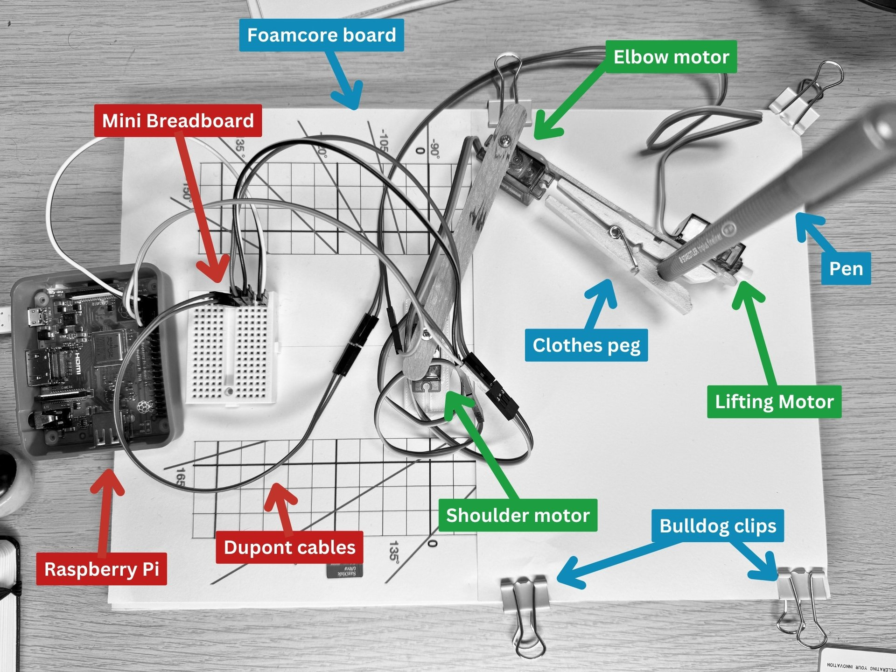
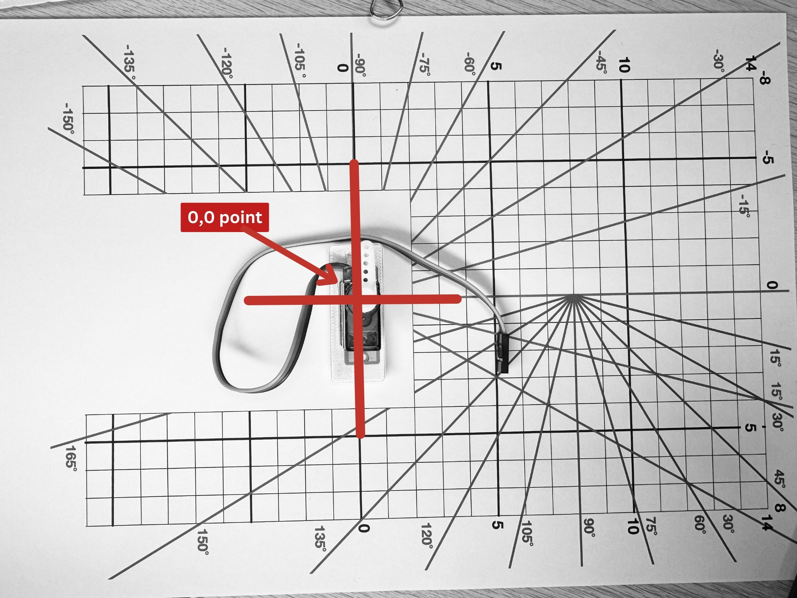
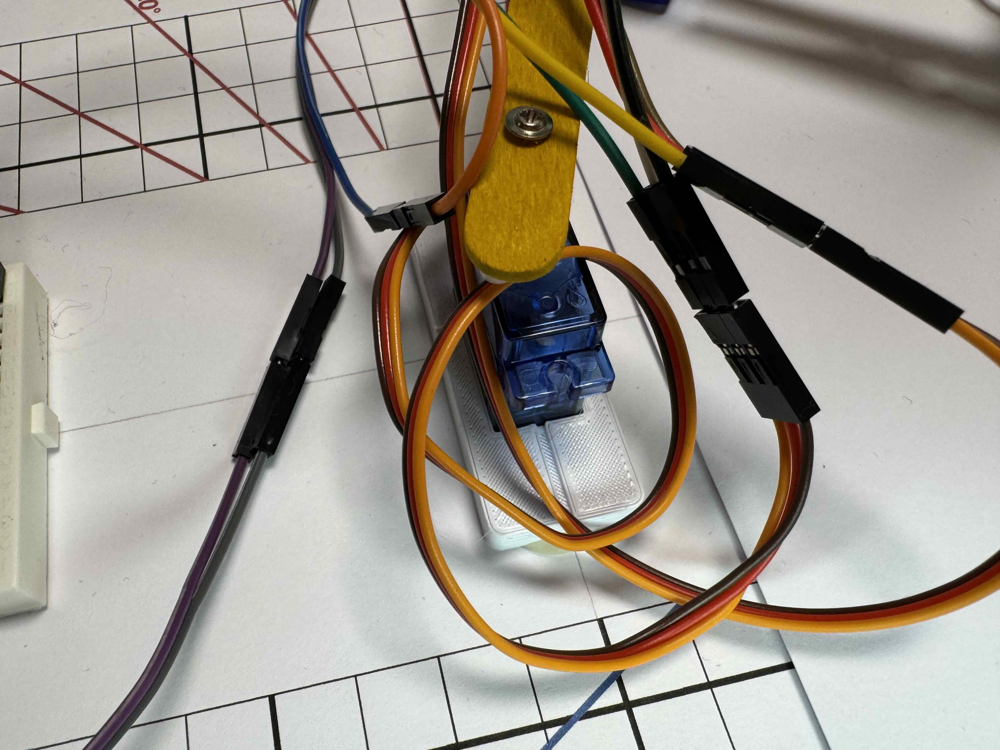
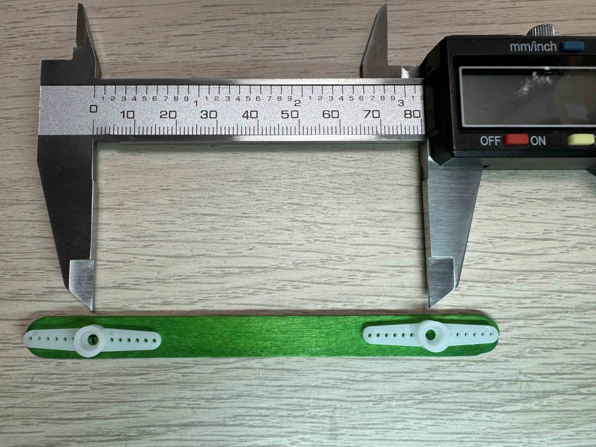
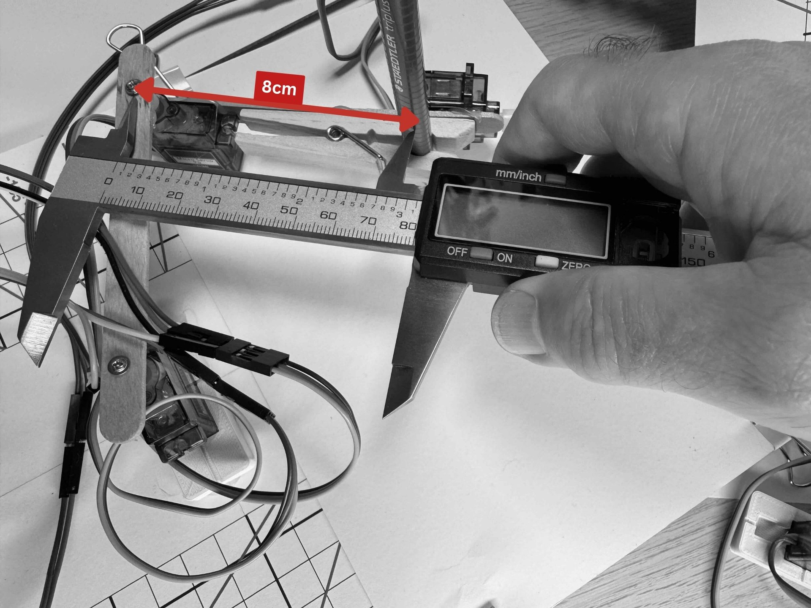
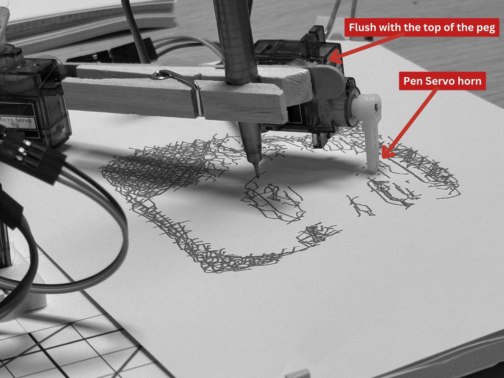

## Assembling the BrachioGraph

> **Note:** Make sure you have all the materials from the introduction before starting. You'll need servos, popsicle sticks, hot glue, foam board, and the other items listed in the "What you'll need" section.

---

{:class="w-100 card-hover card-shadow rounded-3"}

---

## Step 1: Building the Base

1. Take the foam core board and cut it to the desired size for the base, I chose A4 size as the paper I will be using is A5 (A4 cut in half).

1. Print out the [base template](assets/template-grid.pdf) [^1] and stick it to the foam core board using a glue stick.

1. The shoulder servo needs to be lifted slightly (between 4-6mm) above the base to allow the arm to move freely. To do this, cut out a small piece of foam core board and glue it to the base where the shoulder servo will be placed.
  
    You can 3D printed a [small spacer](assets/base.stl) to lift the servo, but you can also use anything you have to hand.

1. Glue the shouler servo to the base using hot glue; the center of the servo should be aligned to the 0,0 point on the grid.

    {:class="w-100 card-hover card-shadow rounded-3"}

    {:class="w-100 card-hover card-shadow rounded-3"}

---

## Step 2: Building the  Inner Arm

1. Mark a line on the center of the popsicle stick, 8cm end to end.

1. Drill a small pilot hole (1-2mm drill bit) on either side of the line; this will enable the servo horn to be securely screwed to the stick.

1. Glue the two servo horns to the popsicle stick, ensuring the center of the horn is aligned with the center of mark the stick.

    {:class="w-100 card-hover card-shadow rounded-3"}

---

## Step 3: Building the Outer arm

1. Attach a servo with hot glue to the other popsicle stick; the servo mountings should be roughly in the center of the stick.

    {:class="w-100 card-hover card-shadow rounded-3"}

1. Attach the clothes peg with hot glue to the end of the outer arm; this will hold the pen; be sure to make the center point of the pen and the center point of the elbow servo are 8cm a part.

1. Attach the pen servo with hot glue to the end of the outer arm. The servo horn should be able to move the pen up and down freely.

    {:class="w-100 card-hover card-shadow rounded-3"}

[^1]: Provided by <https://brachiograph.art>

---

## Common Issues

- **Problem**: Hot glue doesn't hold the servos in place
- **Solution**: Roughen the surfaces with sandpaper before gluing. Apply glue to both surfaces and hold firmly for 30 seconds
- **Why**: Smooth plastic surfaces don't bond well with hot glue without preparation

- **Problem**: The arm lengths aren't exactly 8cm
- **Solution**: Precision matters! Measure carefully from center to center. Use a ruler with mm markings for accuracy
- **Why**: The BrachioGraph library assumes 8cm arms - different lengths will cause drawing inaccuracy

- **Problem**: Servo horn won't attach securely to popsicle stick
- **Solution**: Use small screws through the pilot holes you drilled, plus hot glue. Screws alone or glue alone may not hold under movement
- **Why**: The servo applies torque to the horn - it needs mechanical fastening, not just adhesive

- **Problem**: The foam board base bends or warps
- **Solution**: Use thicker foam board (5mm minimum) or reinforce with a second layer. Keep it flat while gluing
- **Why**: A warped base affects drawing accuracy and servo positioning

- **Problem**: Popsicle sticks crack when drilling
- **Solution**: Use a very small drill bit (1-2mm), drill slowly, and support the stick on scrap wood underneath
- **Why**: Popsicle sticks are thin wood that can split easily if drilled too aggressively

- **Problem**: The clothes peg won't hold the pen firmly
- **Solution**: Try a spring-loaded peg instead of a flat wooden one. You can also wrap tape around the pen for a tighter fit
- **Why**: The pen must be held firmly to maintain consistent contact with the paper

---
