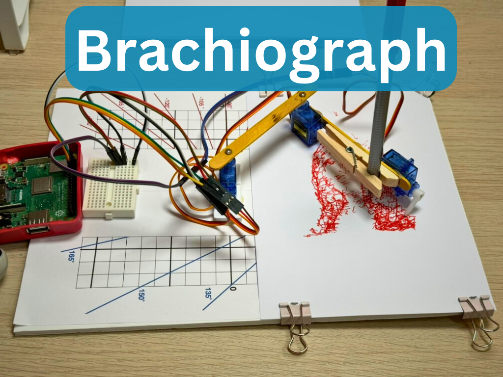

{:class="cover"}

---

A BrachioGraph (from the Greek `Brachio`; *Arm*, and `Graph`; *draw*) is a simple pen plotter that you can build at home using a few simple components. It's a fun project that will help you create robots, and understand more about programming, and electronics. In this tutorial, we'll show you how to build a BrachioGraph from scratch and control it using Python.

---

## What is a BrachioGraph?

A BrachioGraph is a type of robotic arm designed for drawing using a pen or pencil. It is made up of a couple of hobby servos and other household items such as popsicle sticks, hot glue, and a foamcore board. The BrachioGraph is controlled by a microcontroller such as an Arduino or Raspberry Pi, which sends commands to the servos to move the pen in the X and Y directions.

In this tutortial we will use a Raspberry Pi to drive the arm. The Raspberry Pi will run a Python script that sends commands to the servos to move the pen in the X and Y directions. The BrachioGraph can be used to draw simple shapes, write text, or even create intricate designs.

The BrachioGraph Python code is available at <https://github.com/evildmp/brachiograph> and we will walk you through the process of setting up the hardware and software to get your BrachioGraph up and running.

---

Let's get building!

---