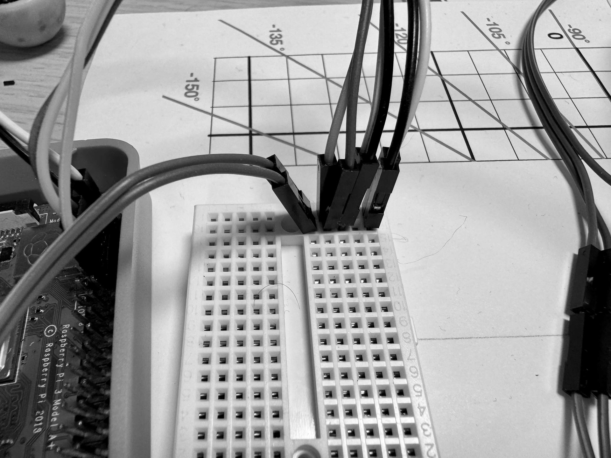
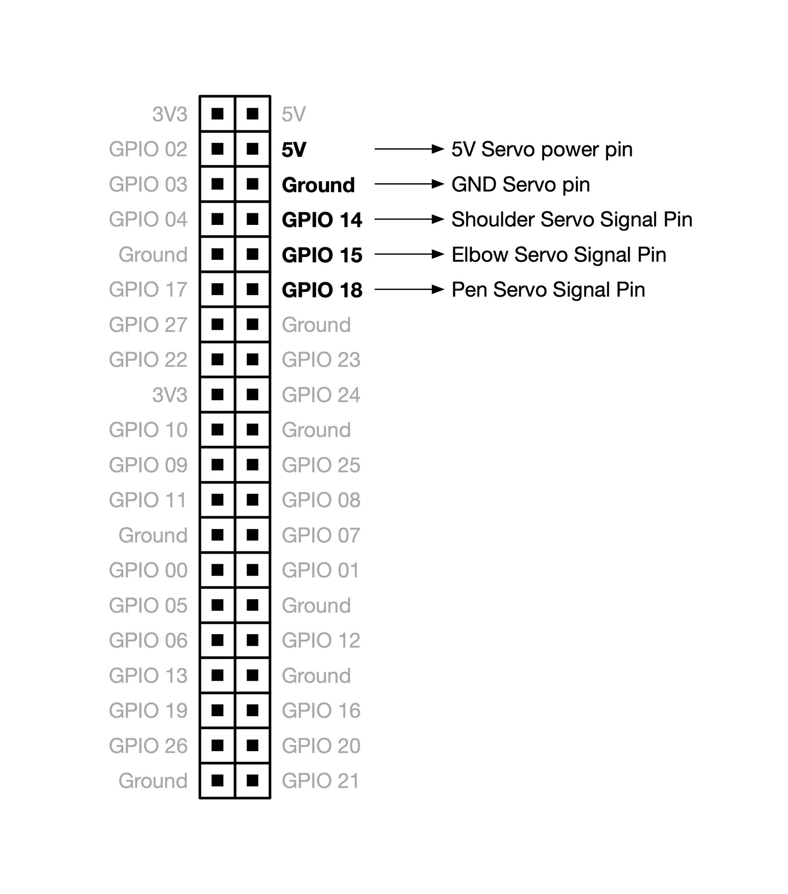
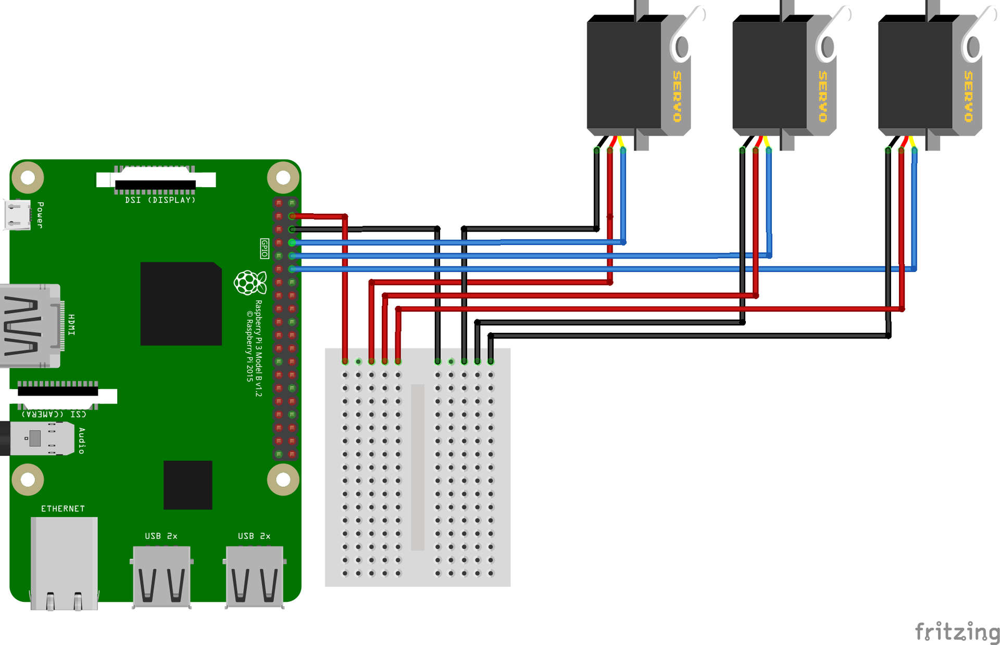
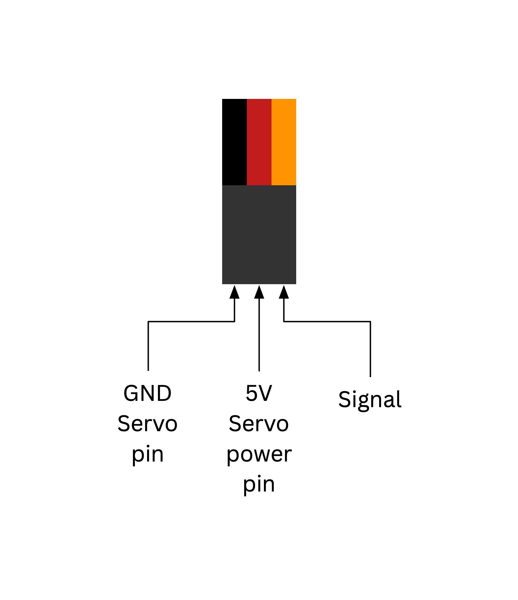

## Wiring up the BrachioGraph

In this lesson, we will learn how to wire up the BrachioGraph plotter using a Raspberry Pi and SG90 servos. The BrachioGraph is a simple pen plotter that can be controlled using Python. By connecting the servos to the Raspberry Pi, we can move the pen in the X and Y directions to create drawings and designs.

{:class="w-100 card-hover card-shadow rounded-3"}

---

## Pinout of the Raspberry Pi

The Raspberry Pi has a set of GPIO (General Purpose Input/Output) pins that can be used to connect external devices such as servos, sensors, and LEDs. The GPIO pins are numbered from 1 to 40 and can be accessed using Python code.

Here is the pinout of the Raspberry Pi 3+:

{:class="w-100 card-hover card-shadow rounded-3"}

{:class="w-100 card-hover card-shadow rounded-3"}

---

> **Note:** The Raspberry Pi GPIO pins are sensitive and can easily damage the board if connected incorrectly. Always double-check the connections before powering on the Raspberry Pi.

---

## GPIO to Servo Wiring table

Here is the wiring table for connecting the SG90 servos to the Raspberry Pi GPIO pins:

Servo    | Raspberry Pi GPIO
---------|------------------
5V       | 5V
GND      | GND
Shoulder | GPIO 14
Elbow    | GPIO 15
Pen      | GPIO 18
{:class="table table-striped"}

---

## Hobby Servo pins

Hobby Servo motors have three wires: Ground (GND) which is the black wire, Power (VCC) which is the red wire, and Signal (SIG) which is the orange or white wire. The Signal wire is connected to the GPIO pin on the Raspberry Pi to control the position of the servo.

The VCC Can be 5V or higher depending on the servo, the SG90 servos recommended for this project are powered by 5V.

{:class="w-50 card-hover card-shadow rounded-3"}

---
