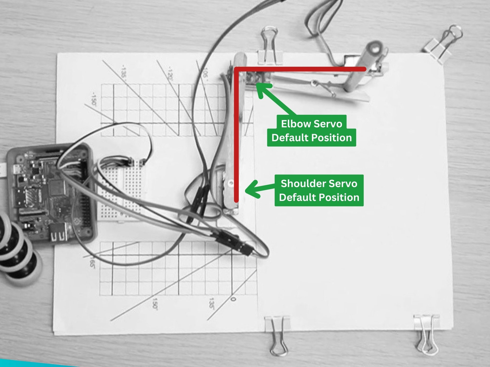

## Creating a BrachioGraph

In this lesson, we will learn how to code the BrachioGraph plotter using Python.

---

Type the following code into the Python command line (also known as the Read Execute Print Loop or REPL) to import the BrachioGraph library:

```python
from brachiograph import BrachioGraph

bg = BrachioGraph() # This will create a new BrachioGraph object
```

---

You can now use the `bg` object to control the BrachioGraph plotter.

When the BrachioGraph object is created, the arm will move to the default position.

---

## Attach the inner arm to the Shoulder servo

Now that the servo motor has been set to its default position by the code we have just run, we can attach the inner arm to the shoulder servo.

{:class="w-100 card-hover card-shadow rounded-3"}

---

The servo might not attach at exactly 90 degrees, but that's okay. The calibration code will take care of that, later.

---

Test the arm by running the following code:

```python
bg.set_angles(0, 90)
```

This will move the arm to the 0, 90 position; the shoulder servo will move to 0 degrees and the elbow servo will move to 90 degrees. Note that the arm will move their very quickly, without any motion easing.

---

## Park the arm

To park the arm, run the following code:

```python
bg.park()
```

This will move the arm to the park position, which is the default position.

---

## Attach the outer arm to the Elbow servo

Now that the inner arm is attached to the shoulder servo, we can attach the outer arm to the elbow servo.

You can also add the pen (or pencil) to the clothes peg at the end of the outer arm. The tip of the pen should not be touching the paper.

Let's test the arm by running the following code:

```python
bg.set_angles(-90, 120)
```

This will move the arm to the -90, 120 position; the shoulder servo will move to -90 degrees and the elbow servo will move to 120 degrees.

---

## Rasing and lowering the pen

To lower the pen to the writing position, run the following code:

```python
bg.pen.down()
```

The pen should now be touching the paper, if its not, adjust the positon of the pen accordingly.

To raise the pen, run the following code:

```python
bg.pen.up()
```

---

## Check the status of the BrachioGraph

You can check the status of the BrachioGraph by running the following code:

```python
bg.status()
```

The BrachioGraph will report its status:

```bash
------------------------------------------
                      | Servo 1 | Servo 2
                      | Shoulder| Elbow
----------------------|---------|---------
          pulse-width |    1500 |    1500
                angle |     -90 |      90
hysteresis correction |     0.0 |     0.0
------------------------------------------

------------------------------------------
pen: up
------------------------------------------
bottom left: (-8, 4) top right: (6, 13)
------------------------------------------
```

---
