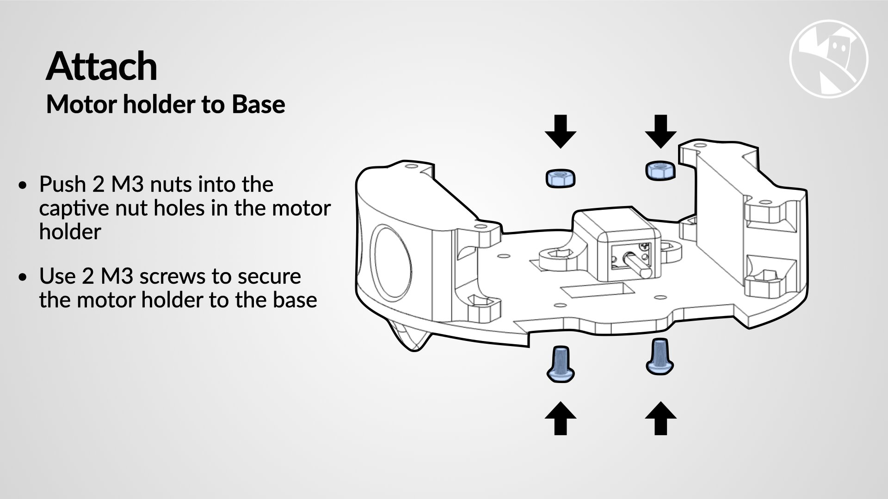
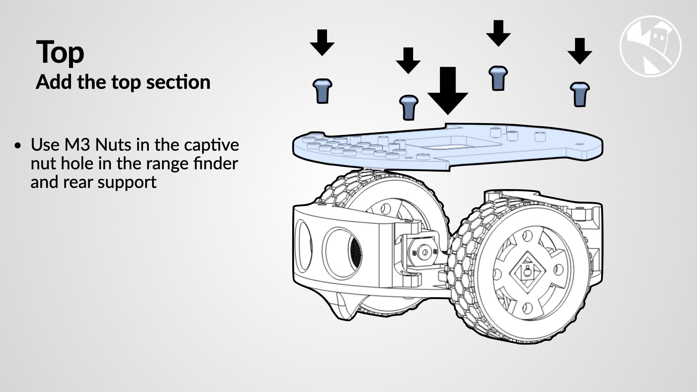

Step | Detail
---|---
{:class="img-fluid w-100"}| Use M3 Nuts in the captive nut hole
{:class="img-fluid w-100"}| Push 2 M3 nuts into the captive nut holes in the range finder and rear support, Use 2 M3 screws to secure the range finder and rear support
{:class="img-fluid w-100"}| Push the motor into the motor holder, Push the motor spindle through the opening, Then push it flush with the motor holder
{:class="img-fluid w-100"}| Push 2 M3 nuts into the captive nut holes in the motor holder, Use 2 M3 screws to secure the motor holder to the base
{:class="img-fluid w-100"}| Repeat for the other motor, Push 2 M3 nuts into the captive nut holes in the motor holder, Use 2 M3 screws to secure the motor holder to the base
{:class="img-fluid w-100"}| Push the Ultrasonic sensor into the range finder holder
{:class="img-fluid w-100"}| Push the wheels onto the motors, The spindles are D shaped, and the flat sections need to align with the flat sections on the motors
{:class="img-fluid w-100"}| Use M3 Nuts in the captive nut hole in the range finder  and rear support
{:class="img-fluid w-100"}| Use M2 Screws to secure the Pico to the Top section
{:class="table table-striped"}

---

## Wiring and general assembly notes

1. Begin by soldering the Pico lipo shim to the Pico. Apply some flux to make the soldering process easier.
1. Solder the red cable to the 5 volt on the Pico. Take note of the captive nuts where the battery will be placed.
1. Screw the battery in place. Be sure to screw only the left-hand side so that the Lipo shim can be placed on top.
1. Connect the battery from the other side and press the button to check if the connection is working well.
1. Screw the assembly onto the base, using screws and captive nuts to make a secure connection.
1. Add the Pimroni motors and screw them into place. Use pliers to squish the nuts and secure them.
1. Install the rangefinder and screw it into place. It has captive nuts that make it easy to screw.
1. Add the thin Moon Boogie Wheels.
1. Install the servo holder. It has captive knots that make it easy to put into place and secure.
1. Add the pen holder and the cog that goes against it.
1. Test fit the Sharpie to ensure it fits snugly.
1. Add the motor cables. If you forgot to do this before, you can undo the motor holders and then re-screw them back into place.
1. Crimp some female to male Dupont cables and connect the servo to the pins on the back of the Pico.
1. Check your connections and run some code to test your Burger bot.
1. By following these steps, you can build your own Burger bot just like the one in the [video](https://youtu.be/5G6psAuTYT4).

---
