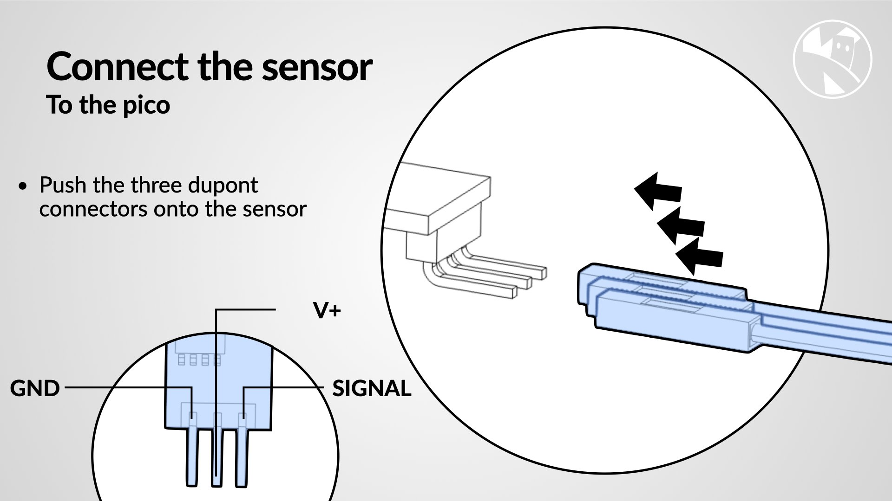
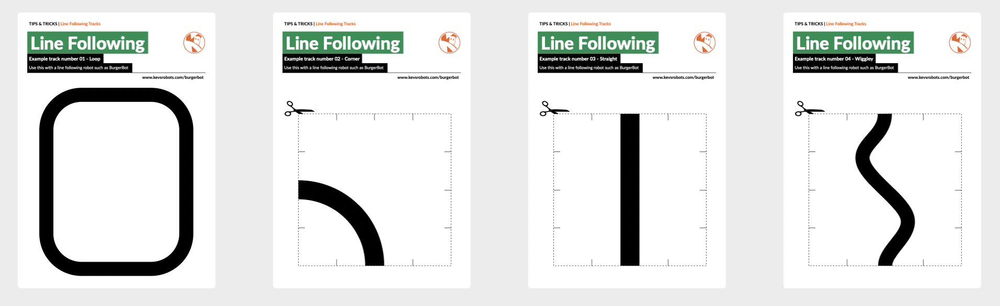

## Line following Upgrade

A great upgrade for BurgerBot is a line following sensor.

Step | Detail
---|---
[{:class="img-fluid w-100"}](assets/line01.jpg) | Learn about the TCRT5000 sensor
[{:class="img-fluid w-100"}](assets/line02.jpg) | Attach the sensor
[{:class="img-fluid w-100"}](assets/line03.jpg) | Attach the sensor assembly to the robot
[{:class="img-fluid w-100"}](assets/line04.jpg) | Connect the sensor to the Pico
{:class="table table-striped"}

---

## Download the 3d printable Line following sensor holder

Click here to download the 3d pinrtable parts:

* [`line_sensor_holder.stl`](/assets/stl/burgerbot_v2/line_sensor_holder.stl) - 40 minute print time

You will also need 2 M3 screws and and 2 M3 Nuts.

---

## Purchase the sensor

To purchase a [TCRT5000 click here](https://shop.pimoroni.com/products/line-tracking-sensor-tcrt5000-module).

---

## Download the Tracks PDF

{:class="img-fluid w-50 shadow-lg"}

Download the line following tracks [PDF here](assets/tracks.pdf)

---
