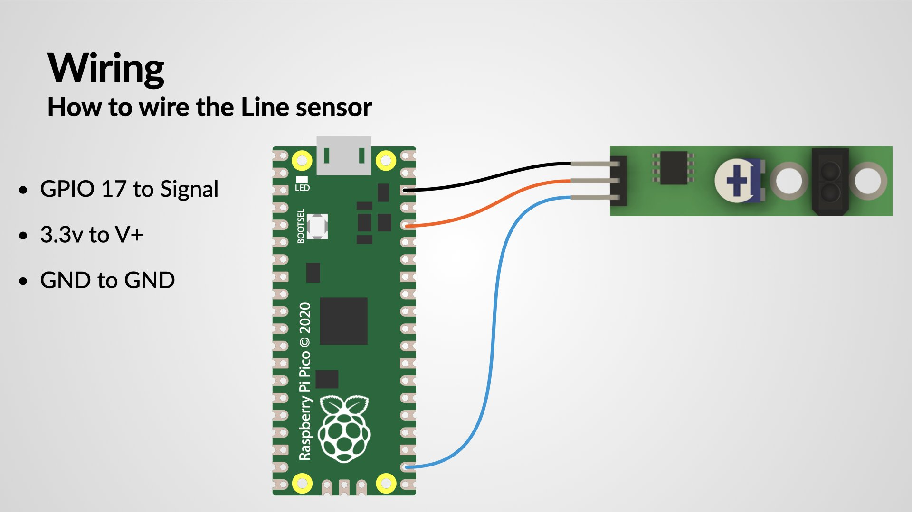

## Wiring up the Line sensor

Attach the following wires to the pico

Pico GPIO Pin | Line Sensor | Comments
--------------|------------|---
3.3v out      | V+ | Solder the end of a female dupont cable to the 3.3v out on the Pico
GND           | GND | Solder the end of a female dupont cable to the ground (GND) out on the Pico
GPIO 17       | Signal| Solder the end of a female dupont cable to GPIO 17 on the Pico
{:class="table table-code-fit"}

[{:class="img-fluid w-100"}](assets/wiring.jpg)

## MicroPython code

Using a line following sensor is fun and simple! After you attach the special wires (called Dupont connectors) to your robot, you can make it work with some cool code.

Remember, we need to slow down our robot's `speed` so it doesn't go too fast and miss the line it's trying to follow. Also, we want our robot to check the line very often, so it can stay on track while moving along the line.

---
