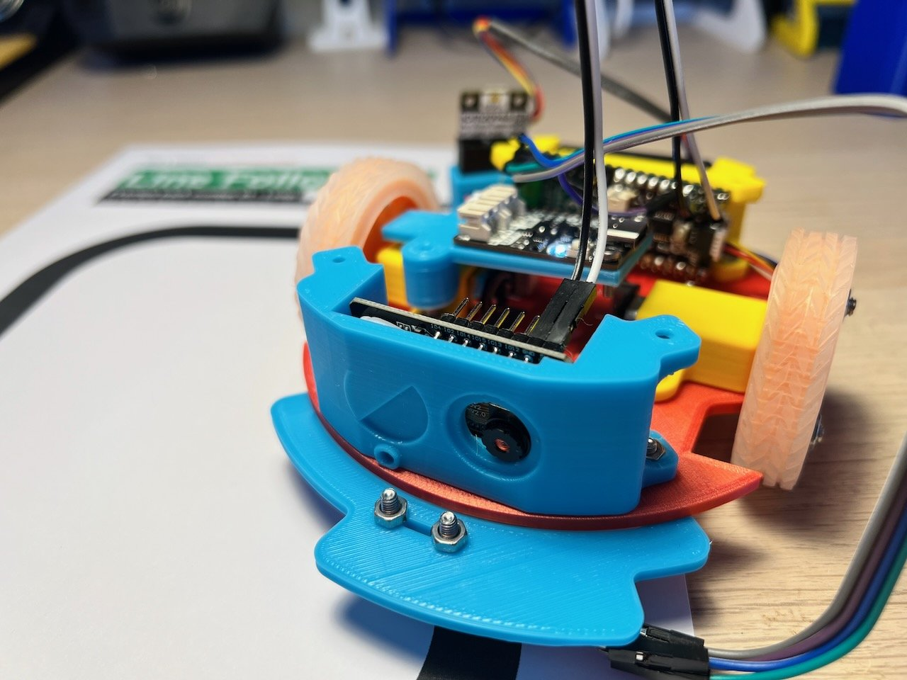

## Vision

Another fun upgrade for your Burgerbot is a camera. The ESP32-Cam module is a cheap and easy to use camera module that can be powered from the Pico's `5v` and `GND` pins. The Camera module hosts its own webserver and can stream the video over Wi-Fi to a browser.

[{:class="img-fluid w-100"}](assets/camera_module.jpg)

---

## Setting up the camera

The first time you plug in the camera it will broadcast its own Wi-Fi hotspot ID that you will need to connect to. You can then connect it to your local Wi-Fi hotspot with the password too. The next time it restarts it will remember these settings and connect up. You will need to check the devices connected to your router to find the IP address of the camera, however once you have this you can type that into your browser and being viewing what the robot can see.

---

## The Camera holder 3D Printable part

The camera module requires the existing BurgerBot range finder holder is replaced with a new 3d printable part.

Click here to download the new Camera holder:

* [`camera_holder.stl`](/assets/stl/burgerbot_v2/camera_holder.stl) - The Camera Holder

---
