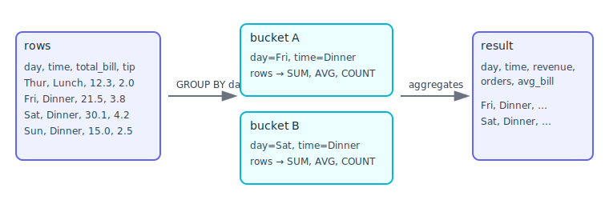

## Basic Queries

Let’s practice core SQL with a small public dataset. We’ll use the Seaborn `tips` dataset via HTTP.

> New to terms like GROUP BY, JOIN, or predicate pushdown? See the [Beginner glossary](09_conclusion#beginner-glossary-the-language-of-data).

## Mental model (2 minutes)
- A table is like a spreadsheet: columns (fields) and rows (records).
- **SELECT** chooses which columns you want to see (projection).
- **WHERE** chooses which rows you want (filtering).
- **ORDER BY** sorts the result.
- **GROUP BY** summarizes rows into aggregates (SUM, COUNT, AVG…).
- **JOIN** combines tables that share a key.

Why this is useful: these five ideas cover 80% of everyday analytics.

## Load sample data

In the CLI:

```sql
CREATE OR REPLACE TABLE tips AS
SELECT * FROM read_csv_auto('https://raw.githubusercontent.com/mwaskom/seaborn-data/master/tips.csv');

-- Peek at the data
SELECT * FROM tips LIMIT 5;
```

What’s happening:
- `read_csv_auto` downloads the CSV and infers column types for you.
- We save it as a local table `tips` so queries are fast and reproducible.
- `LIMIT 5` is a safe way to preview without dumping everything to the screen.

## Selecting and filtering

Purpose: pick the columns (features) and rows (cases) you care about.

```sql
-- Select specific columns
SELECT day, time, total_bill, tip FROM tips LIMIT 10;

-- Filter rows
SELECT * FROM tips WHERE day = 'Sun' AND total_bill > 20 ORDER BY total_bill DESC LIMIT 10;

-- Derived columns (create a new metric on the fly)
SELECT total_bill, tip, ROUND(tip / total_bill * 100, 2) AS tip_pct FROM tips LIMIT 10;
```

> You try it (3–5 min)
> - Show top 5 `total_bill` rows for Saturdays only, with `day`, `time`, `total_bill`, and `tip_pct`
> - Add a filter `tip_pct >= 18` and see how results change

Notes:
- Filtering first, then ordering, then limiting keeps results clear and small.
- Derived columns let you compute useful business metrics without changing the table.
- Be careful dividing by zero; you can wrap with `NULLIF(total_bill,0)` to avoid errors.

## Aggregations (summaries)

Purpose: turn many rows into a concise summary for trends and comparisons.



```sql
-- Group and aggregate (dimension: day; measures: count and average)
SELECT day, COUNT(*) AS orders, ROUND(AVG(total_bill), 2) AS avg_bill
FROM tips
GROUP BY day
ORDER BY orders DESC;

-- Multiple dimensions (day + time)
SELECT day, time, ROUND(SUM(total_bill), 2) AS revenue
FROM tips
GROUP BY day, time
ORDER BY revenue DESC;
```

> You try it (3–5 min)
> - Which `day, time` pair has the highest `avg_bill`?
> - Add `COUNT(*) AS orders` and sort by `orders` instead

Notes:
- Dimensions (e.g., `day`, `time`) define “buckets”. Measures (SUM/COUNT/AVG) summarize each bucket.
- `COUNT(*)` counts rows; `AVG` and `SUM` ignore NULLs by default.
- Sorting by a measure surfaces the most important groups first.

## Joins (enrich your data)

Purpose: attach helpful context from another table using a shared key.

```sql
-- Tiny dimension table adds a weekend flag by day
CREATE OR REPLACE TABLE day_names(day TEXT, weekend BOOLEAN);
INSERT INTO day_names VALUES
  ('Thur', FALSE), ('Fri', FALSE), ('Sat', TRUE), ('Sun', TRUE);

SELECT t.day, dn.weekend, COUNT(*) AS orders
FROM tips t
JOIN day_names dn ON dn.day = t.day
GROUP BY t.day, dn.weekend
ORDER BY orders DESC;
```

Notes:
- `JOIN` matches rows where the key columns are equal.
- This is common in analytics: a “fact” table (events) plus small “dimension” tables (attributes).
- Start with `JOIN` (inner) for intersecting values; later explore `LEFT JOIN` when you need to keep all rows from the left side.

## Nulls and types

- `COALESCE(x, 0)` replaces NULLs with a default (handy for sums/ratios).
- Cast types with `CAST(x AS INTEGER)` or shorthand `x::INTEGER` when needed.
- Safe ratio example:

```sql
SELECT ROUND(tip / NULLIF(total_bill,0) * 100, 2) AS tip_pct
FROM tips
LIMIT 5;
```

## Try it yourself
- Largest 5 orders by `total_bill`, showing `day`, `time`, and `tip_pct`.
- Which combination of `day` and `time` has the highest average `tip_pct`?
- Add a small `party_size_band` table (e.g., size 1–2 = small, 3–4 = medium, 5+ = large) and join to compare revenue by band.

## Recap

- SELECT/WHERE/ORDER BY/GROUP BY/JOIN are your core analytics toolkit.
- DuckDB lets you do all of this directly on files or on a local table for speed.
- Next: advanced features like CTEs, views, persistence, and extensions.

---
