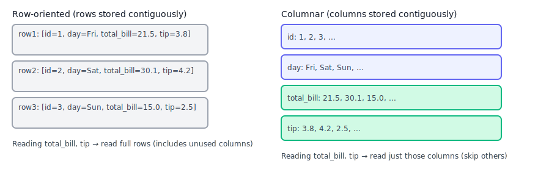
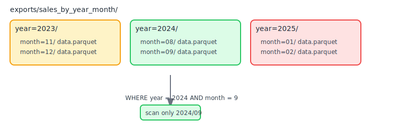

## Working with Parquet

Parquet is a columnar file format ideal for analytics. DuckDB reads and writes Parquet natively and efficiently.

> New to terms like Parquet, partitioning, or predicate pushdown? See the [Beginner glossary](09_conclusion#beginner-glossary-the-language-of-data).

---



## Mental model (2 minutes)
- Columnar layout stores values by column, not by row—great for scanning a few columns across many rows.
- Compression and encoding make files small and fast to read.
- Metadata (schemas, statistics) helps DuckDB skip unnecessary data.

Why this matters:
- Faster queries (read less data), lower storage cost, and better interoperability across tools.

---

## 1) Read Parquet

```sql
CREATE TABLE trips AS SELECT * FROM read_parquet('data/trips/*.parquet');
```

Notes:
- You can query files directly without creating a table, but persisting can speed up iteration.
- Use globs like `*.parquet` to read multiple files at once.

> What is a “glob”?
> A glob is a simple wildcard pattern for matching files and folders:
> - `*.parquet` — all Parquet files in a folder
> - `trips_2024-*.parquet` — files starting with `trips_2024-`
> - `year=*/month=*/*.parquet` — partitioned folders by year/month
> DuckDB accepts these patterns in functions like `read_parquet()` and `read_csv_auto()`.

Select only the columns you need and filter early to reduce IO:

```sql
SELECT vendor_id, pickup_date, fare_amount
FROM trips
WHERE pickup_date >= DATE '2024-01-01';
```

---

## 2) Write Parquet

Produce compact, portable outputs for downstream tools.

```sql
COPY (
  SELECT vendor_id, DATE_TRUNC('month', pickup_date) AS month,
         SUM(fare_amount) AS revenue
  FROM trips
  GROUP BY vendor_id, month
) TO 'exports/trips_monthly.parquet' (FORMAT 'parquet');
```

Notes:
- Ensure the `exports/` folder exists first.
- Use descriptive filenames that reflect content and grain (e.g., `*_monthly`).

---

## 3) Partitioned Parquet layout

Partitioning creates subfolders by keys; DuckDB can skip folders when those keys are filtered.

```sql
COPY (
  SELECT *, strftime(pickup_date, '%Y') AS year,
             strftime(pickup_date, '%m') AS month
  FROM trips
) TO 'exports/trips_by_year_month'
  (FORMAT 'parquet', PARTITION_BY (year, month));
```

Now you can scan selected partitions quickly:

```sql
SELECT COUNT(*)
FROM read_parquet('exports/trips_by_year_month/year=2024/month=09/*.parquet');
```

Notes:
- Partition keys become virtual columns available during scans.
- Choose low‑cardinality keys (year, month) to avoid too many tiny files.

> Partitioning, explained
> - Imagine a filing cabinet: you put trips into drawers by `year`, then folders by `month`. If you only need 2024‑09, you open just that folder.
> - On disk this looks like `year=2024/month=09/…`. DuckDB understands this pattern and can skip all other folders.
> - A good partition key is something you filter by often (date, region) and has limited distinct values (12 months, a handful of regions).
>
> When to partition
> - Datasets larger than a few hundred MB, or when you regularly query slices (by month, by region).
> - Don’t over‑partition (e.g., by minute or by user ID) — it creates thousands of tiny files.
>
> How to query partitions
> - By folder path:
>   ```sql
>   SELECT * FROM read_parquet('…/year=2024/month=09/*.parquet');
>   ```
> - Or by predicate using virtual columns:
>   ```sql
>   SELECT COUNT(*)
>   FROM read_parquet('…/year=*/month=*/*.parquet')
>   WHERE year = 2024 AND month = 9;
>   ```

---

## 4) Predicate pushdown and column pruning

> What is “predicate pushdown”?
> - A predicate is your filter (the `WHERE` clause). Pushdown means DuckDB sends that filter into the file reader, so it only reads the parts that could match.
> - Parquet stores min/max stats per row group. If `fare_amount > 0` and a row group’s max is 0, DuckDB can skip that group entirely.
> - Result: less data read from disk/network and faster queries.
>
> Without pushdown (conceptually): read data -> then filter -> keep a few rows.
> With pushdown: tell the reader the filter first -> skip non‑matching chunks -> read much less.

```sql
SELECT vendor_id, SUM(fare_amount) AS revenue
FROM read_parquet('exports/trips_by_year_month/year=2024/*.parquet')
WHERE fare_amount > 0
GROUP BY vendor_id;
```

Notes:
- Reading fewer columns and rows speeds things up dramatically.
- Combine with partition filters for best results.

---

## 5) Schema evolution (what and how)

What it is:
- Your schema is the list of columns and their data types. Over time, new columns appear, types widen, or names change.

Why it matters:
- When you read many files together, mismatched schemas can cause errors or confusing results unless you align them.

Safe patterns:
- **Additive columns**: new files add a column; old files don’t have it. When combining, treat the missing column as `NULL` and optionally fill with a default using `COALESCE`.
- **Type widening**: cast to a common type (e.g., `CAST(id AS BIGINT)` everywhere) before combining.
- **Renames**: prefer adding a new column and deprecating the old; provide a view that maps old -> new to keep queries stable.

Inspect schemas quickly:
```sql
-- Peek at columns and types via DESCRIBE on a scan
DESCRIBE SELECT * FROM read_parquet('exports/trips_by_year_month/year=2024/*.parquet');
```

Normalize when combining different vintages:
```sql
-- Example: newer files have `surcharge`, older files do not
CREATE OR REPLACE VIEW trips_all AS
SELECT vendor_id, pickup_date, fare_amount, surcharge
FROM read_parquet('data/new/*.parquet')
UNION ALL
SELECT vendor_id, pickup_date, fare_amount, CAST(NULL AS DOUBLE) AS surcharge
FROM read_parquet('data/old/*.parquet');
```

Persist a curated, consistent table:
```sql
CREATE OR REPLACE TABLE trips_curated AS
SELECT
  CAST(vendor_id AS VARCHAR) AS vendor_id,
  CAST(pickup_date AS TIMESTAMP) AS pickup_ts,
  fare_amount,
  COALESCE(surcharge, 0) AS surcharge
FROM trips_all;
```

Notes:
- Group files with the same schema in each SELECT, then `UNION ALL` with aligned columns.
- Use `CAST` and `COALESCE` to harmonize types and defaults.
- Document intended types/meanings in a small `schema.md` in your repo.

Common pitfalls:
- Mixing numeric and text IDs across files; pick one type and cast.
- Renaming a column in-place; prefer additive changes with a migration view.
- Timezone surprises; store timestamps with timezone strategy documented.

---

## Troubleshooting
- "No such file or directory": create the target folder before `COPY`.
- "Mismatched schemas": ensure files share compatible column names and types.
- "Too many small files": reduce partitions or compact outputs occasionally.

---

## Try it yourself
- Export a daily summary partitioned by `year, month, day` and query only one week.
- Compare query time selecting 3 columns vs `SELECT *` on the same dataset.
- Add a new column to your table and verify old Parquet files still read.

---

## Recap
- Parquet + DuckDB = fast, compact analytics.
- Partition wisely and filter early to minimize IO.
- `COPY` makes exporting analytical tables easy and portable.

---

## Read multiple files with globs

```sql
SELECT COUNT(*)
FROM read_parquet('data/sales/part-*.parquet');
```

> You try it
> - Replace with any folder you have; confirm count matches number of rows across files

---

## Write Parquet

```sql
COPY (
  SELECT * FROM my_table
) TO 'exports/my_table.parquet' (FORMAT PARQUET);
```

> You try it
> - Export a filtered subset (e.g., `WHERE date >= '2024-01-01'`)

---

## Partitioned writes

```sql
COPY (
  SELECT * FROM my_table
) TO 'exports/sales_by_year_month'
  (FORMAT PARQUET, PARTITION_BY (year, month));
```



> You try it
> - List the created folder tree and spot `year=YYYY/month=MM` folders

---

## Predicate pushdown and column pruning

```sql
SELECT customer_id, SUM(amount) AS revenue
FROM read_parquet('exports/sales_by_year_month')
WHERE year = 2024 AND month = 6
GROUP BY customer_id;
```

> You try it
> - Add a second filter on `amount > 0` and run `EXPLAIN` to see filtered scans

---

## Schema evolution

```sql
-- Old files without column `coupon`
-- New files add nullable `coupon` string
SELECT COUNT(*), COUNT(coupon) AS with_coupon
FROM read_parquet('exports/sales_by_year_month');
```

> You try it
> - Add one small Parquet with an extra nullable column and confirm queries still work

---

## Tips
- Prefer fewer, larger Parquet files for performance; avoid millions of tiny files.
- Keep partition columns low-cardinality (like `year`, `month`, `country`).
- Use manifests or views to stabilize changing folder contents.

---

## Recap
- Parquet enables fast analytics through columnar storage and pushdown.
- Use globs to read many files, and partitioned writes to organize data by keys.

---
