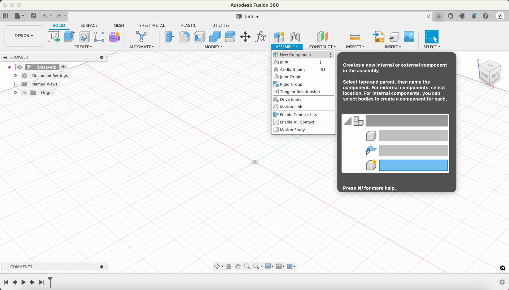
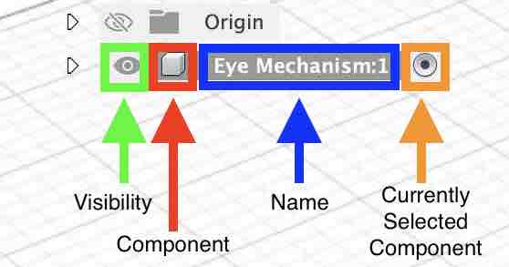

## Open Fusion 360

* **Launch Fusion 360** - Open the Fusion 360 Application

It will open on a fresh new blank design

* **Save Design** - Click on `File` from the file menu, and then `Save`, and give your design a name such as `eye mechanism`

---

## Create a Component

* **Click Assemble** - Click on the Assemble drowdown button on the toolbar

{:class="img-fluid w-100"}

---

* **Click Create Component** - Click on the Create Component button on the toolbar

{:class="img-fluid w-50"}

* **Click Ok** - Click on the ok button

---

* **Look at the Browser** - Check that the new component has been created in the brwoser on the left hand side of the screen

{:class="img-fluid w-50"}

* **Notice the different parts of the component** - 

{:class="img-fluid w-50"}

---
