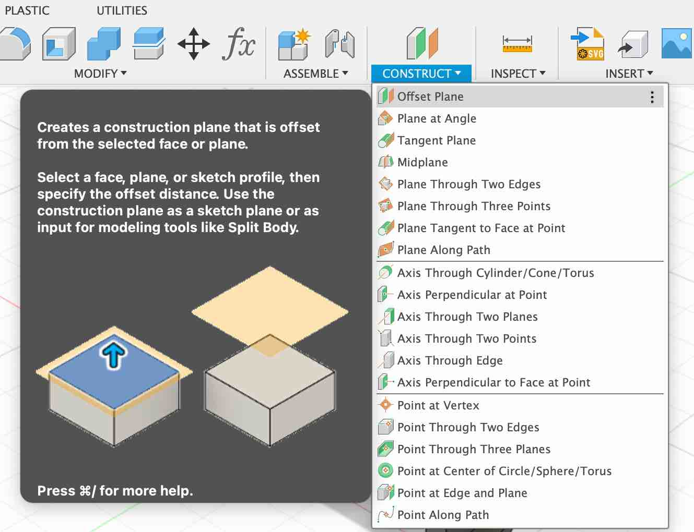
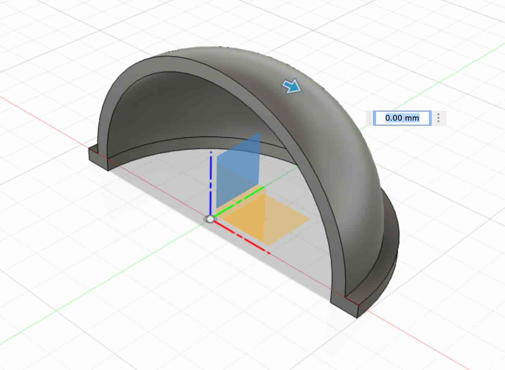
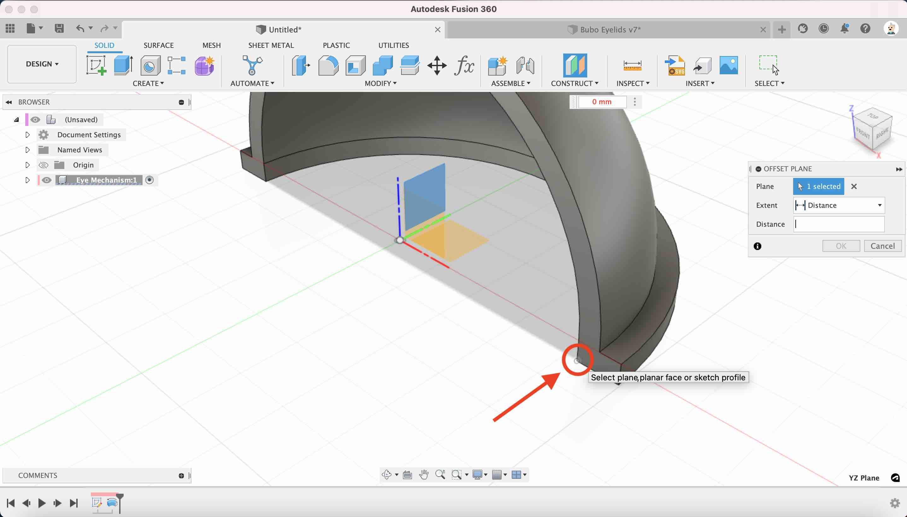
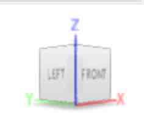
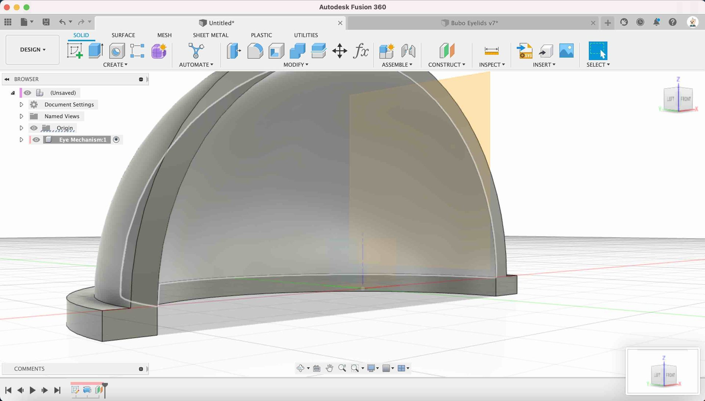
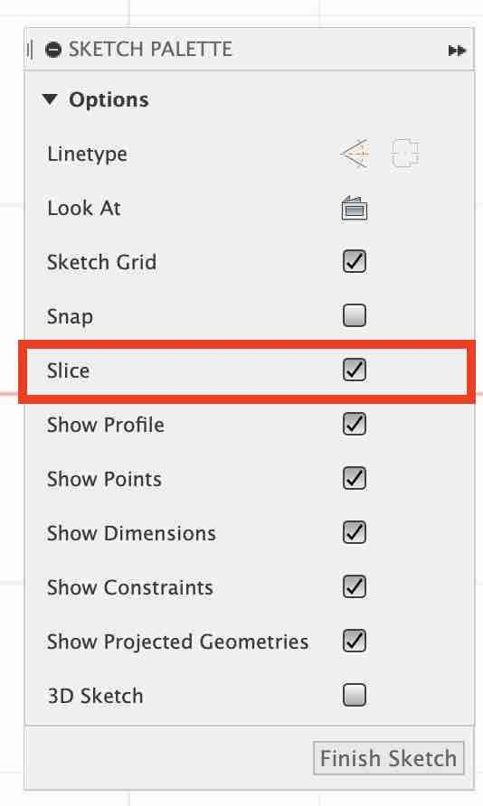
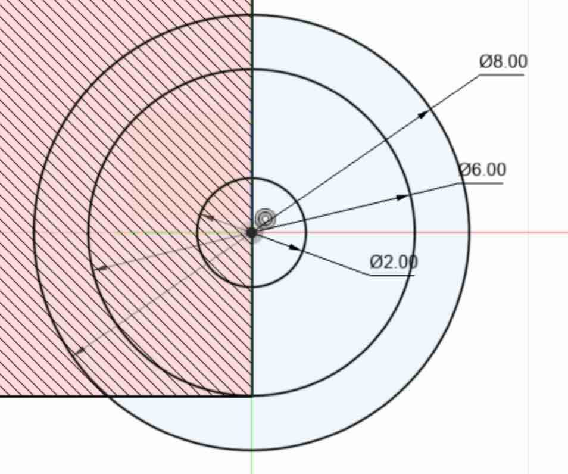
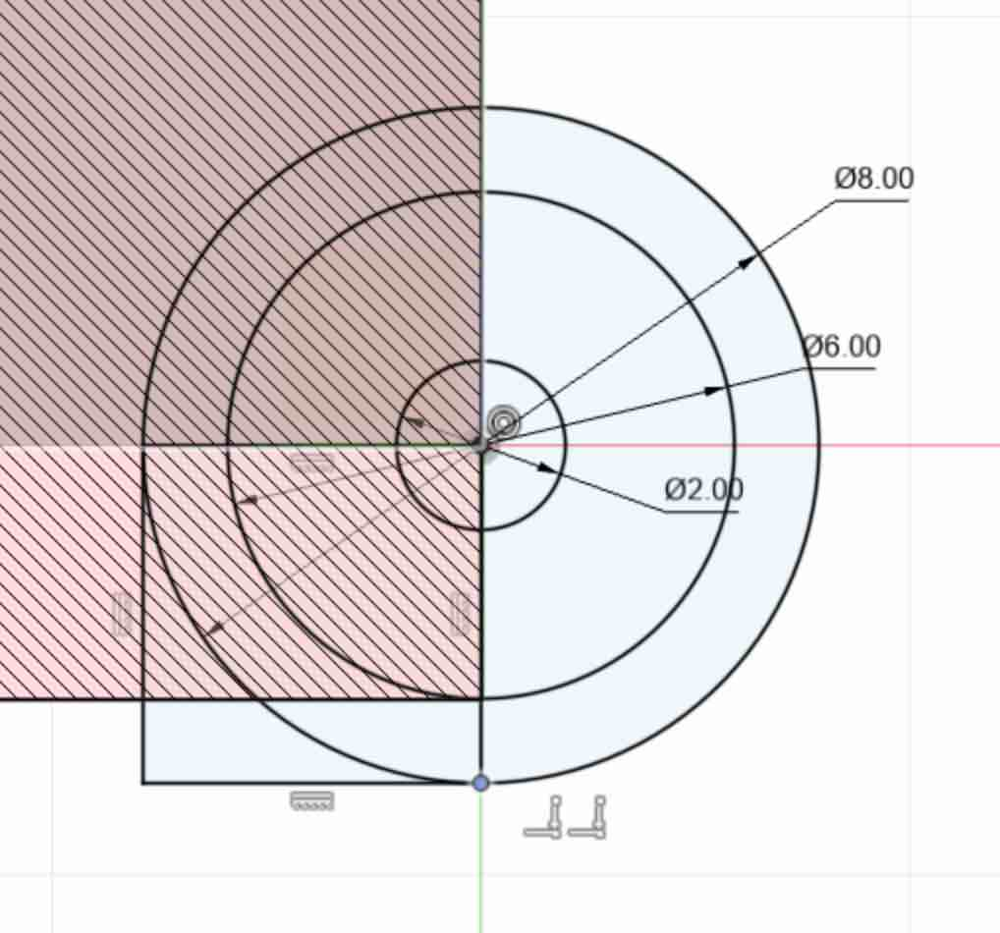
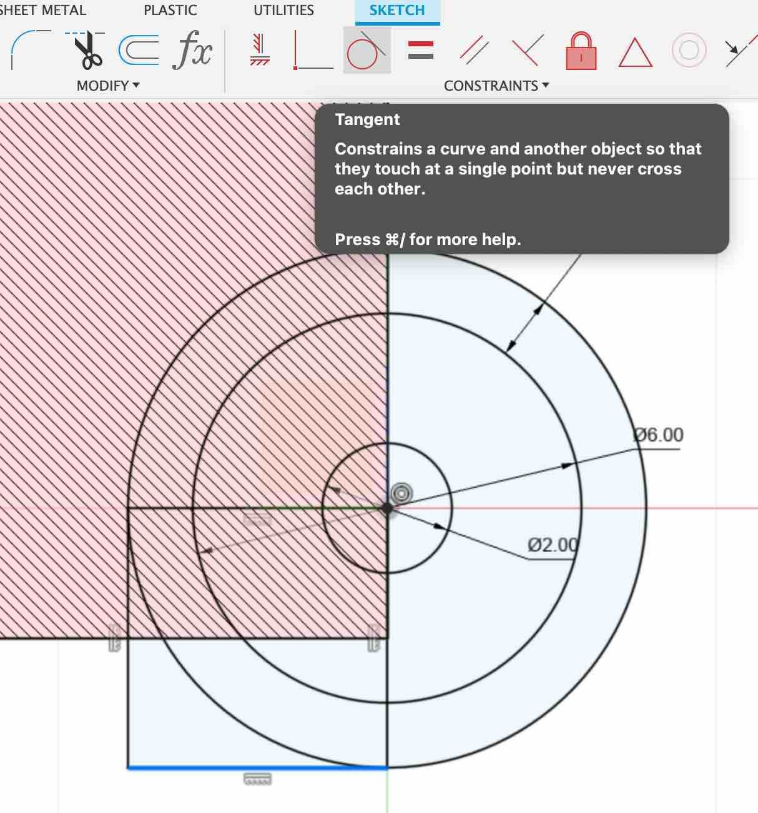

* **Create new Sketch** - Create a new sketch on the edge of the eyelid by clicking the `CONSTRUCT` Menu and selecting the `offset plane` option.

{:class="img-fluid w-50"}

---

* **Select the `YZ` plane** - select the `YZ` plane, this is th eone that is facing the right side of our model.

{:class="img-fluid w-50"}

---

* **Click on the point side the eyelid** - Click on the point thats highlighted in the image below. The new plane should then be offset by `20mm` from the `YZ` plane.

{:class="img-fluid w-100"}

---

* **Create the hinge profile** - Select the newly created offset plane and click on the `Create Sketch` button to create a new sketch on this plane.

> ## The ViewCube
>
> Its best to move the camera rotation to inside the eyelid so you create the sketch in the correct orientation. Move the camera by using the `viewcube`.
>
> {:class="img-fluid w-50"}

---

{:class="img-fluid w-50"}

---

* **Slice** - Click on the `Slice` option from the `Sketch Palette`. Slice will remove the parts of the model that are between the camera and the selected sketch profile. This allows us to see inside of the model.

{:class="img-fluid w-50"}

---

* **Create three circles** - Using the circle creation mode (press `c`), create three circles:

  * one that is 2mm
  * one that is 6mm
  * one that is 8mm
  
The origin of each circle is the point where the horizonal and verticle lines of our profile meet (the origin).

{:class="img-fluid w-50"}

---

* **Create a square** - Use the rectangle drawing mode by pressing `r`. Start the rectangle at the origin, and drag it until the bottom line is touches the bottom of the circle, and the leftmost side touches the left side of the circle. You can also use the Tangent tool to ensure the line and circles are aligned.

{:class="img-fluid w-50"}

> ### The `Tangent` Tool
>
> * **Select the line** - Select the left line of the rectangle
> * **Click Tangent** - and then click the `tangent` tool button from the toolbar.
> * **Select the circle** - Select the circle to create the tangent constraint which alings the line to the circle.

{:class="img-fluid w-50"}

---

> ## Constraints
>
> Constraints **allow you to relate one sketch entity to another sketch entity**. If you look at. the constraint icons in the sketch palette you'll see that the sketch constraints use geometric expressions, with the exception of fix/unfix.
{:class="bg-blue"}

---

* Finish Sketch**** - Click `the Finish Sketch` button

---
