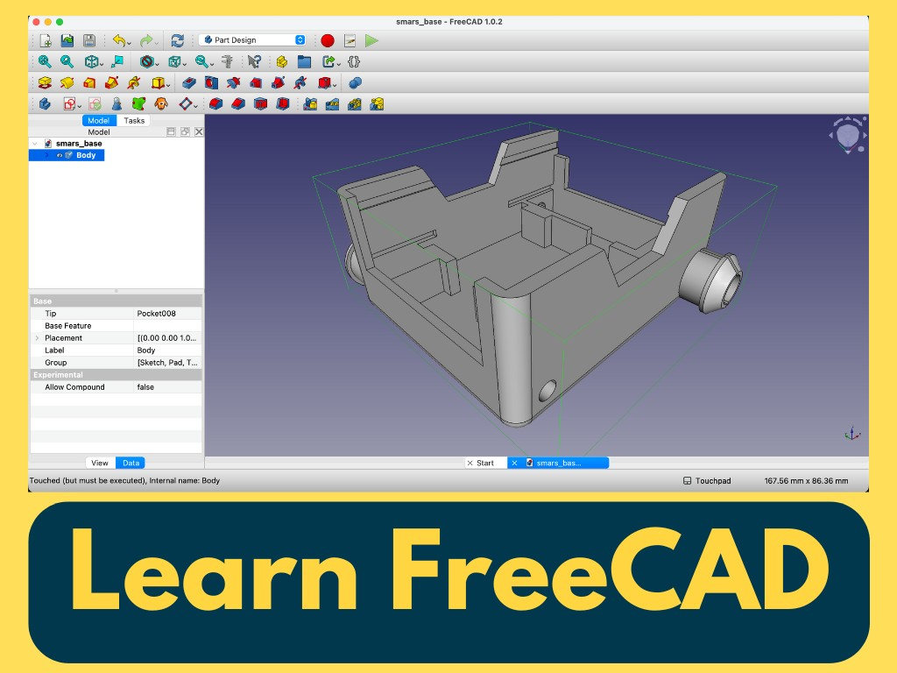

{:class="cover"}

## Welcome, Robot Builders!

You're about to learn one of the most valuable skills in robotics: **designing your own robot parts from scratch**. By the end of this course, you'll have created a complete, 3D-printable robot chassis using FreeCAD - and you'll understand every design decision that went into it.

This isn't just a "follow the steps" tutorial. We'll explain **why** each dimension matters, **how** professional designers think about robot design, and **what** makes a part actually printable and functional.

---

## What is SMARS?

**SMARS** stands for **Screwless Modular Assembleable Robotic System**. It's a popular open-source robot platform designed specifically for makers and educators. The genius of SMARS is in its name:

- **Screwless**: Parts snap together without screws or glue
- **Modular**: Swap components, add sensors, customize endlessly
- **Assembleable**: Easy to build, even for beginners
- **Robotic System**: A complete platform for learning robotics

The SMARS base we'll design holds two DC motors, an Arduino, batteries, and has mounting points for sensors and accessories. It's been built by thousands of makers worldwide!

---

## What You'll Learn

By completing this course, you'll be able to:

- **Navigate FreeCAD confidently** - Move around 3D space like a pro
- **Create parametric sketches** - Design shapes that can be easily modified
- **Use professional CAD techniques** - Constraints, construction geometry, and references
- **Apply design-for-manufacturing principles** - Make parts that actually print well
- **Export print-ready files** - Generate STL files for any 3D printer

### Skills You'll Master

| Skill | FreeCAD Tool | Real-World Application |
|-------|--------------|------------------------|
| Sketching | Rectangle, Line, Circle | Creating 2D profiles for any part |
| Extruding | Pad | Turning sketches into 3D solids |
| Hollowing | Thickness (Shell) | Making lightweight, material-efficient parts |
| Rounding | Fillet | Improving strength and aesthetics |
| Cutting | Pocket | Creating holes, slots, and cutouts |
| Mirroring | Mirror | Duplicating symmetric features |
| Patterning | Polar Pattern | Repeating features around a center |
| Revolving | Revolve | Creating round features like stubs and shafts |
{: .table .table-single }

---

## Course Structure

This course is organized into 4 sections with 10 hands-on lessons:

### Section 1: Getting Started
- **Lesson 1**: Navigation in FreeCAD - Master the 3D workspace

### Section 2: Designing the SMARS Base
- **Lesson 2**: Creating the Base - Build the foundation
- **Lesson 3**: Shell and Fillet - Hollow it out and smooth the edges
- **Lesson 4**: Side Holes - Add the iconic SMARS profile and motor holes
- **Lesson 5**: Front and Rear Profiles - Cable routing and component access
- **Lesson 6**: Arduino Slots - Mount your microcontroller
- **Lesson 7**: Wheel Stubs - Connect to the SMARS wheel system
- **Lesson 8**: Motor Holder - Secure the DC motors

### Section 3: Exporting for 3D Printing
- **Lesson 9**: Save as STL - Prepare for printing with best practices

### Section 4: Summary
- **Lesson 10**: Summary and Next Steps - What you've achieved and where to go next

**Estimated time**: 3-4 hours (take breaks - CAD is mentally intensive!)

---

## What You'll Need

### Software (Free!)

- **FreeCAD 0.21 or newer** - Download from [freecad.org](https://www.freecad.org/)
  - Works on Windows, Mac, and Linux
  - Completely free and open-source
  - No account or subscription required

### Hardware (For Printing)

- **3D Printer** - Any FDM printer with at least 120mm x 100mm build area
- **Filament** - PLA recommended for beginners (PETG for durability)

Don't have a printer? No problem! You can:
- Use a local makerspace or library
- Order prints from online services (Craftcloud, PCBWay, etc.)
- Just follow along to learn the CAD skills

### Knowledge Prerequisites

**You should know:**
- Basic computer skills (files, folders, menus)
- How to install software

**You do NOT need:**
- Previous CAD experience
- 3D printing experience
- Programming knowledge
- Engineering background

This course assumes you're starting from zero!

---

## Why FreeCAD?

You might wonder why we're using FreeCAD when there are other options like Fusion 360 or TinkerCAD. Here's why:

**FreeCAD Advantages:**
- **Completely free** - No subscriptions, no feature limits, forever
- **Open source** - Community-driven development
- **Offline capable** - Works without internet
- **Parametric** - Change dimensions and the whole model updates
- **Professional tools** - Used in real engineering projects

**The trade-off:** FreeCAD has a steeper learning curve than TinkerCAD, but you'll learn skills that transfer to professional CAD software.

---

## How This Course Works

### Step-by-Step with Screenshots

Every operation includes a screenshot showing exactly what you should see. If your screen looks different, something went wrong - scroll back and check!

### Design Reasoning

We don't just tell you "make this 70mm". We explain:
- **Why** that dimension was chosen
- **What** would happen if you changed it
- **How** it relates to the physical robot

### Try It Yourself Challenges

Some lessons include optional challenges to deepen your understanding. These are marked with a wrench icon.

### Common Issues Sections

When things go wrong (and they will - that's learning!), check the "Common Issues" boxes for solutions.

---

## The SMARS Base Specifications

Before we start designing, let's understand what we're building:

| Specification | Value | Why? |
|--------------|-------|------|
| Base dimensions | 70mm x 58mm x 32mm | Fits standard N20 motors and Arduino Nano |
| Wall thickness | 2-3mm | Strong enough to handle, light enough for motors |
| Motor hole diameter | 4.5mm | Fits N20 motor shafts with slight clearance |
| Fillet radius | 4mm | Reduces stress concentration, looks professional |

These aren't arbitrary numbers - each was chosen to work with specific components. As you progress, you'll understand why.

---

## Let's Get Started!

In the next lesson, we'll master FreeCAD navigation. It might seem basic, but **smooth navigation is the foundation of efficient CAD work**. Professionals can orbit, pan, and zoom without thinking - and soon you will too.

Ready to design your first robot? Let's go!

---

> **Save your work frequently!** FreeCAD can crash, especially on complex operations. Use `Ctrl+S` (or `Cmd+S` on Mac) after every major step. Your future self will thank you.
