## What We're Building

The SMARS base is a **70mm × 58mm × 32mm** solid block. These aren't random numbers:

| Dimension | Size | Why This Size? |
|-----------|------|----------------|
| Length | 70mm | Fits two N20 motors side by side with clearance |
| Width | 58mm | Matches standard SMARS wheel track width |
| Height | 32mm | Tall enough for Arduino Nano + batteries |
{: .table .table-single }

This block becomes the foundation for everything else - we'll hollow it out, add holes, and create mounting features in later lessons.

---

## Understanding Parametric Design

We're about to do something clever: create a **parametric sketch**. This means:

1. We draw shapes (rectangles, lines, circles)
2. We add **constraints** (dimensions, positions, relationships)
3. FreeCAD calculates the exact geometry

**Why this matters**: If you later decide the base should be 75mm long instead of 70mm, you change ONE number and the entire model updates. That's the power of parametric CAD!

---

## Step-by-Step: Create the Base

### 1. Create a New Document

Click on `File` > `New` to create a fresh FreeCAD document.

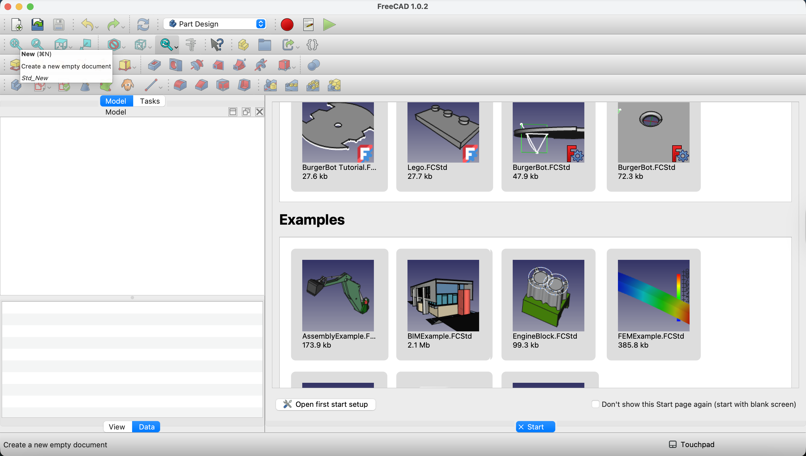{:class="img-fluid w-100"}

### 2. Save Your Work (Important!)

Click `File` > `Save As` and name it `smars_base.FCStd`.

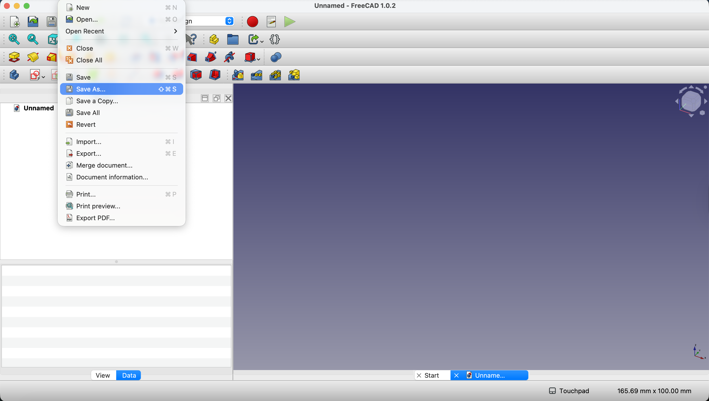{:class="img-fluid w-100"}

**Pro tip**: Save frequently! FreeCAD can crash during complex operations. Use `Ctrl+S` after every major step.

### 3. Enter Part Design Workbench

Click on `Create Sketch`. If you don't see this option, switch to the **Part Design** workbench using the dropdown in the toolbar.

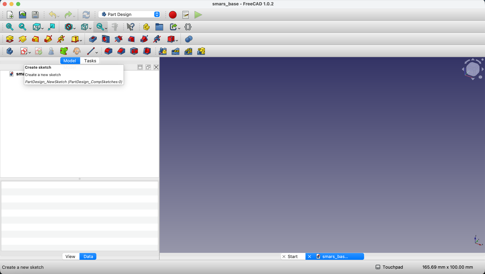{:class="img-fluid w-100"}

**What's a workbench?** FreeCAD uses "workbenches" for different tasks. Part Design is for creating solid parts - exactly what we need.

### 4. Select the Sketch Plane

Click on `XY-Plane` to sketch on the horizontal plane.

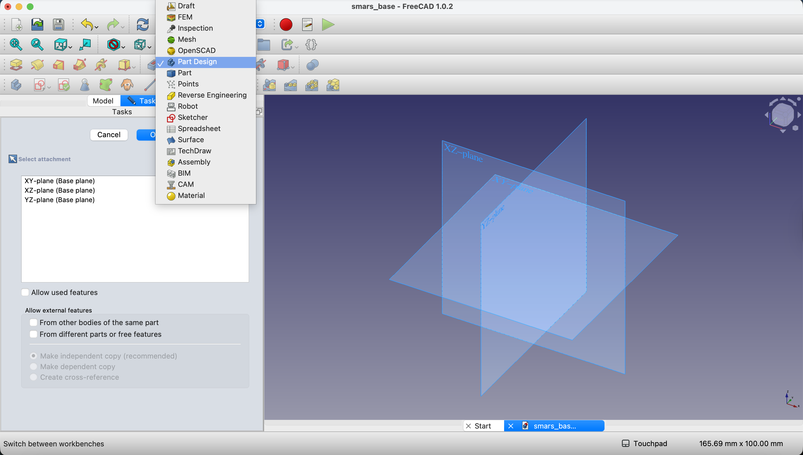{:class="img-fluid w-100"}

**Why XY?** The XY plane is like your workbench surface. Our robot sits on this plane, so it makes sense to start here.

### 5. Draw a Rectangle

Select the **Rectangle** tool from the toolbar and draw a rectangle anywhere on the sketch plane.

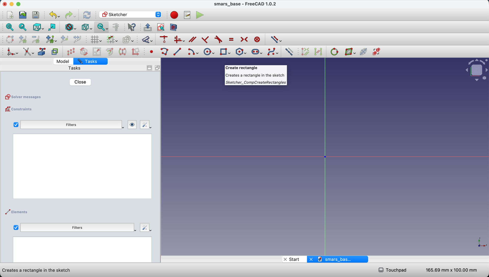{:class="img-fluid w-100"}

### 6. Add Dimensions

Type `70mm` for length and `58mm` for width. Press `Tab` to switch between fields.

{:class="img-fluid w-100"}

**Design note**: The 70mm length comes from N20 motor dimensions. Each motor is about 25mm long, and we need space between them plus wall thickness.

---

## Centering the Rectangle (The Professional Way)

Right now our rectangle is somewhere random on the sketch. For a symmetric robot base, we want it **centered on the origin** (0, 0). Here's a clever technique using construction geometry:

### 7. Draw Diagonal Lines

Use the **Line** tool to draw diagonal lines from corner to corner - both diagonals. When your mouse pointer comes close to the corners, the cursor changes to indicate you can snap to that point.

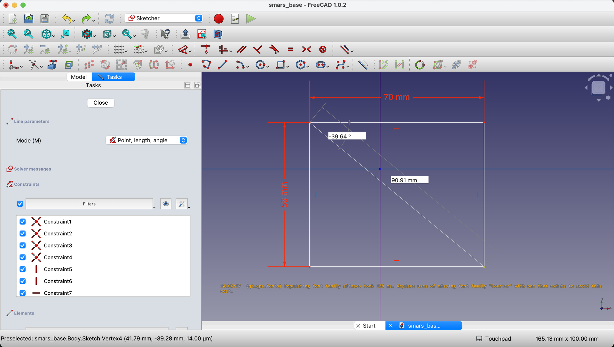{:class="img-fluid w-100"}

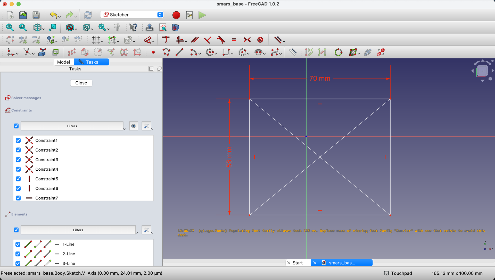{:class="img-fluid w-100"}

**Why diagonals?** The intersection of a rectangle's diagonals is its exact center. Geometry in action!

### 8. Mark the Center Point

Select the **Point** tool and click at the intersection of the two diagonals.

{:class="img-fluid w-100"}

{:class="img-fluid w-100"}

### 9. Convert to Construction Geometry

Press `Escape` to exit the point tool. Select both diagonal lines (hold `Ctrl` and click each), then click **Toggle construction mode** (the dashed line icon).

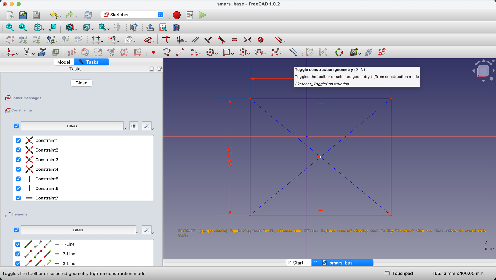{:class="img-fluid w-100"}

**What's construction geometry?** Lines marked as "construction" help you position things but don't become part of the final shape. The dashed appearance shows they're helpers, not features.

### 10. Constrain Center to Origin

This is the key step:

1. Click the center point we created
2. Hold `Ctrl` and click the origin (the small red/green circle where axes meet)
3. Click **Constrain Coincident** (or press `C`)

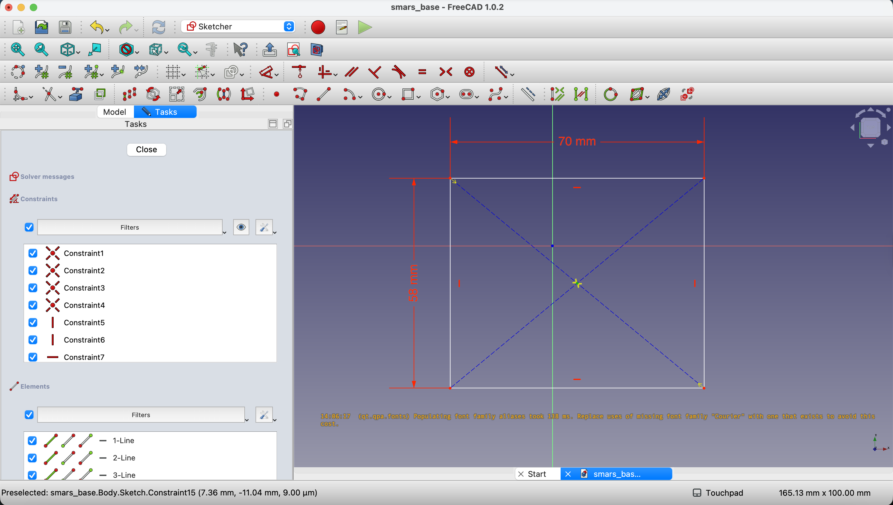{:class="img-fluid w-100"}

{:class="img-fluid w-100"}

{:class="img-fluid w-100"}

**What just happened?** You told FreeCAD: "These two points must always be in the same place." Now if you change the rectangle size, it stays centered!

### 11. Close the Sketch

Click the **Close** button in the toolbar.

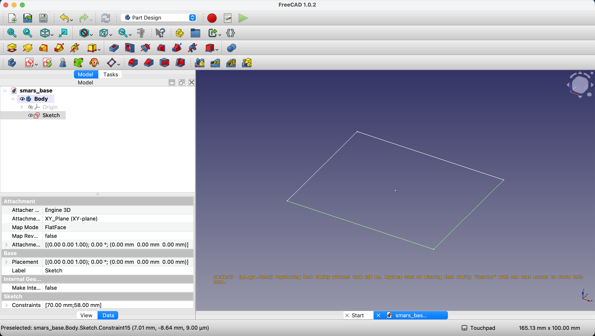{:class="img-fluid w-100"}

---

## Extrude to 3D: The Pad Operation

We have a 2D sketch. Now let's make it 3D!

### 12. Pad the Sketch

With the sketch selected in the Model tree, click the **Pad** button (looks like a yellow box above a red rectangle).

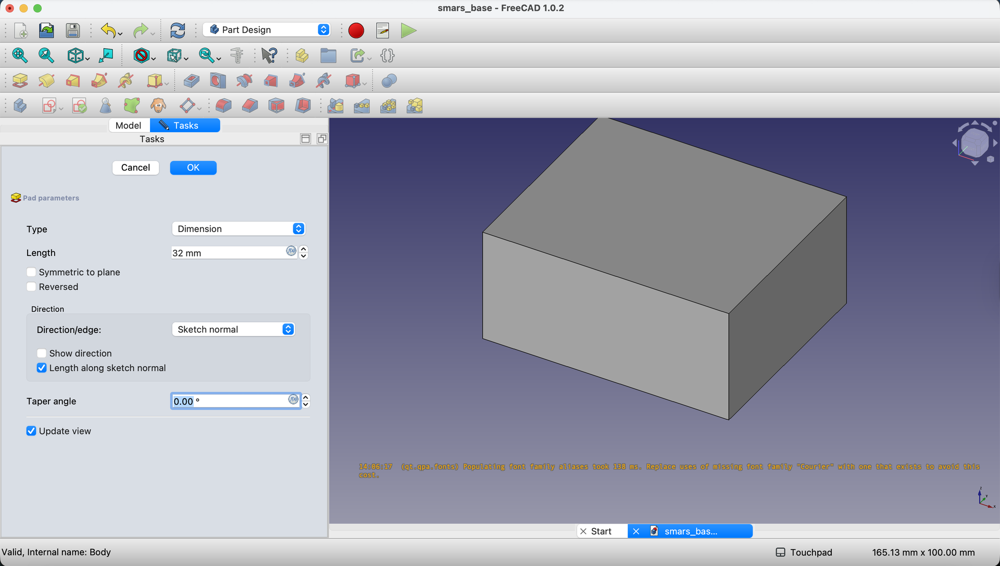{:class="img-fluid w-100"}

Enter `32mm` for the length and click `OK`.

**Why "Pad"?** Different CAD programs call this "extrude" or "boss." FreeCAD calls it "Pad." It pushes your 2D sketch into 3D space.

---

## What You Built

Congratulations! You've created:

- A **parametric sketch** with constraints
- A **centered rectangle** using construction geometry
- A **3D solid** using the Pad operation

Your SMARS base is now a solid 70mm × 58mm × 32mm block, perfectly centered on the origin.

---

## Try It Yourself

1. **Change a dimension**: Double-click the sketch in the Model tree, change 70mm to 80mm. Watch everything adjust!
2. **Examine the constraints**: In sketch edit mode, notice the green color - that means "fully constrained." Orange or white means under-constrained.

---

## Common Issues

### "My sketch is orange/white, not green"
**Problem**: The sketch isn't fully constrained.
**Solution**: Add more constraints. Common missing ones: fixing one corner position, or constraining the center to origin.

### "The Pad button is grayed out"
**Problem**: Nothing is selected, or you're not in Part Design workbench.
**Solution**: Click on your sketch in the Model tree, ensure you're in Part Design workbench.

### "My rectangle isn't the size I specified"
**Problem**: Dimensions didn't apply correctly.
**Solution**: Double-click the sketch to edit it, use the Dimension tool to set/verify each dimension.

### "I can't select the origin point"
**Problem**: The origin is hard to see or click.
**Solution**: Zoom in on where the axes cross. The origin appears as a small point where the green and red lines meet.

---

## What You Learned

In this lesson, you mastered:

- **Parametric sketching** - Drawing with constraints for flexible designs
- **Construction geometry** - Helper lines that guide but don't build
- **Coincident constraints** - Locking points together
- **The Pad operation** - Extruding 2D sketches into 3D solids

---

## Next Up

Our solid block needs to become hollow - after all, we need to fit motors, electronics, and batteries inside! In the next lesson, we'll use the **Shell** and **Fillet** tools to create that interior space.

---
