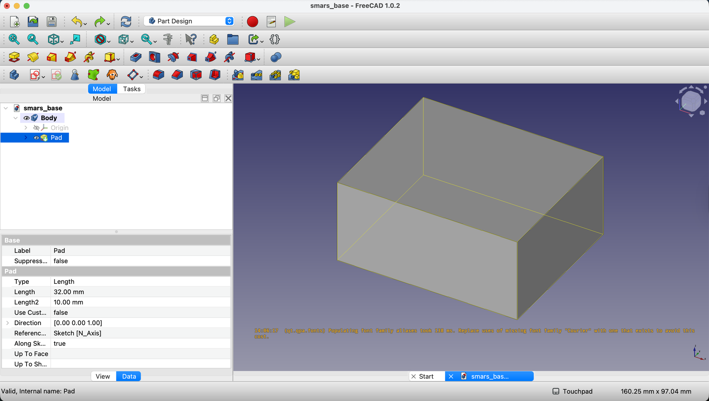
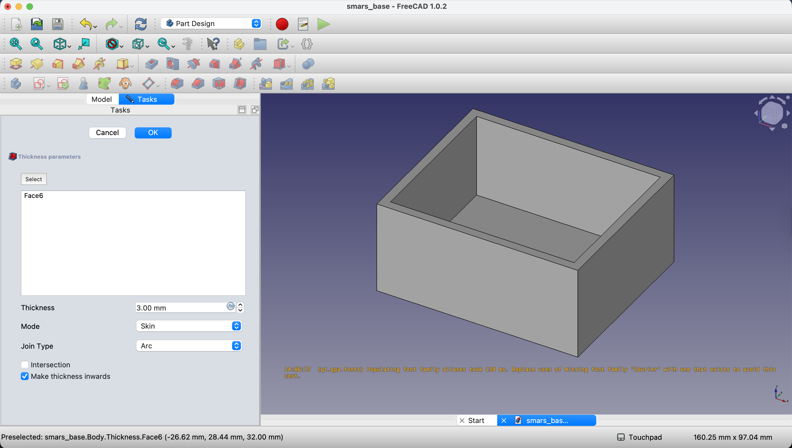
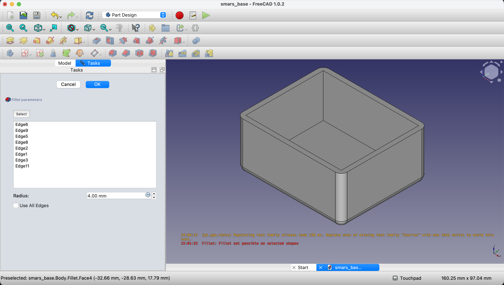
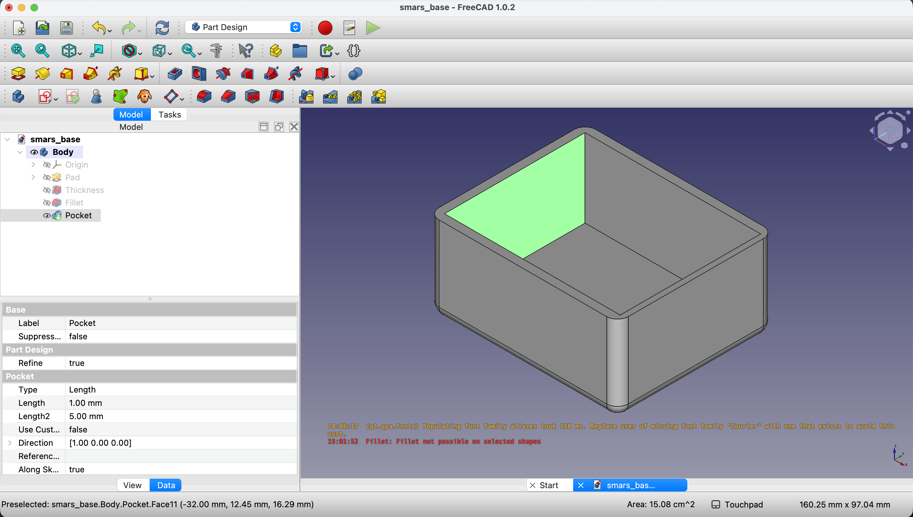
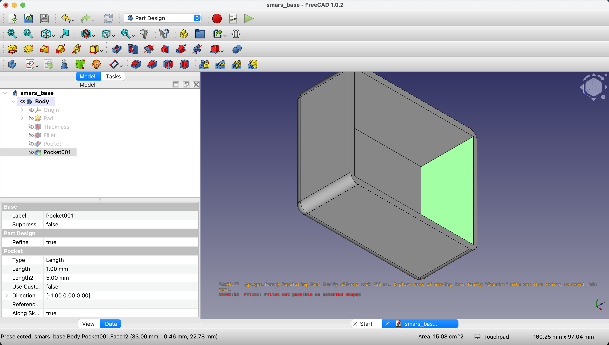
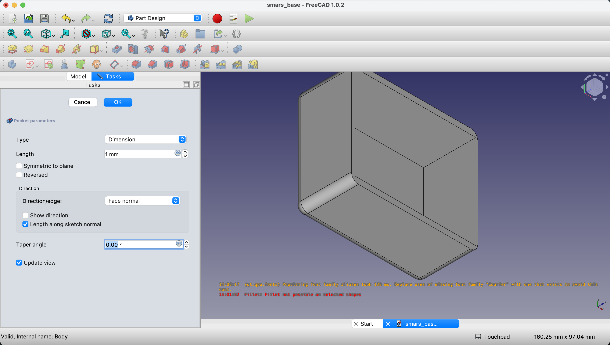

## What We're Building

Right now we have a solid brick. By the end of this lesson, it will be a **hollow box with rounded edges** - ready to hold motors, electronics, and batteries.

| Feature | Purpose |
|---------|---------|
| Shell (3mm walls) | Creates interior space while maintaining strength |
| Fillet (4mm radius) | Reduces stress concentration, easier to print |
| Thin front/back walls (2mm) | Saves material, makes room for cable routing |
{: .table .table-single }

---

## Why Shell and Fillet?

### The Shell Operation

**Problem**: A solid block can't hold anything inside.

**Solution**: The Shell tool removes the interior while keeping walls of a specified thickness. Think of it like hollowing out a pumpkin, but with precise walls!

**Why 3mm walls?** This is the sweet spot for 3D printed parts:
- **Thinner (1-2mm)** = Flexible, can crack under stress
- **Thicker (4-5mm)** = Wastes filament, adds weight
- **3mm** = Strong, rigid, efficient

### The Fillet Operation

**Problem**: Sharp 90° corners have two issues:
1. **Stress concentration** - Force focuses at corners, causing cracks
2. **Print quality** - Sharp corners often have defects

**Solution**: Fillets round the edges, distributing stress and improving print quality.

**Why 4mm radius?** Large enough to see and feel, small enough not to waste interior space.

---

## Step-by-Step: Hollow Out the Base

### 1. Apply the Thickness (Shell) Tool

With the base pad selected in the Model tree, click the **Thickness** button in the toolbar.

{:class="img-fluid w-100"}

### 2. Select the Face to Remove

Click on the **top face** of your block. This tells FreeCAD: "Remove this face and hollow out below it."

In the Thickness dialog, set the value to `3mm`. Click `OK`.

{:class="img-fluid w-100"}

**What just happened?** FreeCAD removed the top face and created 3mm-thick walls on all remaining sides. Your solid block is now a hollow box!

---

## Step-by-Step: Add Fillets

### 3. Start the Fillet Tool

Click the **Fillet** button in the toolbar.

{:class="img-fluid w-100"}

### 4. Select Edges to Round

This is where careful selection matters:

1. Hold `Ctrl` and click the **four vertical edges** (the upright corners)
2. Also select the **four horizontal edges on the bottom face**

In the Fillet dialog, set the radius to `4mm`. Click `OK`.

**Why these edges?**
- Vertical edges: Where walls meet - high stress area
- Bottom edges: Where the base contacts surfaces - protects against chipping

---

## Step-by-Step: Thin the Front and Back Walls

The front and back walls will have cutouts for cables and component access. Thinning them now makes those later operations easier.

### 5. Select the Front Interior Face

Click on the **inside surface** of the front wall.

{:class="img-fluid w-100"}

### 6. Apply Thickness to Front Wall

Click **Thickness** again. Set the value to `1mm`. Click `OK`.

{:class="img-fluid w-100"}

**Wait, 1mm?** Yes - we're *adding* 1mm of thinning to an already 3mm wall, making it 2mm total. FreeCAD's Thickness tool works by offsetting the selected face.

### 7. Repeat for Back Wall

Use the navigation cube to rotate the view and select the **inside surface** of the back wall.

Apply the same `1mm` Thickness operation.

{:class="img-fluid w-100"}

### 8. Return to Default View

Press `0` on your keyboard to return to the isometric view.

{:class="img-fluid w-100"}

---

## Understanding the Design Choices

| Decision | Reasoning |
|----------|-----------|
| 3mm side walls | Strong enough for handling, thin enough for weight |
| 2mm front/back walls | Will have large cutouts - don't need extra material |
| 4mm fillet radius | Visible rounding, better print quality |
| Shell before fillet | Easier to select edges after hollowing |

---

## Try It Yourself

1. **Inspect the interior**: Rotate to look inside. Notice how the shell created uniform walls.
2. **Measure the walls**: Use View → Measure to verify wall thickness (should be 3mm sides, 2mm front/back).
3. **Feel the difference**: If you print this later, notice how fillets make it comfortable to hold.

---

## Common Issues

### "The shell operation fails with an error"
**Problem**: FreeCAD can't compute the shell for complex geometry.
**Solution**: This usually means wall thickness is larger than some feature. Try a smaller shell value (2mm instead of 3mm).

### "I selected the wrong face for shell"
**Problem**: The interior is on the wrong side.
**Solution**: Undo (`Ctrl+Z`), then carefully click only the face you want removed. Use the rotation view to verify your selection before confirming.

### "Fillet fails on some edges"
**Problem**: The fillet radius is too large for certain edges.
**Solution**: Either reduce the radius, or deselect the problematic edges and fillet them separately with a smaller radius.

### "I can't select the interior face"
**Problem**: Clicking seems to select the exterior.
**Solution**: Rotate the view so you're looking INTO the box. Click on the visible interior surface. Zoom in for precise selection.

### "The wall thickness isn't uniform"
**Problem**: Some walls appear thicker than others.
**Solution**: This can happen if you applied thickness to the wrong faces. Undo and start fresh, being careful about face selection.

---

## What You Learned

In this lesson, you mastered:

- **Shell operation** - Hollowing solids while maintaining wall thickness
- **Fillet operation** - Rounding edges for strength and aesthetics
- **Selective face operations** - Modifying specific walls independently
- **Design-for-printing** - Choosing dimensions that work well with 3D printing

---

## Next Up

Our hollow box needs its iconic SMARS side profile - the distinctive rhombus shape that makes SMARS instantly recognizable. We'll also add the motor shaft holes. Time for the Pocket operation!

---
