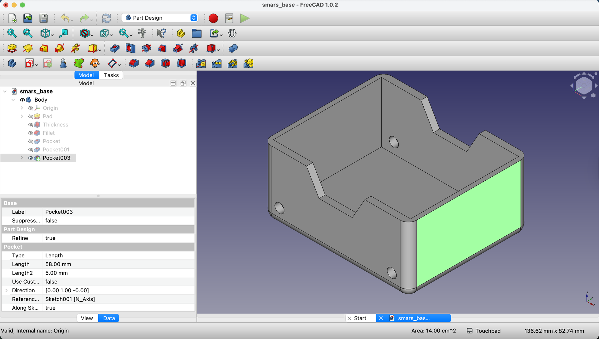
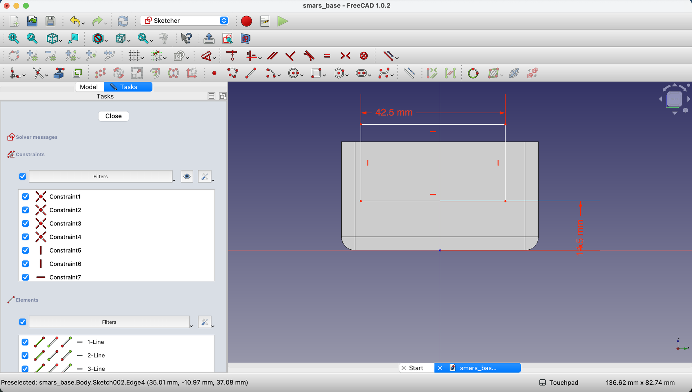
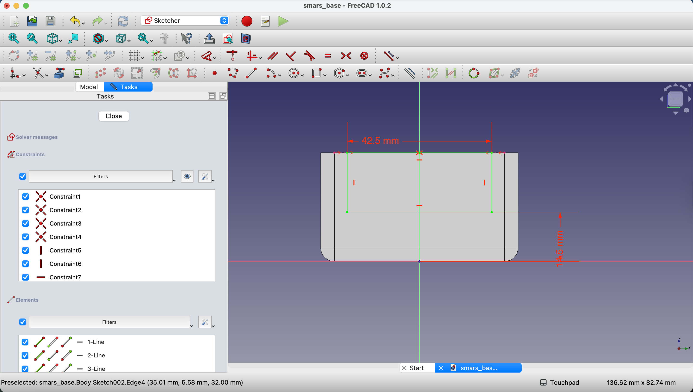
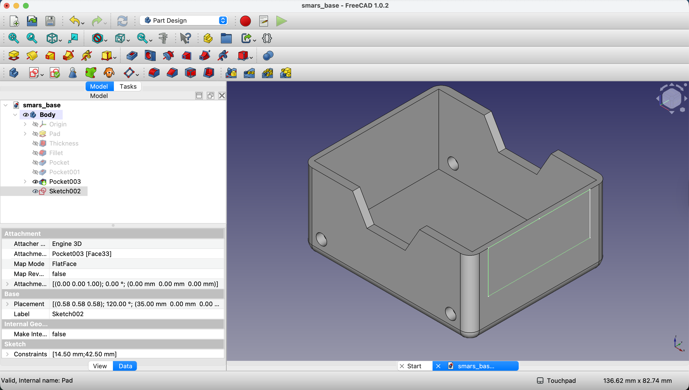
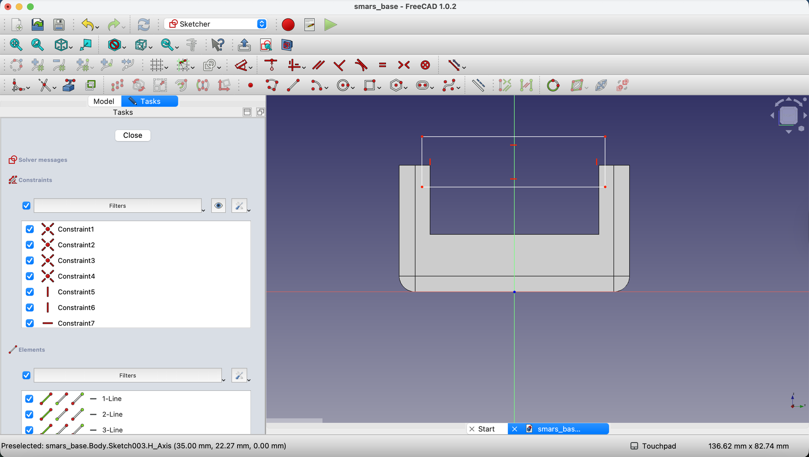
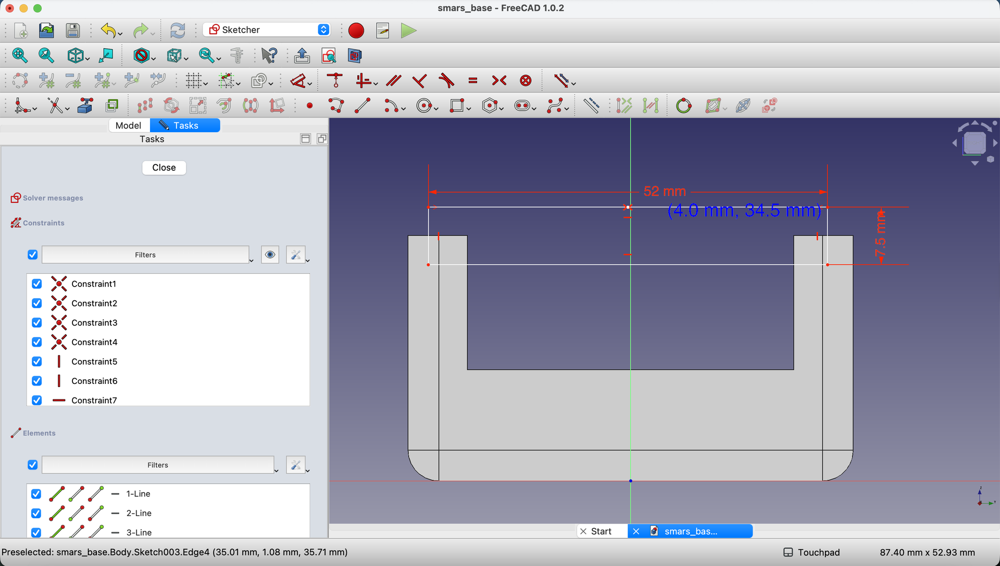
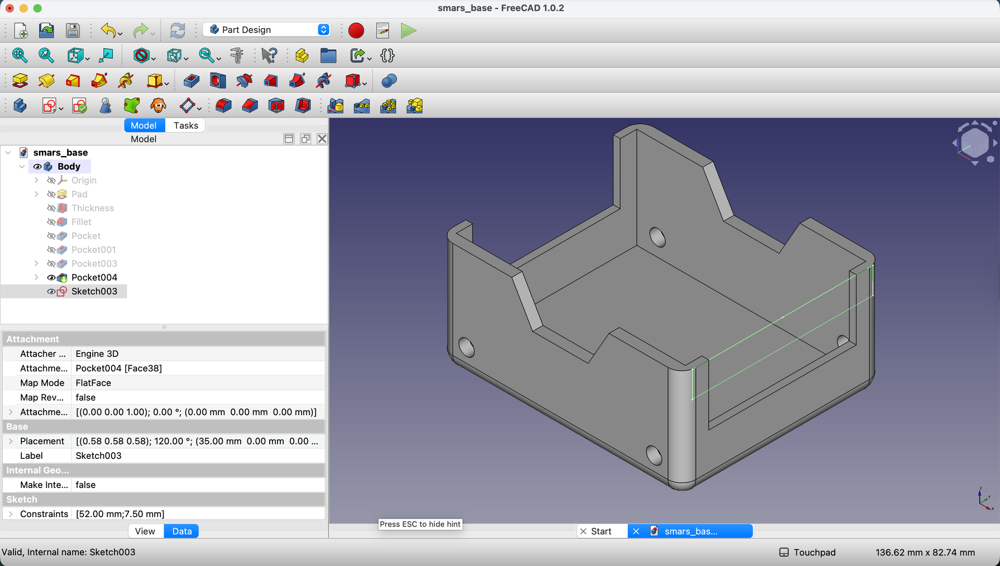

1. First, we need to create a new sketch on the rear face of the base. Click on the rear face to select it, then click on `Create Sketch` in the toolbar.

    {:class="img-fluid w-100"}

2. Using the `Rectangle` tool, draw a rectangle; we'll add the dimensions in the next step.

    {:class="img-fluid w-100"}

3. Add dimensions to the rectangle using the `Dimensions` tool. Set the width to `42.5mm` and the height to `30mm`. Finally, constrain the bottom edge of the rectangle to be `14.5mm` from the bottom edge of the base.

    {:class="img-fluid w-100"}

4. Next, we need to create external geometry for the top edge of the base. Click on the `Create external geometry` button in the toolbar.

    {:class="img-fluid w-100"}

5. Add a `point` to the center of the top edge of the base, when the cursor nears the center, a red symmetry indicator will appear.

    {:class="img-fluid w-100"}

6. Now, add another `point` to the center of the top edge of the rectangle.

    {:class="img-fluid w-100"}

7. Select the point on the rectangle, then hold `Ctrl` and select the point on the base. Click on the `Constrain Coincident` button in the toolbar to attach the two points together.

    {:class="img-fluid w-100"}

8. Close the sketch by clicking on the `Close` button in the toolbar.

    {:class="img-fluid w-100"}

9. Using the `Pocket` tool, pocket the sketch into the base to a depth of `70mm`. Make sure the new sketch is selected in the Model tree before clicking the `Pocket` button.

    {:class="img-fluid w-100"}

10. Click `OK` to confirm the pocket operation.

    {:class="img-fluid w-100"}

11. Create another sketch on the rear face using the `Create Sketch` button.

    {:class="img-fluid w-100"}

12. Using the `Rectangle` tool, draw a rectangle; we'll add the dimensions in the next step.

    {:class="img-fluid w-100"}

13. Add dimensions to the rectangle using the `Dimensions` tool. Set the width to `52mm` and the height to `7.5mm`. 

    {:class="img-fluid w-100"}

14. Create a new point using the `Point` tool at the center of the top edge of the Rectangle.

    {:class="img-fluid w-100"}

15. Bring in the top left and top right edges of the base as external geometry using the `Create external geometry` button.

    - Constrain the centerpoint of our rectangle by selecting the center point of the rectangle, then holding `Ctrl` and selecting the top left and top right corners of the base and then clicking the `Constrain Symmetric` button in the toolbar.

    {:class="img-fluid w-100"}

16. Close the sketch by clicking on the `Close` button in the toolbar.

    {:class="img-fluid w-100"}

17. Select the new sketch in the Model tree and use the `Pocket` tool to pocket the sketch into the base to a depth of `2mm`.

    {:class="img-fluid w-100"}

18. Click `OK` to confirm the pocket operation.

    {:class="img-fluid w-100"}