In this lesson we'll learn to use the `Mirror` tool to create slots for mounting an Arduino board inside the SMARS robot base.

1. First, we need to create a new sketch on the inside face of the right side of the base. Click on the inside face to select it, then click on `Create Sketch` in the toolbar.

    {:class="img-fluid w-100"}

2. When the sketch opens, we can't see the surface we're working on, to fix this we can create a clipped view. Click on the `Clipping plane` menu item from the `View` menu.

    {:class="img-fluid w-100"}

    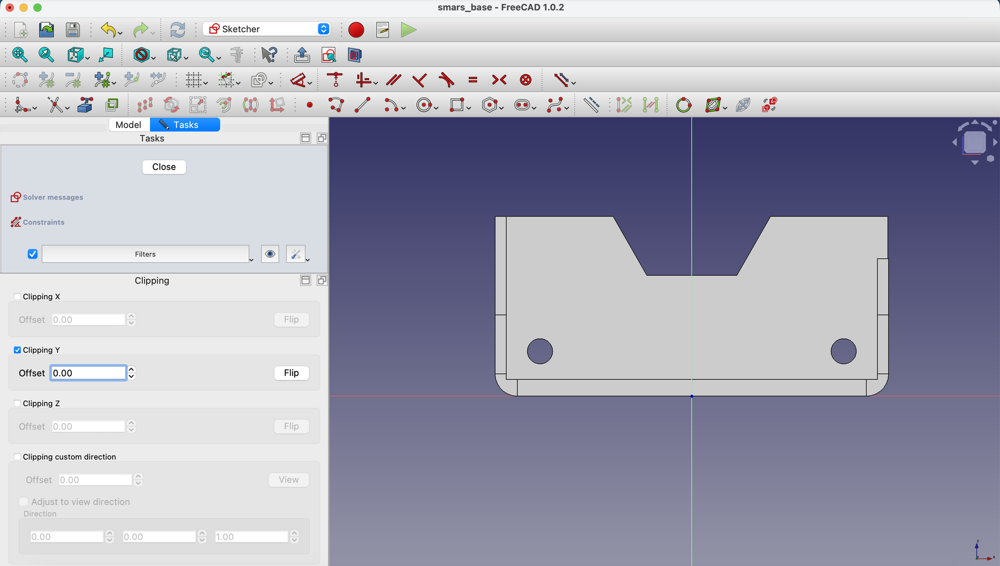{:class="img-fluid w-100"}

3. Using the `Rectangle` tool, draw a rectangle; we'll add the dimensions in the next step.

    {:class="img-fluid w-100"}

4. Add dimensions to the rectangle using the `Dimensions` tool. Set the height to `2mm`. 

    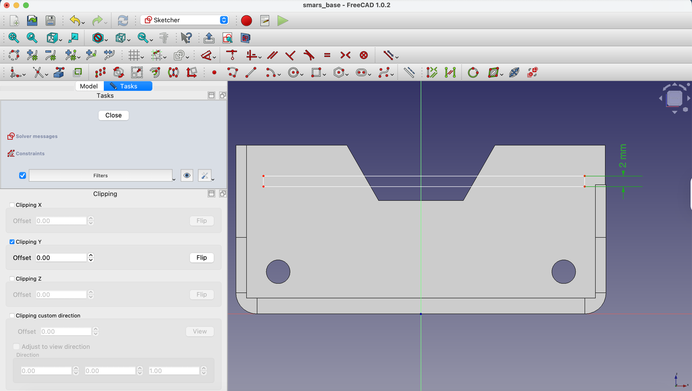{:class="img-fluid w-100"}

5. Use the `Create external geometry` tool to project the top edge of the base into the sketch

    - Constrain the bottom edge of the rectangle to be `5.5mm` from the top edge of the base using the `Dimension` tool.

    {:class="img-fluid w-100"}

6. Use the `Create external geometry` tool to project the inside edge of the base into the sketch, as well as the right most edge.

    {:class="img-fluid w-100"}

    - Constrain the left edge of the rectangle to the inside edge of the base using the `Constrain Coincident` tool.

    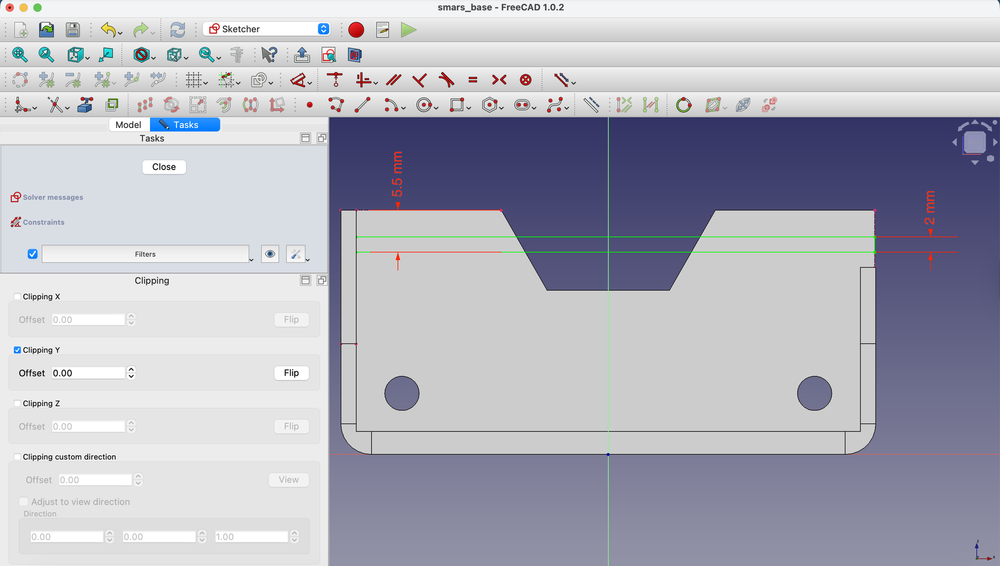{:class="img-fluid w-100"}

7. Next we need to bring in the diagonal edges of the cutout out and then create an enclosed area for the slot.

    Unlike Fusion 360, FreeCAD insists that ensured shapes are fully enclosed, so we need to create lines to connect the rectangle to the diagonal edges, the area between them needs to just be construction lines only.

    - Use the `Create external geometry` tool to project in the diagonal edges of the cutout.

    {:class="img-fluid w-100"}

    - Next, lets change the two horizonal lines to construction lines by selecting them and clicking the `Toggle construction mode` button in the toolbar.

    {:class="img-fluid w-100"}

    - Create two new points using the `point` tool, along the projected diagonal lines - we'll constrain them in the next step.

    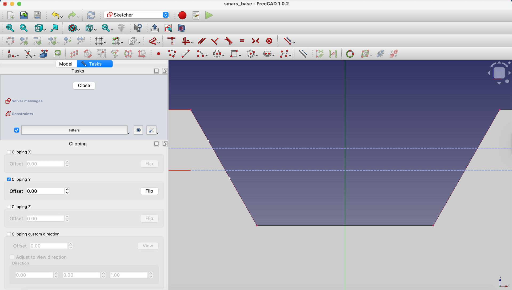{:class="img-fluid w-100"}

    - Constrain the new points to be on the projected diagonal edges to the two horizonal lines using the `Constrain Coincident` tool.

    {:class="img-fluid w-100"}

    - Repeat the same steps for the right hand side of the cutout profile.

    {:class="img-fluid w-100"}

    {:class="img-fluid w-100"}

    - Use the `Line` tool to connect the top right corner of the rectangle to the projected diagonal edge, and then connect that to the bottom right corner of the rectangle.

    {:class="img-fluid w-100"}

    - We need to connect the two new solid lines from the top and bottom lines to the new diagonal lines to create two enclosed areas. Use the `Line` tool to connect the two lines.
    
    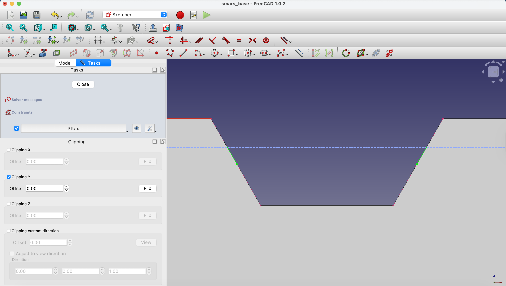{:class="img-fluid w-100"}

    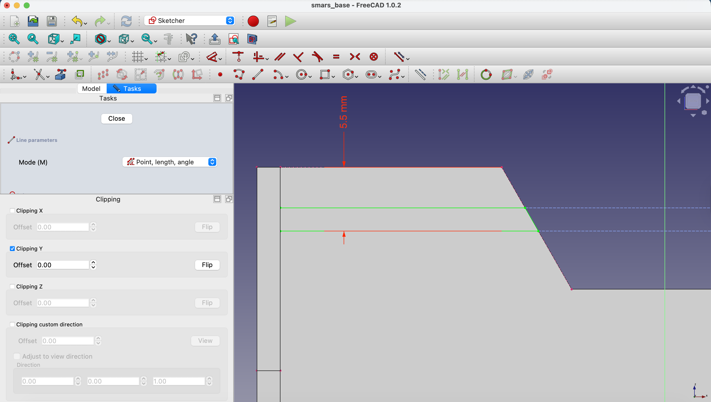{:class="img-fluid w-100"}

7. Close the sketch by clicking on the `Close` button in the toolbar.

    {:class="img-fluid w-100"}

    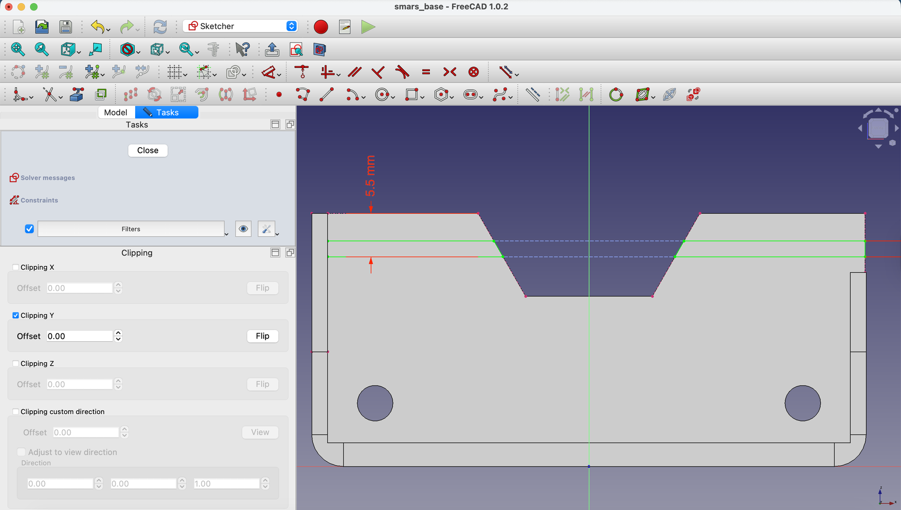{:class="img-fluid w-100"}

    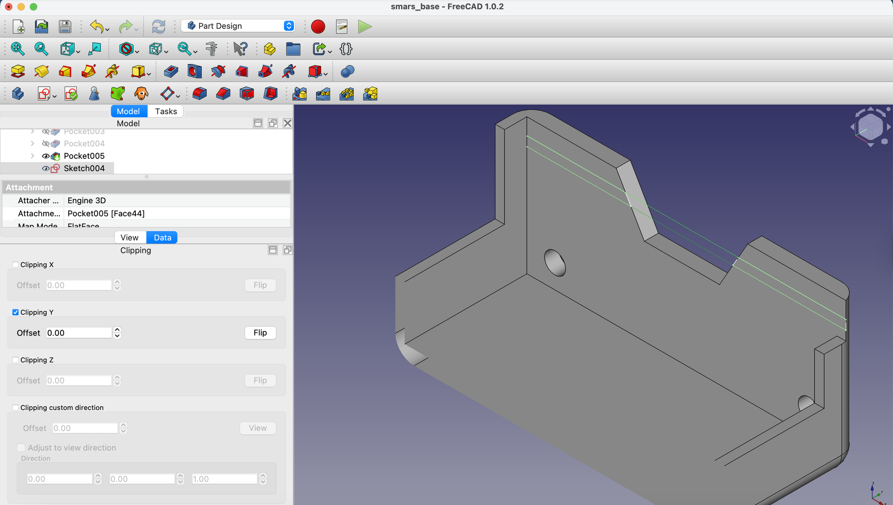{:class="img-fluid w-100"}

8. With the sketch selected in the Model tree, click on the `Pocket` button in the toolbar.

    - In the `Pocket` dialog, set the `Length` value to `0.5mm` to cut into the side of the base. Click `OK` to apply the pocket.

    {:class="img-fluid w-100"}

9. Lets close the clipped view by `Clipping Y` plane again from the `Clipping View` pane.

    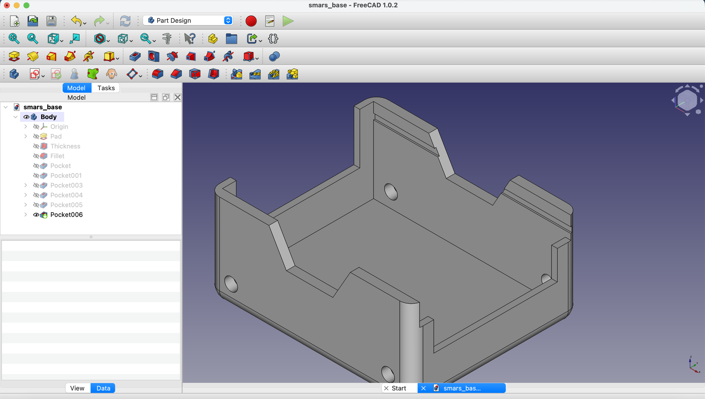{:class="img-fluid w-100"}

    - Then close the Clipping plane dialog with the `close` button at the bottom of the pane. On a Mac this may be off the screen - double clicking the title bar of the pane should bring it into view.

10. Next we want to mirror the slot to the other side of the base. We'll need to create a new datum plane in the center of the base to use as the mirror plane. First we need to create a point at the middle of the base that we can then use to create the datum plane from.

    - Click on the `Create new sketch` button in the toolbar and select the back face of the base.

    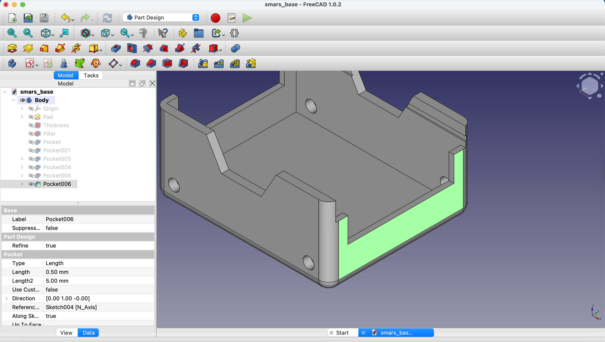{:class="img-fluid w-100"}

    - Use the `Create external geometry` tool to project in the top edge of the base.

    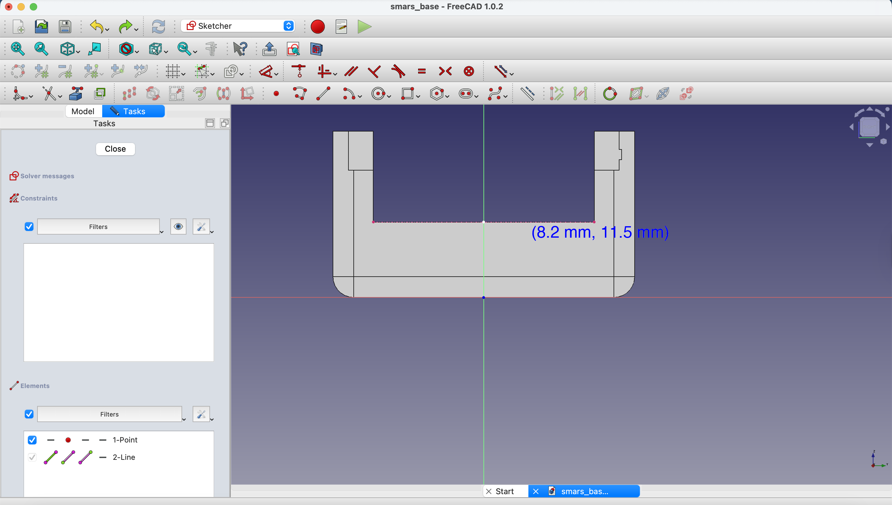{:class="img-fluid w-100"}

    - Use the `Point` tool to create a point at the midpoint of the projected front edge.

    {:class="img-fluid w-100"}

    - Close the sketch by clicking on the `Close` button in the toolbar.

    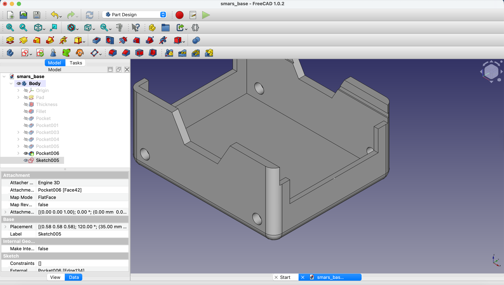{:class="img-fluid w-100"}

11. With the new sketch selected in the Model tree, click on the `Datum Plane` button in the toolbar.

    - In the `Datum Plane` dialog, set the attachment to `Object's YZ`. Click `OK` to create the datum plane.

    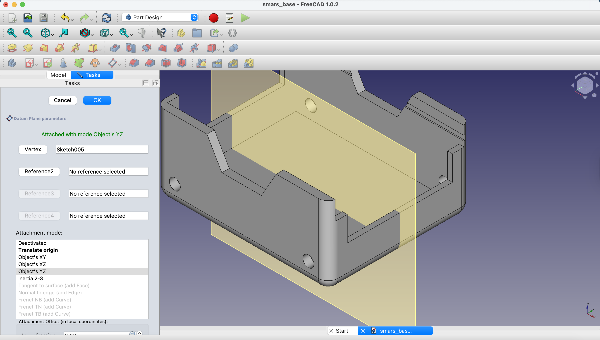{:class="img-fluid w-100"}

12. Now we can use the `Mirror` tool to mirror the slot to the other side of the base. Select the pocket feature in the Model tree, then click on the `Mirror` button in the toolbar.

    - In the `Mirror` dialog, set the `Mirror plane` to the datum plane we just created. Click `OK` to create the mirrored slot.

    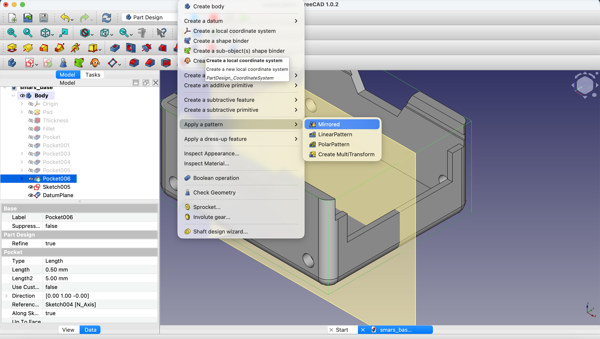{:class="img-fluid w-100"}

13. You should now see the Arduino slots on both sides of the base.

    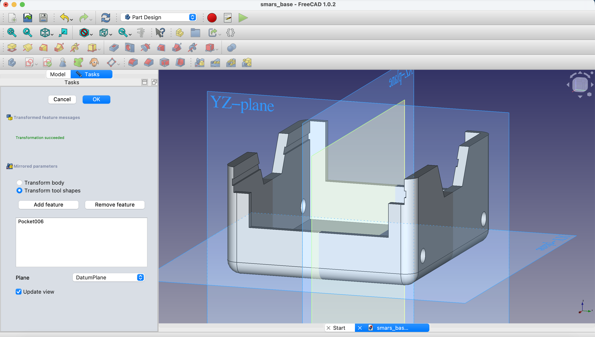{:class="img-fluid w-100"}

14. Turn off the datam plane visibility by unchecking the eye icon next to the datum plane in the Model tree.

    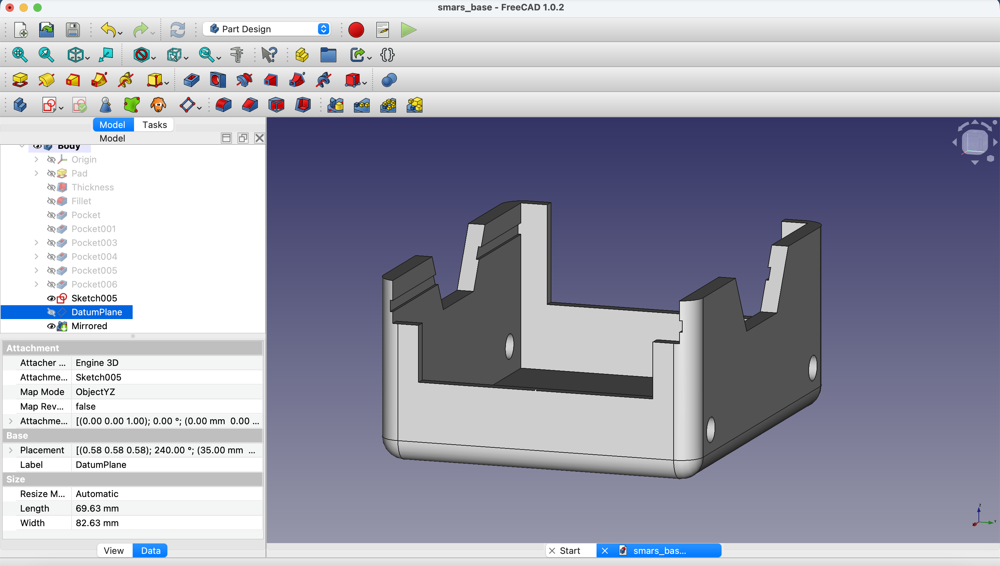{:class="img-fluid w-100"}    

---
