In this lesson we'll learn how to create the wheel stubs for the SMARS robot base. We'll use a circular pattern to create both stubs at the same time using the `Polar Pattern` tool.

1. First, we need to create a new sketch on the left face of the base. Click on the left face to select it, then click on `Create Sketch` in the toolbar.

    {:class="img-fluid w-100"}

2. Using the `External Geometry` tool, project the two circular motor holes into the sketch.

    {:class="img-fluid w-100"}

3. Using the `Point` tool, create a point at the bottom of each projected circle. The cursor will show a red symmetry indicator when you hover over the edge.

    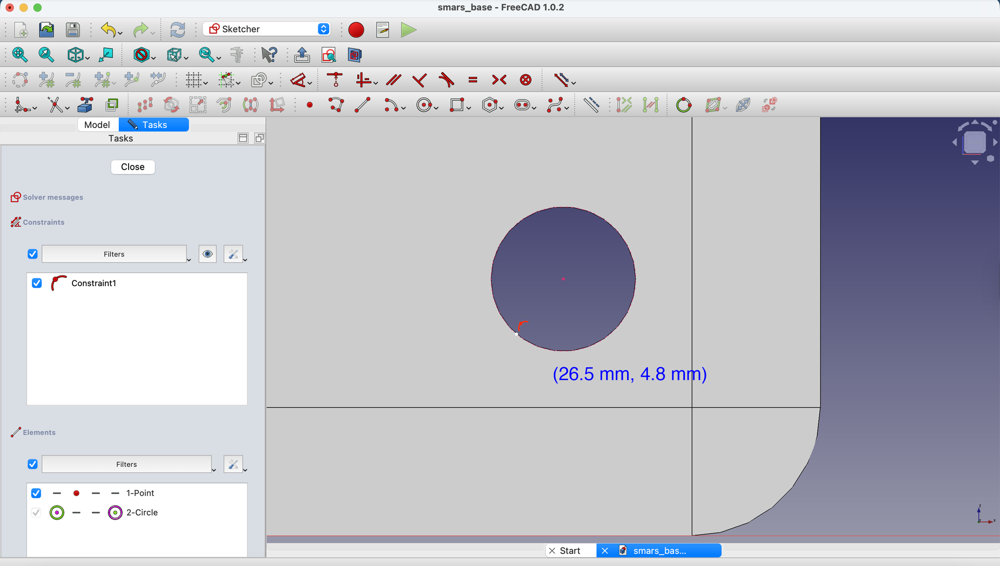{:class="img-fluid w-100"}

4. Using the `Line` tool, draw a vertical line between the two points. 

    - Select the line and make it construction by clicking the `Toggle construction mode` button in the toolbar.

    We'll add a vertical constraint in the next step.

    {:class="img-fluid w-100"}

    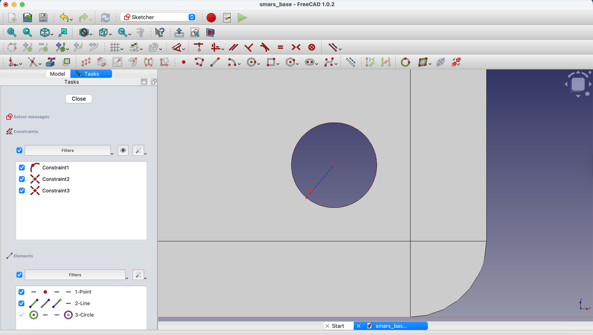{:class="img-fluid w-100"}

5. Select the line and use the `Vertical Constraint` tool to make the line vertical.

    {:class="img-fluid w-100"}

6. Close the sketch by clicking on the `Close` button in the toolbar.

    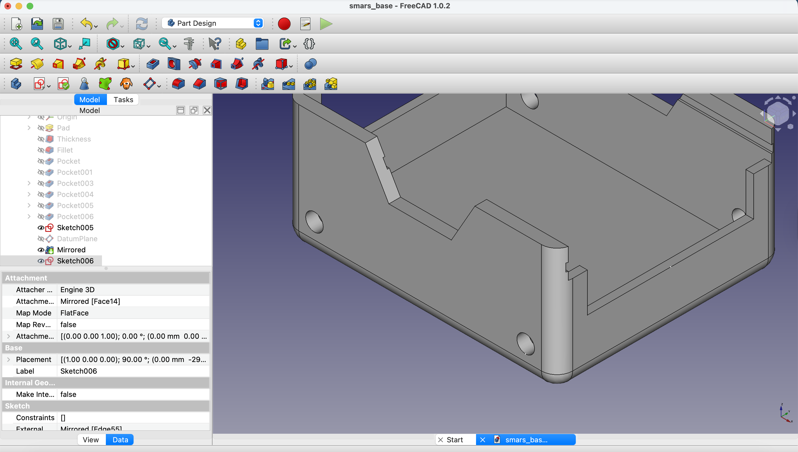{:class="img-fluid w-100"}

7. Create a new datum plane using the `Create a datum plane` tool in the toolbar.

    - In the `Data` tab of the datum plane, set the `Attachment mode` value to `Translate Origin`, and click on the point (also known as a vertex) at the bottom of the vertical line we created in the sketch.

    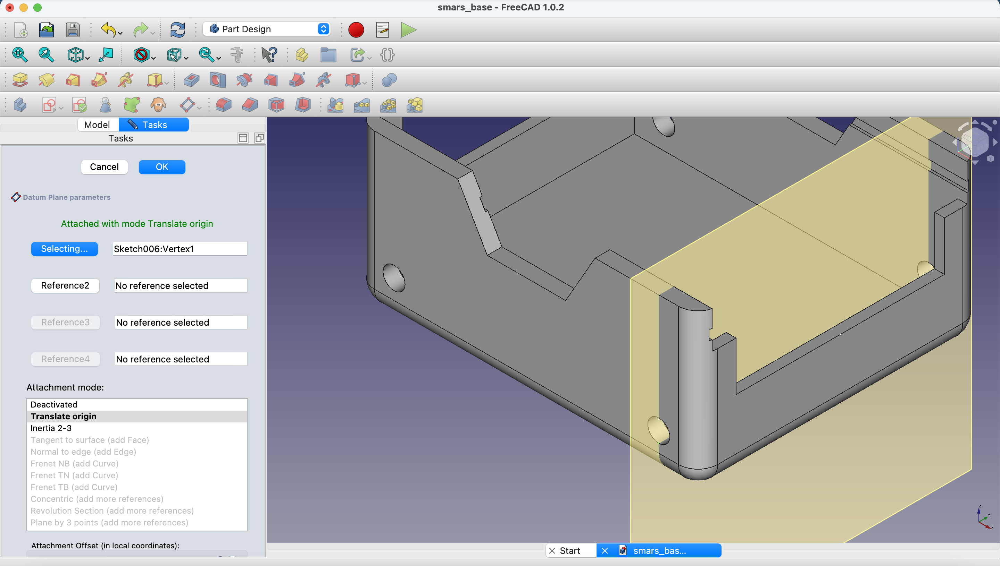{:class="img-fluid w-100"}

    - Close the datum plane dialog by clicking the `Close` button in the toolbar.

    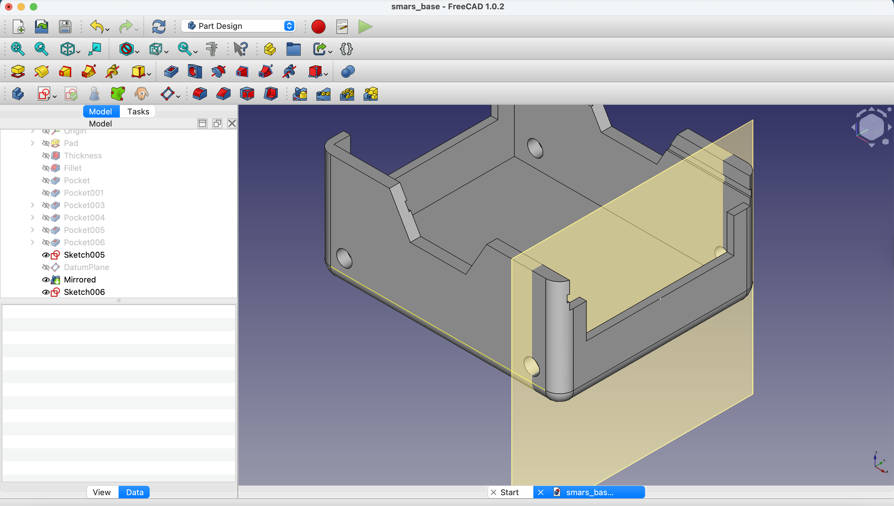{:class="img-fluid w-100"}

8. Next, we need to create a new sketch on the datum plane we just created. Click on the datum plane to select it, then click on `Create Sketch` in the toolbar.

    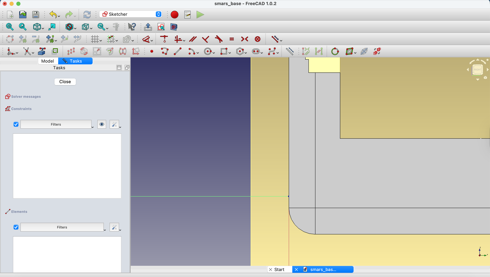{:class="img-fluid w-100"}

9. Create the shape in the picture below, we'll add the dimensions in the next step.

    {:class="img-fluid w-100"}

    - Use the Horizontal and Vertical constraint tools to align the shape as shown.

10. Add dimensions to the shape using the `Dimensions` tool. 

    - Use the `Dimension` tool to set the angle of the slanted line to `135 degrees`.

    {:class="img-fluid w-100"}

11. Add the additional dimensions as shown in the picture below.

    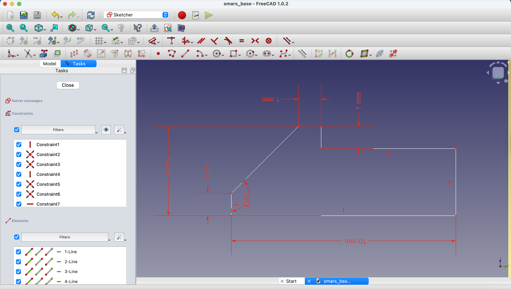{:class="img-fluid w-100"}

12. Next we need to project in the motor hole top edges so we can align the wheel stub shape to them.

    - Click on the `Create external geometry` button in the toolbar.

    {:class="img-fluid w-100"}

    - Click on the circluar edge of motor hole to project them into the sketch. You may need to rotate the view slightly to select the edges.

    - Return the view to the original orientation (press the `3` Key to return to the side view).

    - Project in the edge of the base using the `Create external geometry` tool again.

    {:class="img-fluid w-100"}

13. Use the `Line` tool to draw a horizontal line from the left edge of the base, roughtly in the middle of the motor hole. 

    - Select the line and make it construction by clicking the `Toggle construction mode` button in the toolbar.
    
    - We'll add a symetric constraint in the next step.

    - Using the `Constrain Symmetric` tool, select the horizontal line we just drew, then hold `Ctrl` and select the two points from the projected geometry we created earlier. This will make the horizontal line symetric about the two points.

    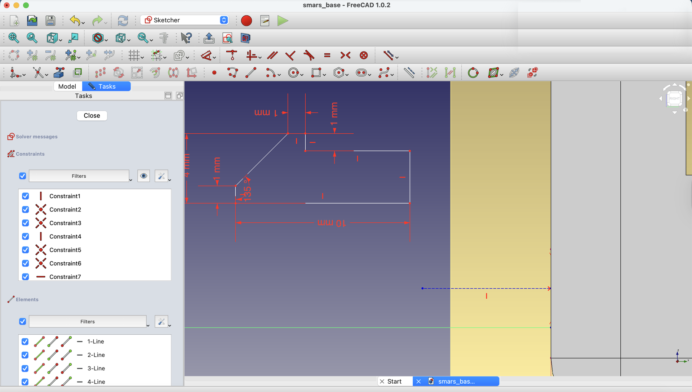{:class="img-fluid w-100"}

13. Using the `Dimension` tool, set the distance from the top edge of the wheel stub shape to the projected edge of the motor hole to `8mm`.

    - Also use the `Constrain Coincident` tool to attach the top right point of the wheel stub shape to the left edge of the base.

    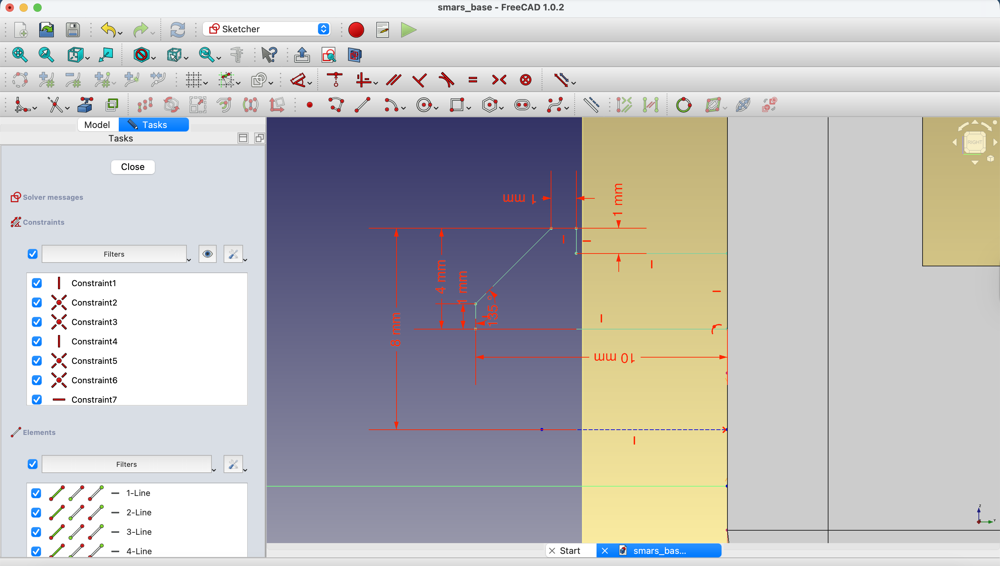{:class="img-fluid w-100"}

14. Close the sketch by clicking on the `Close` button in the toolbar.

    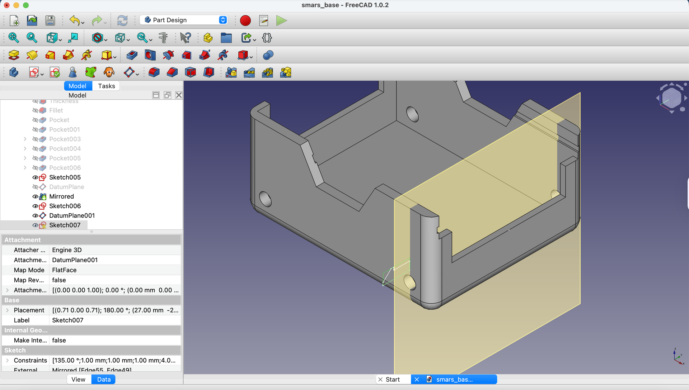{:class="img-fluid w-100"}

15. Use the Revolve tool to create the wheel stub.

    - Select the sketch in the Model tree on the left, then click on the `Revolve` button in the toolbar.

    - In the `Revolve` dialog, set the `Angle` value to `360 degrees` and make sure the `Axis` is set to `Mirrored:Edge55`. Click `OK` to apply the revolve. *(Note: The edge number may be different in your model)*.

    - You might need to rotate the view to see the wheel stub after the revolve.

    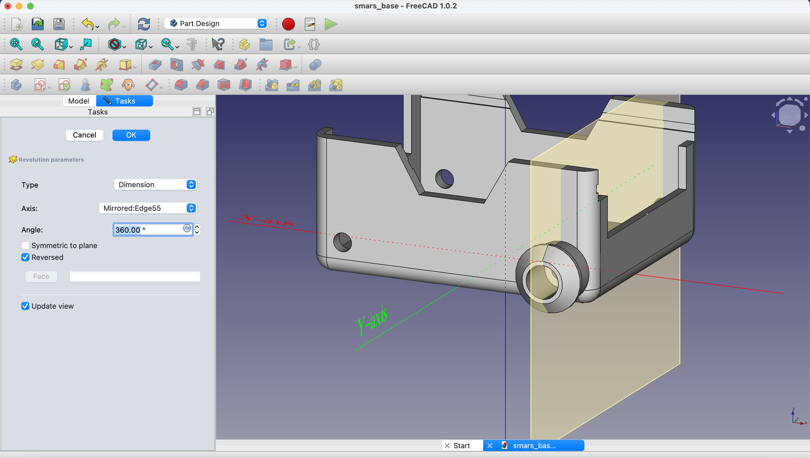{:class="img-fluid w-100"}

16. Rotate the view so you can see the flat part of the wheel stub. We want to extrude this into the base so that its all one solid piece.

    - Hide the datum plane by clicking the eye icon next to it in the Model tree.

    - Select the flat face of the wheel stub to select it.

    {:class="img-fluid w-100"}

17. Use the `Pad` tool to extrude the wheel stub into the base.

    - In the `Pad` dialog, set the `Length` value to `2mm`. Click `OK` to apply the pad.

    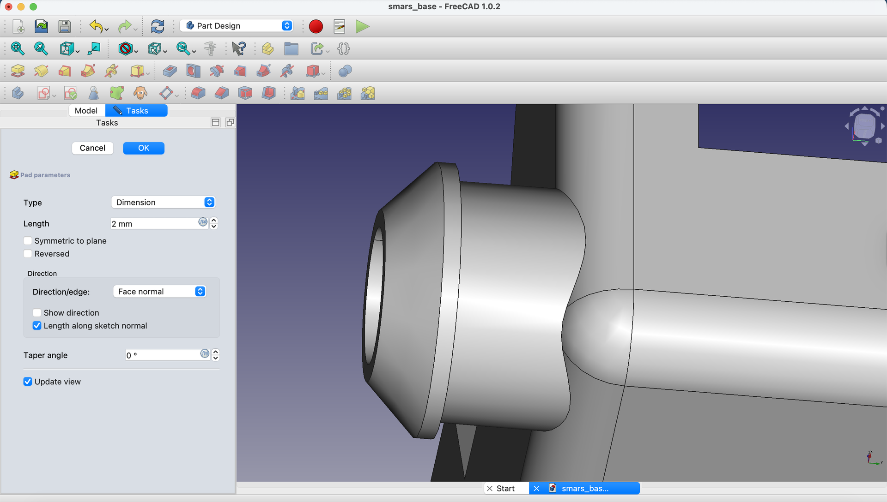{:class="img-fluid w-100"}

    - Close the Pad dialog by clicking the `Close` button in the toolbar.

    {:class="img-fluid w-100"}

    - Press `0` (zero) to return to the default view.

    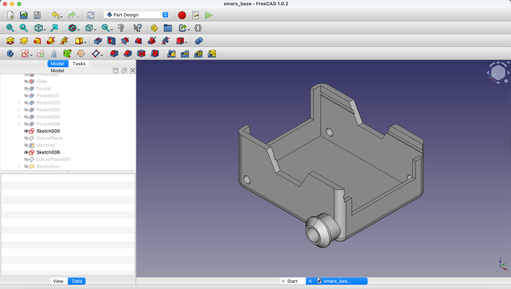{:class="img-fluid w-100"}

18. Create a new sketch on the flat part of the wheel stub we just extruded.

    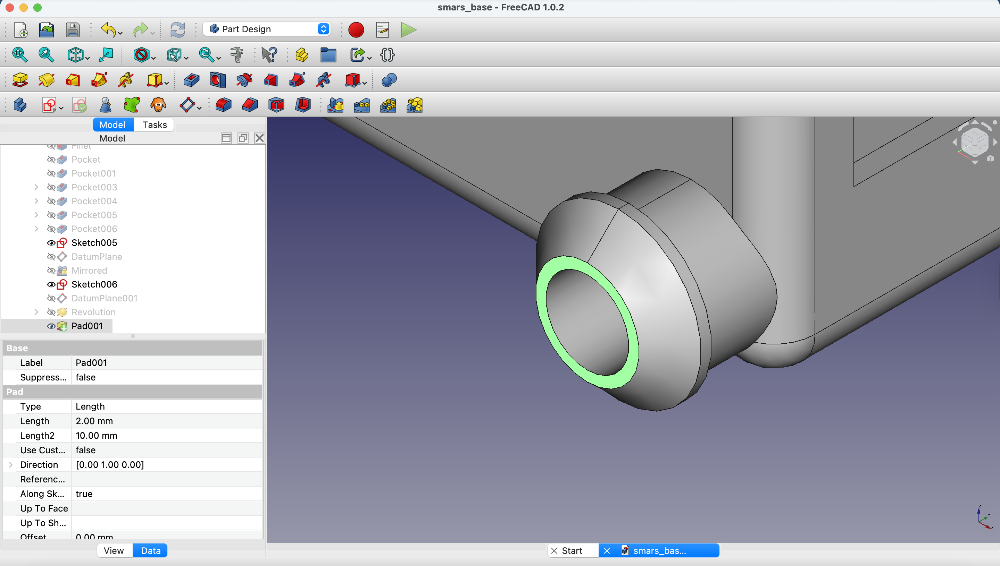{:class="img-fluid w-100"}

19. Using the `Rectangle` tool, draw a rectangle; we'll add the dimensions in the next step.

    {:class="img-fluid w-100"}

20. Add dimensions to the rectangle using the `Dimensions` tool. Set the width to `1mm`, We'll make the top and bottom of the rectangle tangent to the outer circular edge of the wheel stub in the next step.

    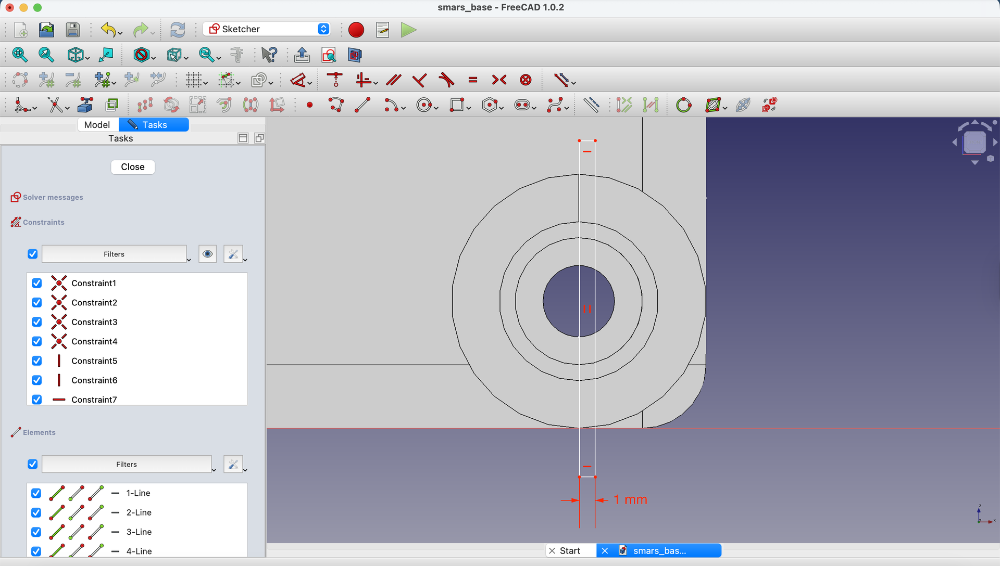{:class="img-fluid w-100"}

21. Project in the inner motor hole circle using the `Create external geometry` tool.

    - Add a mid-point to the top of the rectangle using the `Point` tool, make it centered by moving the cursor until you see the cursor change to the red `> <` icon. 

    {:class="img-fluid w-100"}

22. Add a line using the `Line` tool from the mid-point of the rectangle to the bottom of the projected motor hole circle.

    - Select the line and make it construction by clicking the `Toggle construction mode` button in the toolbar.

    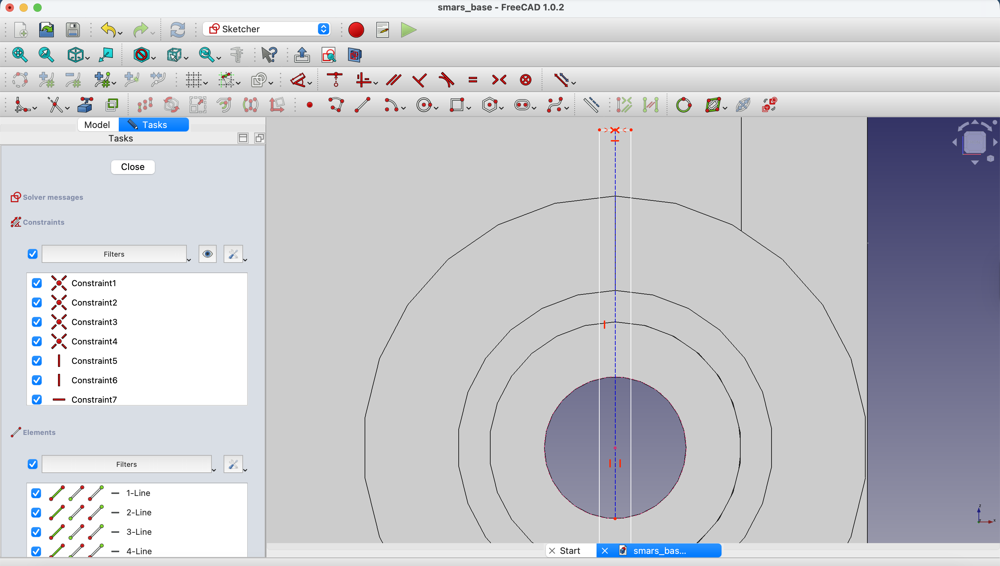{:class="img-fluid w-100"}

23. Use the `Create external geometry` tool to project in the outer circular edge of the wheel stub.

24. Use the `Constrain Tangent` tool to make the top and bottom edges of the rectangle tangent to the outer circular edge of the wheel stub.

    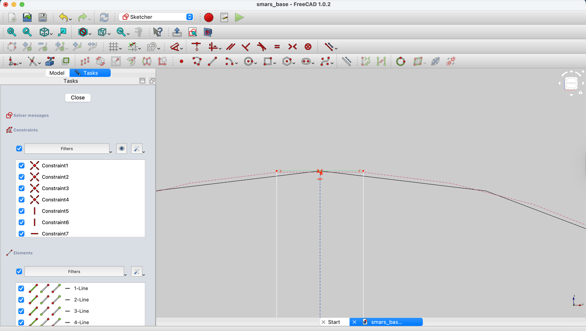{:class="img-fluid w-100"}

    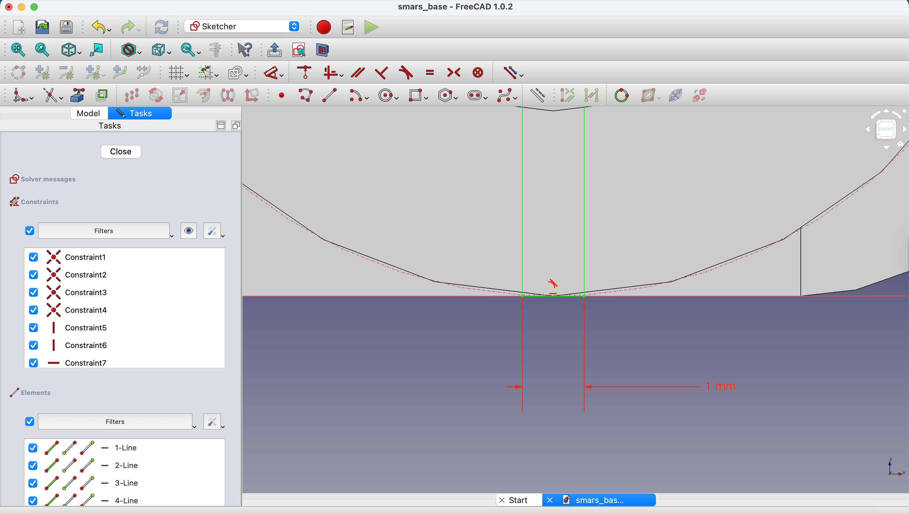{:class="img-fluid w-100"}

    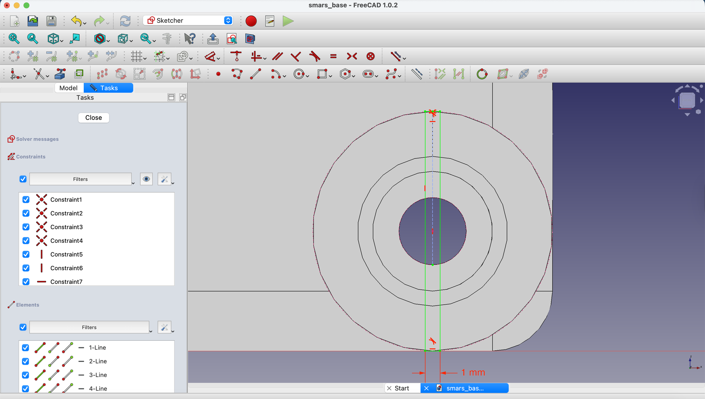{:class="img-fluid w-100"}

25. Close the sketch by clicking on the `Close` button in the toolbar.

    {:class="img-fluid w-100"}

26. Select the new sketch in the Model tree and use the `Pocket` tool to pocket the sketch into the wheel stub to a depth of `10mm`.

    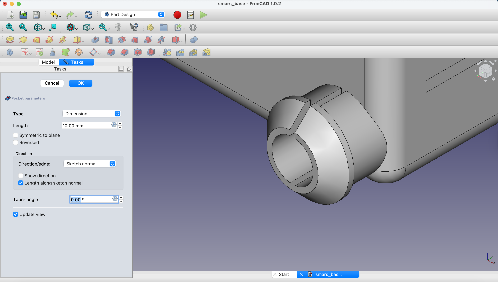{:class="img-fluid w-100"}

    - Click `OK` to confirm the pocket operation.

27. We will now create a circular pattern to copy the wheel stub to the other side of the base.

    - Select the Pocket in the Model tree.

    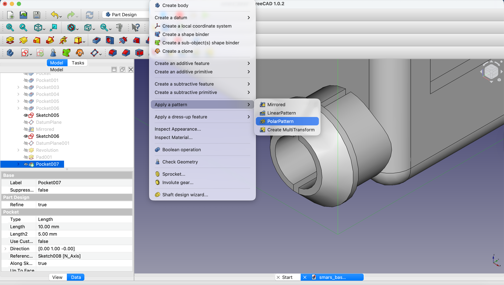{:class="img-fluid w-100"}

    - Click on the `Polar Pattern` tool in the toolbar.

    - In the `Polar Pattern` dialog, set the `Axis` to `Z Axis`, set the `Number of occurrences` to `2`, and check the `Symmetric` checkbox. Click `OK` to apply the polar pattern.

    - You may have to create another `Polar Pattern` for the `Pocket` feature if it doesn't get copied over automatically.

    {:class="img-fluid w-100"}

    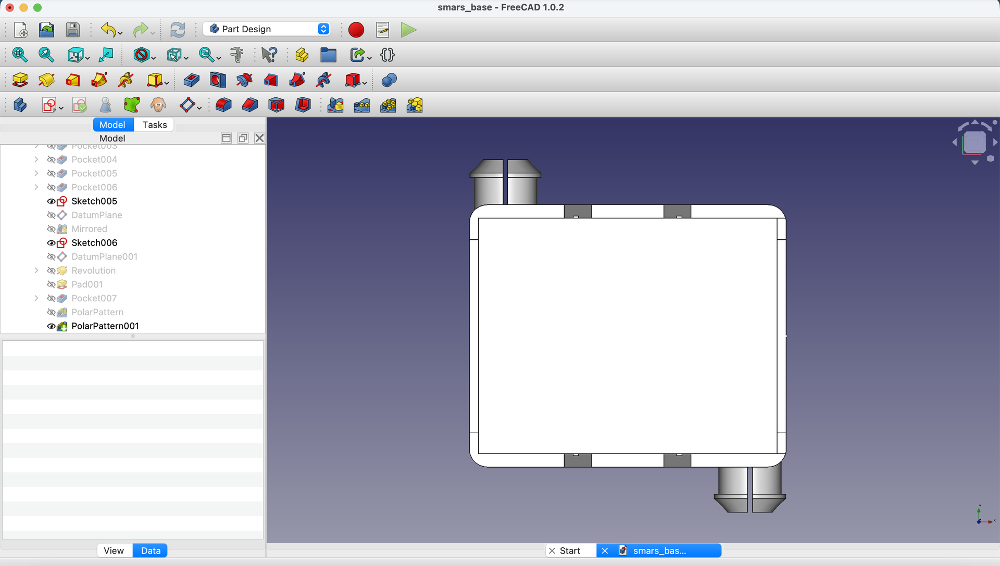{:class="img-fluid w-100"}
