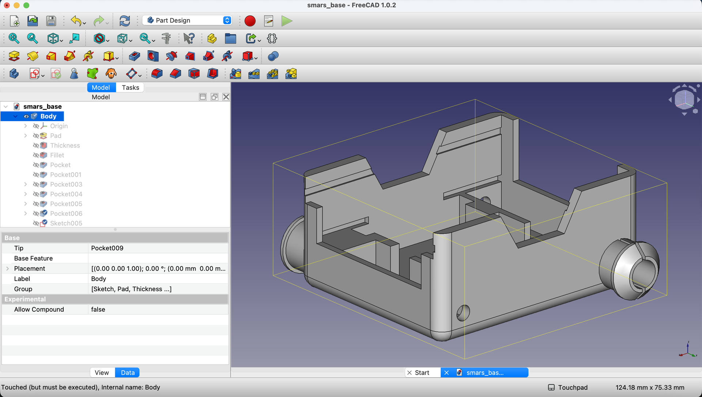
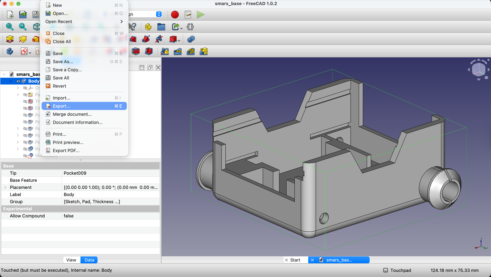

## What We're Building

Your SMARS base design is complete - now it's time to turn it into a real, physical robot part! In this lesson you'll:

1. Export the model as an STL file
2. Learn optimal 3D print settings
3. Understand common printing issues and fixes

---

## Understanding STL Files

### What is STL?

**STL** (Stereolithography) is the standard file format for 3D printing. It describes your model as a collection of triangles - the more triangles, the smoother the curves.

**Why STL?**
- Universal format - works with any 3D printer
- Simple - just geometry, no colors or materials
- Reliable - been the standard for decades

### The Export Process

FreeCAD → STL → Slicer → G-code → Printer

1. **FreeCAD** creates the 3D model
2. **STL export** converts to triangle mesh
3. **Slicer software** (Cura, PrusaSlicer) creates print instructions
4. **G-code** tells the printer exactly how to move
5. **Printer** creates the physical part

---

## Step-by-Step: Export to STL

### 1. Select the Model

In the Model tree, select the final body/feature of your SMARS base. This should be the complete model with all features.

{:class="img-fluid w-100"}

**Important**: Select the body or part, not an individual sketch or feature. The export will only include what you select.

### 2. Open the Export Dialog

Click `File` menu in the top left corner.

{:class="img-fluid w-100"}

### 3. Select Export

From the dropdown menu, select `Export...`

{:class="img-fluid w-100"}

### 4. Choose STL Format

In the file dialog:
- Navigate to your desired save location
- In the `Save as type` dropdown, select `STL Mesh (*.stl)`

{:class="img-fluid w-100"}

### 5. Save the File

Enter a filename like `smars_robot_base.stl` and click `Save`.

**Naming tip**: Use descriptive names with no spaces: `smars_base_v1.stl`, `smars_base_final.stl`

---

## Recommended Print Settings

### Material Choice

| Material | Pros | Cons | Best For |
|----------|------|------|----------|
| **PLA** | Easy to print, no heated bed required | Can warp in heat | Indoor robots, beginners |
| **PETG** | Stronger, heat resistant | Strings more | Outdoor use, durability |
| **ABS** | Very strong, heat resistant | Needs enclosure, fumes | Professional use |

**Recommendation**: Start with PLA. It's forgiving and produces great results.

### Layer Height

| Setting | Result |
|---------|--------|
| 0.3mm | Fast print, visible layers - good for prototypes |
| 0.2mm | Balanced speed and quality - **recommended** |
| 0.1mm | Slow print, smooth finish - cosmetic parts |

For functional robot parts like SMARS, **0.2mm** is ideal.

### Infill

| Percentage | Use Case |
|------------|----------|
| 15-20% | Standard - good strength-to-weight ratio |
| 30-40% | Extra durability for high-stress parts |
| 50%+ | Usually unnecessary - wastes filament |

**Recommendation**: 20% infill with grid or gyroid pattern.

### Supports

The SMARS base is designed to print **without supports** when oriented correctly:
- Print with the **open top facing up**
- The base bottom sits flat on the print bed
- All overhangs are under 45°

### Print Orientation

**Correct orientation**:
```
        ┌─────────┐  ← Open top (facing up)
        │         │
        │  SMARS  │
        │  BASE   │
        │         │
        └─────────┘  ← Flat bottom (on print bed)
```

This orientation:
- No supports needed
- Strongest layer adhesion in stress areas
- Clean bottom surface

---

## Slicer Software Recommendations

### Free Options

| Software | Platform | Notes |
|----------|----------|-------|
| **Cura** | Win/Mac/Linux | Most popular, extensive settings |
| **PrusaSlicer** | Win/Mac/Linux | Great defaults, good documentation |
| **Bambu Studio** | Win/Mac | For Bambu printers |

### Import Settings

When you open the STL in your slicer:
1. **Scale**: Should be 1:1 (70mm × 58mm × 32mm)
2. **Position**: Center on print bed
3. **Orientation**: Open top facing up

If the model appears tiny or huge, check that your FreeCAD units were in millimeters.

---

## Pre-Print Checklist

Before starting your print, verify:

- [ ] **Model is watertight** - No holes or gaps in the mesh
- [ ] **Correct size** - 70mm × 58mm × 32mm (check in slicer)
- [ ] **Proper orientation** - Open top facing up
- [ ] **No supports needed** - Model should slice cleanly without them
- [ ] **Print time estimate** - Usually 2-4 hours depending on settings
- [ ] **Filament estimate** - About 15-25g of material

---

## Common Printing Issues

### "My print warped off the bed"
**Cause**: Poor bed adhesion, especially with PLA cooling too fast.
**Fix**:
- Clean bed with isopropyl alcohol
- Use a brim (5-10mm) in slicer settings
- Ensure first layer is slightly squished
- Check bed leveling

### "The motor holes are too tight"
**Cause**: 3D printers slightly shrink holes due to corner rounding.
**Fix**:
- Use a 4mm drill bit to clean up holes
- Or increase hole size in FreeCAD to 4.7mm

### "Layers are separating"
**Cause**: Print temperature too low or print speed too fast.
**Fix**:
- Increase hotend temperature by 5-10°C
- Reduce print speed
- Check for drafts near printer

### "Wheel stubs broke off"
**Cause**: Layer orientation creates weak point.
**Fix**:
- Ensure you're printing in the correct orientation
- Increase wall count (3-4 walls)
- Try PETG for more flexibility

### "Surface is rough/bubbly"
**Cause**: Moisture in filament.
**Fix**:
- Dry filament (food dehydrator or filament dryer)
- Store filament in sealed container with desiccant

---

## Post-Processing Tips

### Cleanup
- Remove any stringing with a heat gun (briefly) or knife
- Clean up support marks if you used any
- Test-fit motors and wheels

### Test Assembly
Before building the full robot, verify:
1. Motors fit snugly in retention cutouts
2. Motor shafts pass through holes freely
3. Arduino slides into slots
4. Wheels attach to stubs properly

### If Parts Don't Fit
- **Too tight**: Sand with fine sandpaper, or drill out holes
- **Too loose**: Add tape, or reprint with adjusted dimensions
- **Warped**: Check bed leveling and try printing cooler

---

## Try It Yourself

1. **Export the STL** following the steps above
2. **Open in a slicer** and verify the dimensions
3. **Preview the slice** - look for any issues in the layer preview
4. **Print it!** (if you have a printer)

---

## Common Issues

### "FreeCAD shows export errors"
**Problem**: The model has geometry issues preventing clean export.
**Solution**:
- Check for overlapping faces in the Model tree
- Try using Part → Check Geometry to find problems
- As a workaround, export as STEP first, then convert to STL

### "STL file is empty or wrong size"
**Problem**: Wrong item selected during export.
**Solution**: Select the Body or Part in the Model tree, not a sketch or single feature.

### "Slicer shows the model as too small/large"
**Problem**: Unit mismatch between FreeCAD and slicer.
**Solution**: FreeCAD should be in mm. If the model is 1000x too big, FreeCAD was in meters. Scale by 0.001 in the slicer.

---

## What You Learned

In this lesson, you mastered:

- **STL export** - Converting CAD models to printable format
- **Print settings** - Material, layer height, infill recommendations
- **Orientation** - Positioning for best print quality
- **Troubleshooting** - Common issues and their fixes

---

## Next Up

Congratulations - your design is ready to print! In the final lesson, we'll summarize everything you've learned and explore where to go next with your new CAD skills.

---
