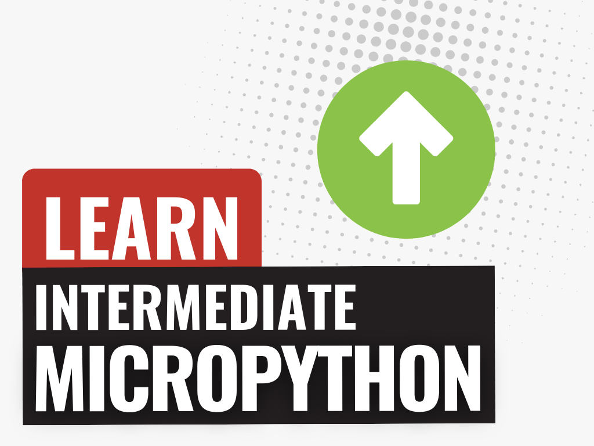

{:class="cover"}

In the previous course on [Introduction to MicroPython](/courses/introduction-to-micropython/), you learned the basics of MicroPython and how to get started with it. In this course, we will dive deeper into MicroPython and explore more advanced topics, such as:

- **Object-Oriented Programming:** Understand how to create classes and objects in MicroPython.
- **Modules and Packages:** Learn how to organize your code into modules and packages.
- **Decorators** Explore how to use decorators to modify the behavior of functions.
- **Docstrings:** Learn how to write documentation strings for your functions and classes.
- **Interrupts and Timers:** Understand how to work with interrupts and timers in MicroPython.
- **MPRemote** Explore how to manage MicroPython devices using command line tools.

---
