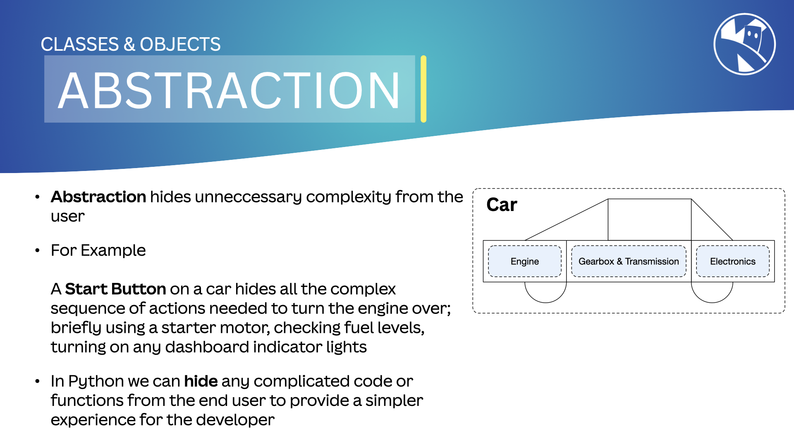

---

title: Abstraction
description: Learn about abstraction in MicroPython and how it simplifies code interaction by hiding complexity.
layout: lesson
type: page
cover: assets/cover.png
---

## Abstraction

In [OOP](02_oop), `Abstraction` means hiding the complexity of a system by exposing only the necessary details.

We achieve this by creating simple interfaces that allow interaction with the code without needing to know its inner workings.

This approach allows us to change how the system works without affecting the code that interacts with it, or the user noticing any change.

{:class="img-fluid rounded-3 w-100 card-shadow card-hover"}

---

## How We Use Abstraction in MicroPython

In MicroPython, we use [`classes`](02a_classes) to create abstractions. A ***class*** is a blueprint for creating objects that represent real-world entities.

In the example below, we model a popular road bike, the Yamaha MT-07, using a ***class***. We provide two public methods `ride` and `get_mileage` to interact with the bike object.

The **Bike** class also has a private property `__mileage` that stores the mileage of the bike. `__mileage` can only be accessed by the `ride()` method to increase the mileage, and `get_mileage()` method to return the current mileage the bike has traveled.

```python
class Bike:
    def __init__(self, make, model):
        self.make = make
        self.model = model
        self.__mileage = 0

    def ride(self, distance):
        self.__mileage += distance
    
    def get_mileage(self):
        return self.__mileage
    
my_bike = Bike("Yamaha", "MT-07")
my_bike.ride(100)
print(my_bike.get_mileage())
```

The ***Bike*** class is an abstraction of a real-world bike. It hides the ***complexity*** of how the bike works and provides a simple interface for interacting with the bike object.

---

## Modularity

MicroPython allows us to create modular code by using classes to create objects that represent real-world entities.

Classes can be composed ***of other*** classes, which allows us to create complex objects that are made up of simpler objects.

For example, if we want to create a robot, we could create a class for the robot and then create objects for the sensors, motors, and other components that make up the robot.

```python
class Sensor:
    def __init__(self, type):
        self.type = type

    def read_value(self):
        # Simulate reading a sensor value
        return 42

class Motor:
    def __init__(self, power):
        self.power = power

    def move(self, direction):
        print(f"Moving {direction} with power {self.power}")

class Robot:
    def __init__(self, name):
        self.name = name
        self.sensor = Sensor("Ultrasonic")
        self.motor = Motor(100)

    def move_forward(self):
        self.motor.move("forward")

    def read_sensor(self):
        return self.sensor.read_value()

robot = Robot("Robo")
robot.move_forward()
print(robot.read_sensor())
```

We cover [`Modules`](07_modules) in a future lesson.

---

## Abstraction vs. Encapsulation

`Abstraction` is about hiding complexity by exposing only the necessary details, while `Encapsulation` is about hiding properties and methods using access modifiers. We cover [`Encapsulation`](05_encapsulation) in a future lesson.

---

### Real-World Example

Think of a car. You don’t need to know how the engine works to drive it. You just use the pedals, steering wheel, and gear stick. The engine is abstracted away from you.

---

### Benefits of Abstraction

- **Simplicity**: Abstraction simplifies complex systems by hiding unnecessary details.
- **Flexibility**: We can change the system's implementation without affecting the code that interacts with it.
- **Reusability**: Abstraction allows us to create interfaces that can be reused in different contexts.

---

### Summary

Abstraction in OOP allows us to hide complexity and create simple interfaces for interacting with systems. It helps simplify, add flexibility, and reuse code in our programs.

---