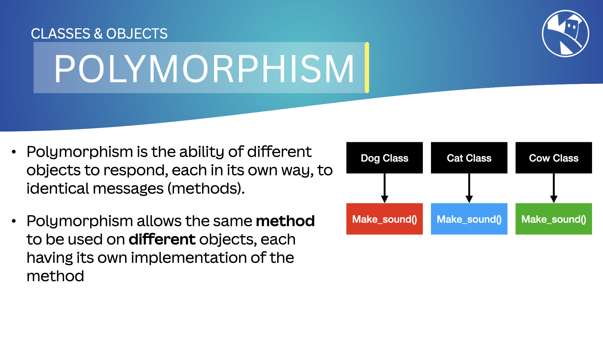

## Polymorphism

In MicroPython, `Polymorphism` means the ability of an object to take on many forms. This allows us to use a single interface to represent different types of objects. Polymorphism, meaning "occurring in many forms," is a key concept in object-oriented programming (OOP).

{:class="img-fluid rounded-3 w-100 card-shadow card-hover"}

---

## What is Polymorphism?

Polymorphism is the ability of different objects to respond, each in its own way, to identical messages (methods). In simpler terms, polymorphism allows the same method to be used on different objects, each having its own implementation of the method.

### Example of Polymorphism

Consider a scenario where we have different classes for different types of animals. Each animal can make a sound, but the sound is different for each animal.

```python
class Dog:
    def make_sound(self):
        return "Bark"

class Cat:
    def make_sound(self):
        return "Meow"

class Cow:
    def make_sound(self):
        return "Moo"

# Using polymorphism
def animal_sound(animal):
    print(animal.make_sound())

dog = Dog()
cat = Cat()
cow = Cow()

animal_sound(dog)  # Outputs: Bark
animal_sound(cat)  # Outputs: Meow
animal_sound(cow)  # Outputs: Moo
```

In the example above, the `animal_sound` function uses polymorphism to call the `make_sound` method on different animal objects. Each object responds to the `make_sound` method in its own way.

---

## Benefits of Polymorphism

- **Flexibility**: Polymorphism allows for writing more flexible and reusable code.
- **Maintainability**: It helps in maintaining the code by allowing changes to be made to the method implementations without affecting the overall system.
- **Extensibility**: New classes and methods can be added with minimal changes to the existing code.

---

## Real-World Example

Imagine a media player application that can play different types of media files (audio, video, etc.). Each media type has its own way of being played, but the media player can use a single interface to play any type of media file.

```python
class Audio:
    def play(self):
        return "Playing audio"

class Video:
    def play(self):
        return "Playing video"

class Image:
    def play(self):
        return "Displaying image"

# Using polymorphism
def play_media(media):
    print(media.play())

audio = Audio()
video = Video()
image = Image()

play_media(audio)  # Outputs: Playing audio
play_media(video)  # Outputs: Playing video
play_media(image)  # Outputs: Displaying image
```

In this example, the `play_media` function uses polymorphism to play different types of media files. Each media type responds to the `play` method in its own way.

---

## Polymorphism vs. Inheritance

Polymorphism and inheritance are closely related concepts in OOP. While inheritance allows classes to inherit properties and methods from a parent class, polymorphism allows different classes to be treated as instances of the same class through a common interface.

For example, we can have a base class `Animal` with a method `make_sound`, and different animal classes (e.g., `Dog`, `Cat`) inherit from the base class and implement their own version of `make_sound`.

```python
class Animal:
    def make_sound(self):
        raise NotImplementedError("Subclasses must implement this method")

class Dog(Animal):
    def make_sound(self):
        return "Bark"

class Cat(Animal):
    def make_sound(self):
        return "Meow"

# Using polymorphism with inheritance
def animal_sound(animal):
    print(animal.make_sound())

dog = Dog()
cat = Cat()

animal_sound(dog)  # Outputs: Bark
animal_sound(cat)  # Outputs: Meow
```

---

### Summary

Polymorphism in MicroPython allows objects to take on many forms and enables a single interface to represent different types of objects. It enhances flexibility, maintainability, and extensibility in code. Understanding and using polymorphism is crucial for effective object-oriented programming.

---
