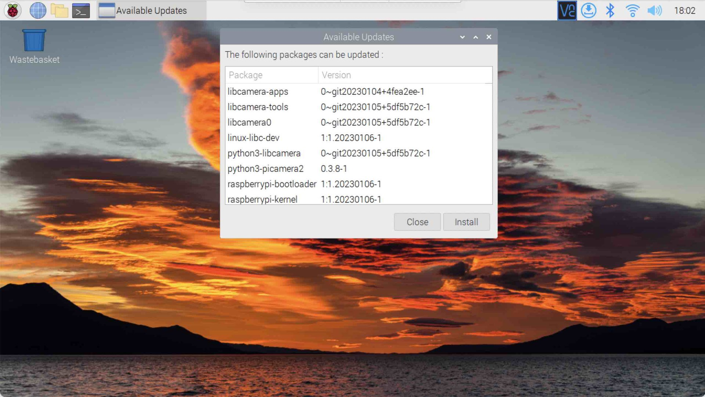
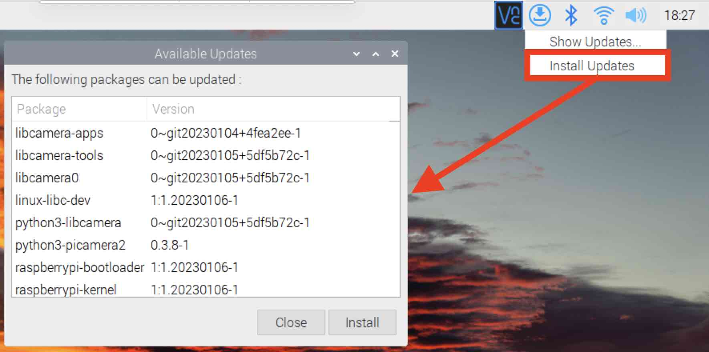

{:class="cover"}

## Install any updates for the Raspberry Pi

* **Connect to the Pi** - Once the Raspberry Pi 4 has booted up, either attach a keyboard, mouse and monitor, or remotely via ssh
* **Open a terminal** - and type:

```bash
sudo apt update
sudo apt upgrade
```

### Alternatively you can use the Raspberry Pi Update menu to install updates.

* **Click on the update icon** - next to the clock; it may not appear immediately after startup.

{:class="img-fluid w-100"}

---
