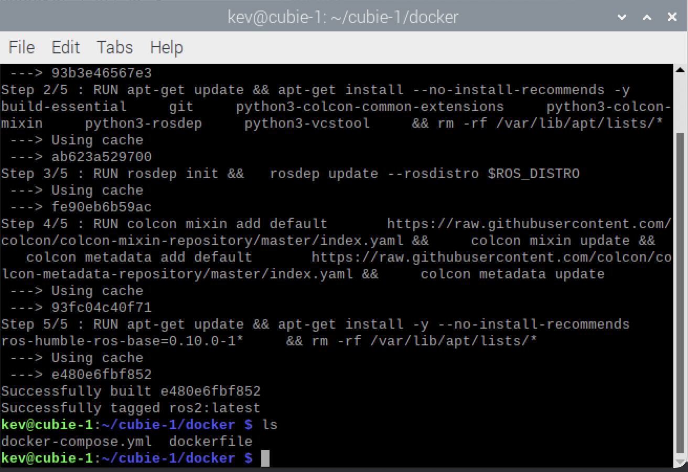

## Dockerfile & Docker-Compose.yml

To make the process of building our ROS2 container simpler I have created a `dockerfile` and accompanying `docker-compose.yml` file. These two files help us build and then run the ROS2 docker container.

---

## Build the container

* **Change directory** - From the terminal, type:

```bash
cd cubie-1/docker
```

* **Docker build** - From the terminal, type:

```bash
docker build -t ros2 .
```

*Where `ros2` is the name of the docker image we have created*

{:class="img-fluid w-50"}

---

## Run the container

* **Run the container** - From the terminal, type:

```bash
docker-compose up -d
```

*The container will now be running, you can check to see if its running using the `docker ps` command.*

---
