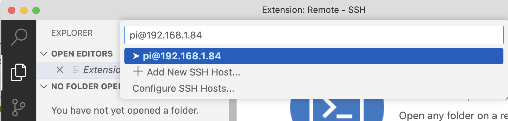
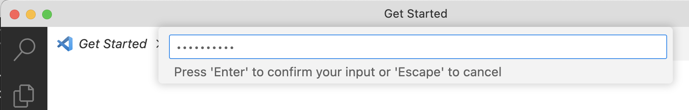
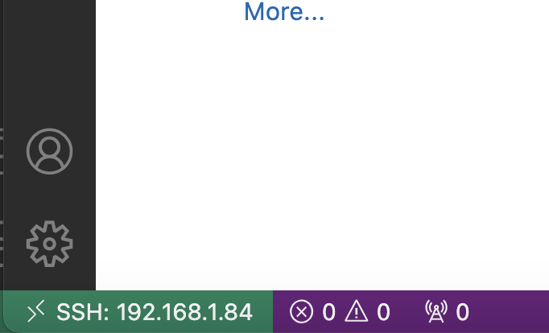
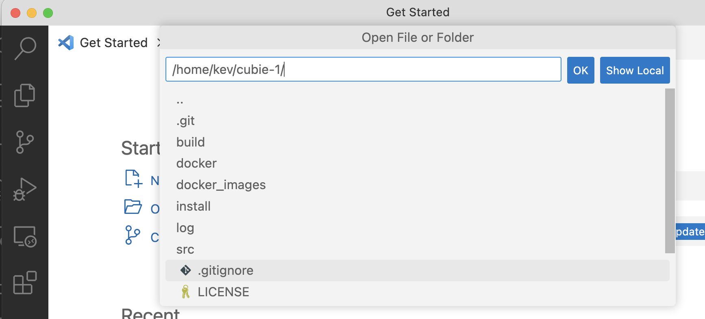
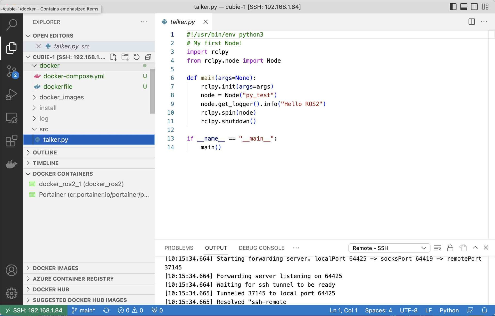
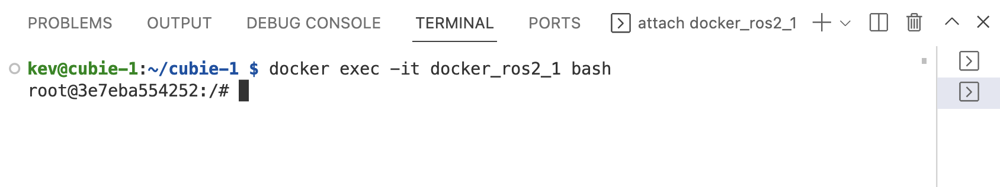

## VSCode Remote connection

Microsoft VSCode can connect to a remote computer, such as our Raspberry Pi, over SSH and then connect to running contains on that remote machine so that we can write, run and debug our ROS2 programs.

We will need to install some extensions first, then connect to our ROS2 container on the Raspberry Pi.

---

## Install Extensions

Lets install the two docker extensions on our main computer (not the Raspberry Pi), that we will use to write, run and debug code.

{:class="img-fluid w-50 shadow-lg"}

* **Click on the Extensions Icon** - This will list installed and installable extensions
* **Type `docker` in the search bar** - This will show installable docker extensions
* **Click Install on the `Docker` extension** - This extension is published by Microsoft
* **Type `remote` in the search bar** - This will show installable remote extensions
* **Click Install on the `Remote - SSH` extension** - This extension is published by Microsoft
* **Click Install on the `Remote Explorer` extension** - This extension is also published by Microsoft

---

## Remote connect

We can now connect to the Raspberry Pi 4 running our new docker container by using SSH from our main computer running VSCode.

* **Open Command Palette** - Hold `CTRL + SHIFT + P` to open the command palette
* **Connect to Host** - Type `connect` in the command palette search and then select Connect
* **Click `Remote-SSH Connect to Host...`** - Then type `pi@192.168.1.4` where `pi` is the username you selected [earlier](02_pi_setup#setup-the-sd-card-using-raspberry-pi-imager) and the `IP Address` is that of your Pi.

{:class="img-fluid w-100 shadow-lg"}

> *To find the ip address of your Pi you can type `ip a` from the Raspberry Pi terminal; there will be a list
> of all the addresses the Pi is using.*

* **Type your Pi's password** - Type the password you created in [Step 2](02_pi_setup#setup-the-sd-card-using-raspberry-pi-imager)

{:class="img-fluid w-100 shadow-lg"}

* **You are now connected to the Pi remotely** - notice the green connection status at the bottom left of VSCode

{:class="img-fluid w-100 shadow-lg"}

* **Click on `Open Folder`** -  We can now open a folder; select 'Cubie-1'

{:class="img-fluid w-100 shadow-lg"}

*You can browse the remote file system and open the files we downloaded [earlier](05_get_cubie#get-cubie-1-files)*

{:class="img-fluid w-100 shadow-lg"}

---

## Connect to the container

We can now connect to the running docker container that we created in [step 7](07_build_container#run-the-container). We can create code from the comfort of our main computer running vscode and run code remotely on our robot. This will make the development process much simpler.

To connect to the container:

* **Open a terminal** - with <code>CTLR + SHIFT + `</code>
* **Connect to the running container** - From the terminal, type:

```bash
docker exec -it docker_ros2_1 bash
```

*Where `docker_ros2_1` is the name of the running container*

{:class="img-fluid w-100 shadow-lg"}

> To list all the running containers, type `docker ps` from the terminal

> 🎉 Congratulations, you've now setup ROS2 in a container on the Raspberry Pi and connected to it from another computer running VSCode.
{:class="bg-blue"}

---
