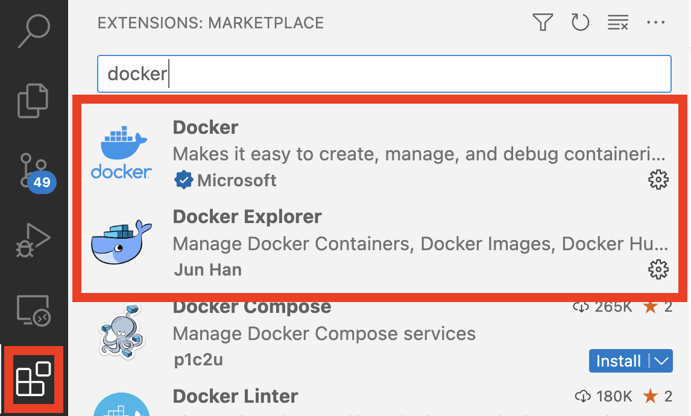

## VSCode Remote connection

Microsoft VSCode can connect to a remote computer, such as our Raspberry Pi, over SSH and then connect to running contains on that remote machine so that we can write, run and debug our ROS2 programs.

We will need to install some extensions first, then connect to our ROS2 container on the Raspberry Pi.

---

## Install Extensions

Lets install the two docker extensions on our main computer (not the Raspberry Pi), that we will use to write, run and debug code.

 {:class="img-fluid w-50"}

* **Click on the Extensions Icon** - This will list installed and installable extensions
* **Type `docker` in teh search bar** - This will show installable docker extensions
* **Click Install on the `Docker` extension** - This will be by Microsoft

## Remote connect

## Connect to the container