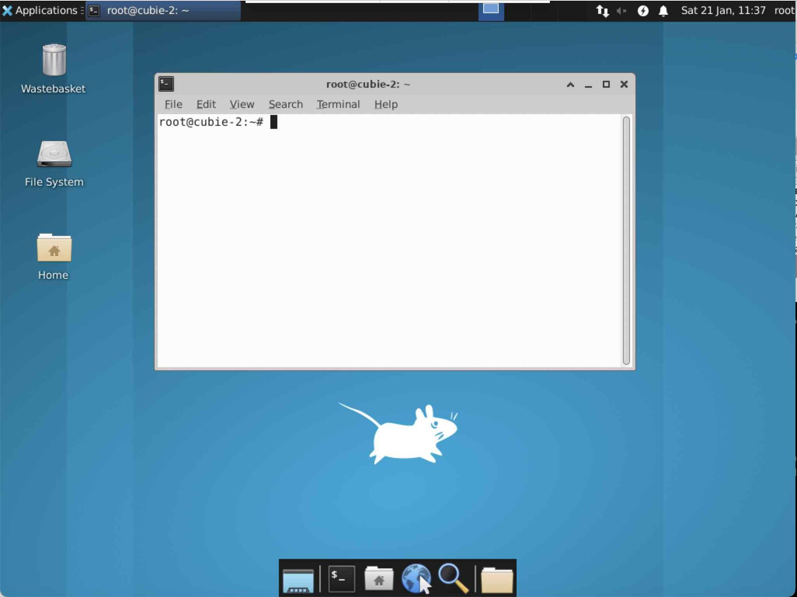

{:class="cover"}

---

To get the ROS visualisation tool `rviz2` to work in our docker container we need to redirect any graphics calls to outside our container into the hosts's X11 environment.

## What is X11

`X11` is a software package developed by the Massachusetts Institute of Technology (MIT) in the 1980s that enables graphical user interfaces (GUIs) to be created and used on Unix-based systems.
It works by using a network protocol called the X Window System Protocol to communicate between the server and the client.
The server is responsible for managing the user interface, while the client is responsible for displaying the user interface.
The X11 protocol is used to send commands from the server to the client, which are then interpreted by the client and used to generate the output.

X11 is used by many popular operating systems, including Linux, Mac OS X, and Windows.

{:class="img-fluid w-100"}

---

## Redirecting the X11 Display to the host

To redirect any X11 display commnds from within the docker container runnign ROS2, to outside the container (our Raspberry Pi 4 OS), we need to do two things:

1. Use `xhost` to enable other processes to access the X11 server (this isn't exactly secure, but for now it works)
1. `export` the `DISPLAY` environment variable - this will complete the plumbing so we can run [RViz2](/resources/glossary#rviz2).

* **xhost** - from the raspberry pi terminal type:

```bash
xhost local:root
```

* **Add display to docker-compose.yml** - Edit the docker-compose.yml file to include the lines:

```yaml
environment:
  - display
```

The full docker-compose.yml file should now look like this:

```yaml
version: "3.9"
services:
  ros2:
    build: .
    network_mode: host
    volumes:
      - /home/kev/ros:/home/ros
      - /home/kev/cubie-1:/ros2
    devices:
      - /dev/ttyUSB0:/dev/ttyUSB0
    tty: true
    environment:
      - DISPLAY
```

---

## Bring up the new docker-container

Now that we have updated our docker-compose file we need to bring the new container online; docker-compose has a simple command for this called `up`:

* **docker-compose up -d** - from the Raspberry Pis terminal, in the folder where the updated docker-compose.yml is, type:

```bash
docker-compose up -d
```

**Note** the `-d` parameter means run the container disconected. If you don't include this, the terminal will run the container and all the container output will display on this terminal, but it will also quick should the terminal session end.

---
