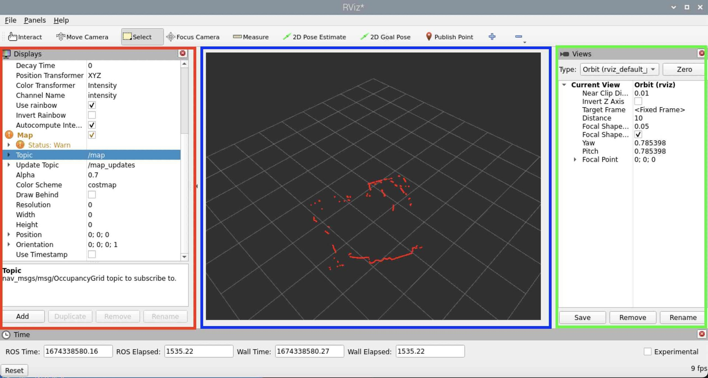

{:class="cover"}

---

## RViz2 Screen Layout

RViz has 3 main panel by default, and you can add additonal panels to suit your needs (its very flexible).

{:class="img-fluid w-100 shadow-lg"}

In the screenshot above you can see the main areas of the screen:

1. The Displays panel (outlined in Red)
1. The Main Camera Display (outlined in Blue)
1. The Views panel (outlined in Green)

---

> ## RPLidar Laser scanner
>
> The SlamTec RPLidar A1 is an affordable laser scanner, ideal for use with robotics, and costs less than £99. We will use this in our tutorial.
> {:class="img-fluid w-100 shadown-lg"}
>

---

## Adding out LiDAR Laser Scan

To view our LiDAR data in Rviz2 we need to do a couple of actions:

* Download and complile the RPLidar_ros code
* Start the RPLidar node
* Start a tranformation node to translate the `laser_scan` coordinates to the `World` coordinates
* Start `rviz2` and add the laser_scan display

---

## Download and complile the RPLidar_ros code

* **Download RPLidar code** - From the Raspberry terminal, type:

```bash
git clone https://github.com/babakhani/rplidar_ros2
```

> The `rplidar_ros2` folder needs to be inside the cubie-1 folder, so make sure this is in the correct place by draging this into the 
> Cubie-1 folder

* **Compile the RPLidar code** - From the docker-full_ros2_1 container, type:

```bash
colcon build
source install/setup.bash
```

---

## Start the RPLidar node

We can now start the Laser scanner node.

* **Start a new container terminal session** - from the Raspberry Pi terminal, type:

```bash
docker exec -it docker-full_ros2_1 bash
```

---

* **Start the Laser Scanner** - from the docker-desktop_ros2_1 container, type:

```bash
cd ros2/rplidar_ros2
source install/setup.bash
ros2 run rplidar_ros rplidar_composition
```

The RPLidar will momentarily stop and then restart, and you will see some output on the terminal showing that the LiDAR is now up and running

---

## Check the scan data topic exists

We can check that the `/scan` topic exists by using the `ros2 topic list` command. Lets open a new terminal and check we can see it.

* **Start a new container terminal session** - from the Raspberry Pi terminal, type:

```bash
docker exec -it docker-full_ros2_1 bash
```

* **Ros2 topic list** - from the docker-desktop_ros2_1 container, type:

```bash
ros2 topic list
```

There should be three topics listed:

```bash
/parameter_events
/rosout
/scan
```

If the `/scan` topic is visible, this means the LiDAR is successfully sending data to the Ros topic named `/scan`.

---

## Start RViz2

Lets start RViz2.

* **Start RViz2** - from the docker-desktop_ros2_1 container, type:

```bash
rviz2
```

We will configure RViz in the next section.

---
