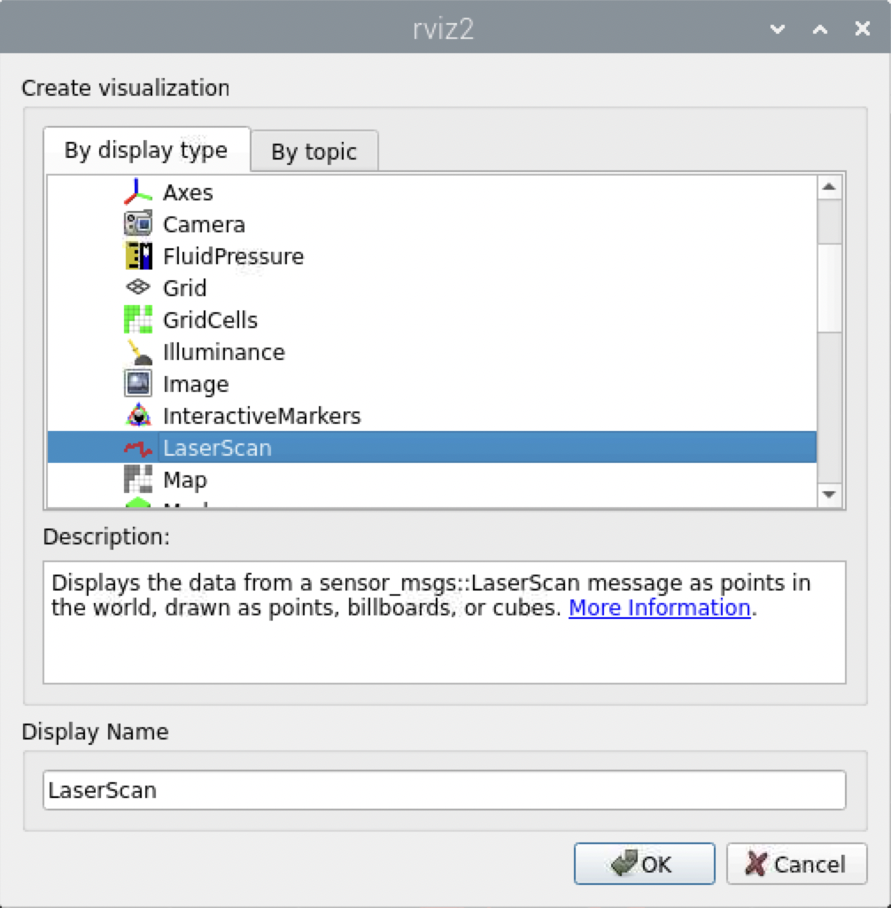
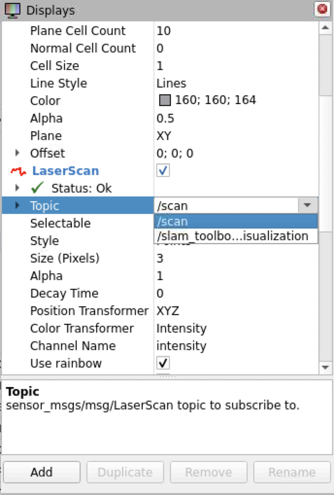
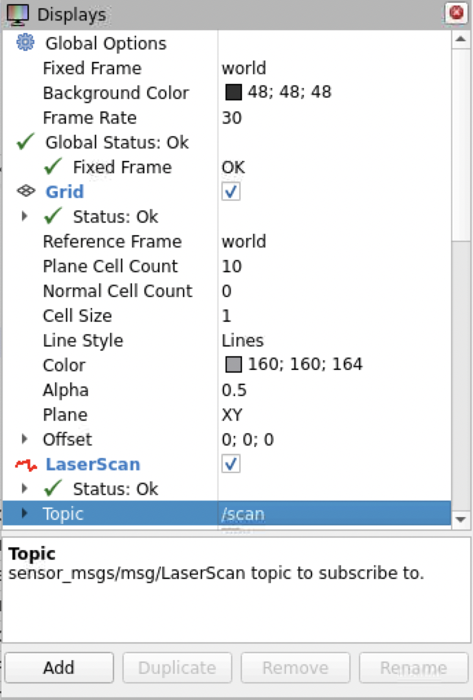
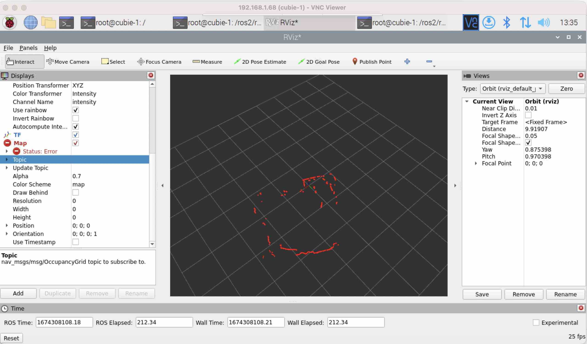

## Visualise Laserscan

It's finally time to visualise the laser scan data.

* **Add Laser_scan topic display** - In rviz2, click the `add` button

* **Select Laser_scan** - Scroll down the list of displays types and select the `laser scan` and click `ok`

{:class="img-fluid w-50 shadown-lg"}

---

* **Set the settings** - Click disclose triangle next to `LaserScan` to open it up

{:class="img-fluid w-50 shadown-lg"}

* **Change topic to scan** - Change the topic to `/scan`

---

* **Change Global Options topic to World** - Change the Global Options, Fixed Frame topic to `world`

{:class="img-fluid w-50 shadown-lg"}

---

🥳 you should now be able to see the Lidar Data in the middle panel

{:class="img-fluid w-100 shadown-lg"}

---
