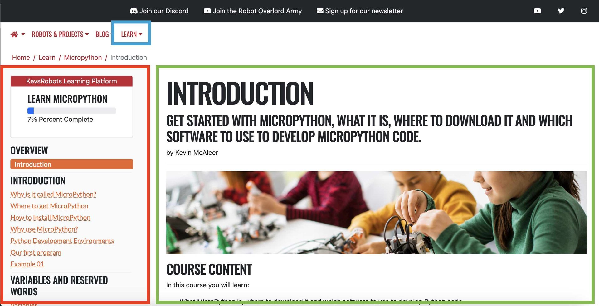

## Accessing courses

Use the [Learn](/learn/) page to access courses.

{:class="img-fluid w-100"}

The screen is split into two main parts: The **Navigation** on the left hand side, and the **Content** on the right hand side.
